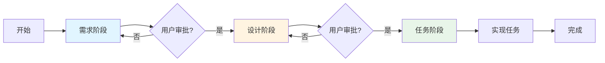

## 2. 快速开始

本章将指导你创建第一个 spec，了解基本的目录结构和工作流程。无论你是通用编码代理还是开发者，这个快速开始指南都将帮助你快速上手。

### 2.1 创建第一个 Spec

让我们通过一个实际示例来创建你的第一个 spec。假设我们要为一个项目添加"用户认证"功能。

#### 步骤 1：确定功能名称

首先，为你的功能选择一个清晰、描述性的名称，并将其转换为 kebab-case 格式：

- **功能描述**：User Authentication（用户认证）
- **Kebab-case 名称**：`user-authentication`

**命名提示**：
- 使用小写字母
- 单词之间用连字符（`-`）分隔
- 保持简洁但具有描述性
- 避免使用缩写（除非是广泛认可的术语）

#### 步骤 2：创建目录结构

在项目根目录下，创建 spec 目录结构：

```bash
# 创建 spec 目录
mkdir -p .agents/specs/user-authentication

# 进入目录
cd .agents/specs/user-authentication
```

#### 步骤 3：创建必需文件

在 spec 目录中创建四个必需文件：

```bash
# 创建配置文件
touch .config.agent

# 创建文档文件
touch requirements.md
touch design.md
touch tasks.md
```

#### 步骤 4：初始化配置文件

编辑 `.config.agent` 文件，添加以下 JSON 内容：

```json
{
  "specId": "a1b2c3d4-e5f6-4a7b-8c9d-0e1f2a3b4c5d",
  "workflowType": "requirements-first",
  "specType": "feature"
}
```

**字段说明**：
- `specId`：使用 UUID v4 格式的唯一标识符（可以使用在线 UUID 生成器）
- `workflowType`：选择 `"requirements-first"` 或 `"design-first"`（详见第 8 章）
- `specType`：对于新功能使用 `"feature"`，对于 bug 修复使用 `"bugfix"`

#### 步骤 5：初始化文档文件

为每个文档文件添加基本结构：

**requirements.md**：
```markdown
# 需求文档：用户认证

## 术语表

（待补充）

## 需求

（待补充）
```

**design.md**：
```markdown
# 设计文档：用户认证

## 概述

（待补充）

## 架构

（待补充）
```

**tasks.md**：
```markdown
# 实现计划：用户认证

## 概述

（待补充）

## 任务

（待补充）
```

#### 步骤 6：验证结构

检查你的目录结构是否正确：

```bash
# 从项目根目录运行
tree .agents/specs/user-authentication
```

你应该看到：

```
.agents/specs/user-authentication/
├── .config.agent
├── requirements.md
├── design.md
└── tasks.md
```

恭喜！你已经成功创建了第一个 spec 的基本结构。

### 2.2 目录结构示例

为了更好地理解 spec 的组织方式，让我们看一个包含多个 spec 的完整项目示例：

```
my-project/                          # 项目根目录
├── .agents/                          # 通用代理的工作空间
│   └── specs/                       # 所有 spec 的容器
│       ├── user-authentication/     # Spec 1: 用户认证
│       │   ├── .config.agent
│       │   ├── requirements.md
│       │   ├── design.md
│       │   └── tasks.md
│       │
│       ├── payment-processing/      # Spec 2: 支付处理
│       │   ├── .config.agent
│       │   ├── requirements.md
│       │   ├── design.md
│       │   └── tasks.md
│       │
│       └── fix-login-timeout/       # Spec 3: 修复登录超时 bug
│           ├── .config.agent
│           ├── requirements.md      # 对于 bugfix，这里是 bugfix.md
│           ├── design.md
│           └── tasks.md
│
├── .kiro/                           # Kiro 的工作空间（如果使用 Kiro）
│   └── specs/                       # Kiro 管理的 spec（独立于 .agents）
│       └── another-feature/
│           ├── .config.kiro
│           ├── requirements.md
│           ├── design.md
│           └── tasks.md
│
├── src/                             # 实际源代码
│   ├── auth/
│   ├── payment/
│   └── ...
│
├── tests/                           # 测试代码
│   ├── auth.test.js
│   └── ...
│
└── package.json                     # 项目配置
```

**关键观察**：

1. **隔离性**：`.agents` 和 `.kiro` 目录完全独立
2. **一致性**：每个 spec 都有相同的四个文件
3. **命名规范**：所有 spec 目录都使用 kebab-case
4. **清晰性**：目录名称清楚地描述了功能或 bug

### 2.3 基本工作流概览

Spec 工作流包含三个主要阶段。以下是每个阶段的简要概述：

#### 阶段 1：需求/Bug 分析

**目标**：明确要构建什么或要修复什么

**产出物**：`requirements.md`（或 `bugfix.md` 用于 bug 修复）

**关键活动**：
1. 定义术语表（确保所有人对关键术语有共同理解）
2. 编写用户故事（描述功能的业务价值）
3. 定义验收标准（明确功能的成功标准）
4. 使用 EARS 模式编写需求（详见第 4 章）
5. 应用 INCOSE 质量规则验证需求（详见第 4 章）

**示例需求**：
```markdown
### 需求 1：用户登录

**用户故事**：作为注册用户，我希望能够使用用户名和密码登录系统，以便访问我的个人账户。

#### 验收标准

1. WHEN 用户输入有效的用户名和密码 THEN 系统应当验证凭证并授予访问权限
2. WHEN 用户输入无效的凭证 THEN 系统应当显示错误消息并拒绝访问
3. THE 系统应当在 3 次失败尝试后锁定账户 15 分钟
```

**阶段结束**：代理停止并等待用户审批

#### 阶段 2：设计

**目标**：规划如何实现需求

**产出物**：`design.md`

**关键活动**：
1. 设计系统架构（组件、模块、层次）
2. 定义组件和接口（API、数据结构）
3. 绘制序列图（交互流程）
4. 定义正确性属性（Correctness Properties）
5. 制定测试策略（单元测试、集成测试、属性测试）

**示例设计片段**：
```markdown
## 架构

用户认证系统包含以下组件：

1. **AuthenticationController**：处理 HTTP 请求
2. **AuthenticationService**：实现认证逻辑
3. **UserRepository**：访问用户数据
4. **TokenService**：生成和验证 JWT token

## 正确性属性

1. **Token 验证的幂等性**：多次验证同一个有效 token 应当返回相同结果
2. **密码哈希的单向性**：无法从哈希值反推原始密码
```

**阶段结束**：代理停止并等待用户审批

#### 阶段 3：任务

**目标**：将设计分解为可执行的离散任务

**产出物**：`tasks.md`

**关键活动**：
1. 将设计分解为具体的实现任务
2. 为每个任务分配编号（1.1, 1.2, 2.1 等）
3. 标记任务依赖关系
4. 引用相关需求（确保可追溯性）
5. 标记可选任务（使用 `*` 后缀）

**示例任务列表**：
```markdown
## 任务

- [ ] 1. 实现认证服务
  - [ ] 1.1 创建 AuthenticationService 类
    - 实现 login(username, password) 方法
    - 实现 validateToken(token) 方法
    - _需求: 1.1, 1.2_
  
  - [ ] 1.2 实现密码哈希功能
    - 使用 bcrypt 库
    - 添加 salt 生成
    - _需求: 1.3_

- [ ] 2. 实现 token 管理
  - [ ] 2.1 创建 TokenService 类
    - 实现 JWT token 生成
    - 实现 token 验证
    - _需求: 1.4_
```

**阶段结束**：开始实现任务

#### 工作流可视化



#### 阶段转换规则

**重要规则**：

1. **停止并等待**：代理必须在完成每个阶段后停止，等待用户审批
2. **整合反馈**：代理必须整合所有用户反馈后才能继续
3. **例外情况**：如果用户回复"Skip to Implementation Plan"，代理可以直接从设计阶段进入任务阶段而不停止
4. **返回选项**：如果在后续阶段发现需求或设计有缺口，代理应提供返回到先前阶段的选项

### 2.4 选择工作流变体

Spec 工作流有三种主要变体，适用于不同的场景：

#### Requirements-First 工作流

**适用场景**：
- 需求明确，业务逻辑复杂
- 需要详细的需求文档作为合同或规范
- 团队成员需要先理解"要做什么"再考虑"怎么做"

**流程**：需求 → 设计 → 任务

**示例场景**：为电商平台添加支付处理功能

#### Design-First 工作流

**适用场景**：
- 技术方案明确，但需求细节需要从设计中推导
- 原型驱动开发
- 重构或架构改进项目

**流程**：设计 → 需求 → 任务

**示例场景**：将单体应用重构为微服务架构

#### Bugfix 工作流

**适用场景**：
- 修复已知 bug
- 需要明确当前行为、预期行为和不变行为

**流程**：Bug 分析 → 设计 → 任务

**特殊文件**：使用 `bugfix.md` 替代 `requirements.md`

**示例场景**：修复用户登录超时问题

**如何选择**：

- 如果你清楚地知道**要做什么**但不确定**怎么做** → 使用 Requirements-First
- 如果你有一个**技术方案**但需要明确**业务需求** → 使用 Design-First
- 如果你要**修复 bug** → 使用 Bugfix 工作流

详细的工作流变体说明请参见第 8 章。

### 2.5 下一步

现在你已经了解了基本的 spec 创建流程和工作流概览，接下来可以：

1. **深入学习目录结构**：阅读第 3 章了解详细的目录规范和配置文件格式
2. **学习需求编写**：阅读第 4 章了解 EARS 模式和 INCOSE 质量规则
3. **学习设计文档**：阅读第 5 章了解如何编写高质量的设计文档
4. **学习任务分解**：阅读第 6 章了解如何将设计分解为可执行任务
5. **了解属性测试**：阅读第 7 章了解何时以及如何使用属性测试

**快速参考**：

- 需要创建 spec？→ 参考 2.1 节
- 不确定目录结构？→ 参考 2.2 节
- 不知道从哪个阶段开始？→ 参考 2.4 节
- 想看完整示例？→ 跳到第 12 章

---

**提示**：如果你是通用编码代理，建议将本章内容作为与用户开始新 spec 时的参考指南。如果你是开发者，可以将本章作为快速入门教程。

