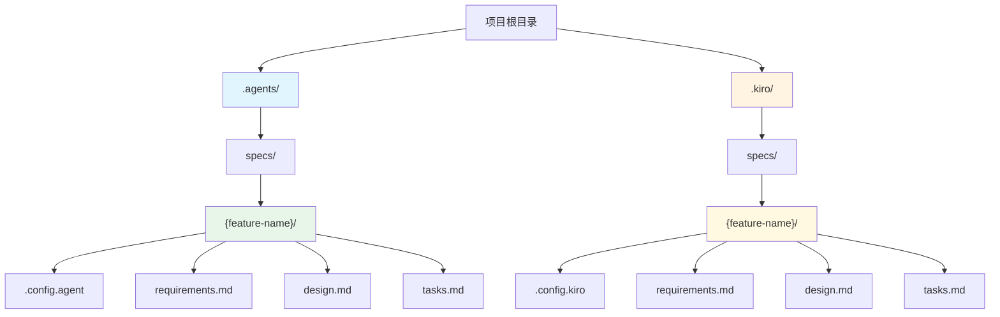

## 3. 目录结构和配置

### 3.1 概述

Spec 工作流使用专用的 `.agents` 目录来组织所有规格说明文件。这个目录结构与 Kiro 的 `.kiro` 目录完全独立，两者可以在同一项目中并存而互不干扰。

### 3.2 基本目录结构

每个 spec（规格说明）都存储在以下路径中：

```
.agents/specs/{feature-name}/
```

其中 `{feature-name}` 是功能的名称，必须使用 **kebab-case** 命名约定。

### 3.3 命名约定

**Kebab-case 规则**：
- 全部使用小写字母
- 单词之间使用连字符（`-`）分隔
- 不使用空格、下划线或大写字母

**正确示例**：
- `user-authentication`
- `payment-processing`
- `data-export-feature`
- `api-rate-limiting`

**错误示例**：
- ❌ `UserAuthentication`（使用了大写字母）
- ❌ `user_authentication`（使用了下划线）
- ❌ `user authentication`（使用了空格）
- ❌ `userAuth`（使用了驼峰命名）

### 3.4 必需文件

每个 spec 目录必须包含以下文件：

1. **`.config.agent`** - 配置文件（JSON 格式）
   - 包含 spec 的元数据
   - 定义工作流类型和 spec 类型

2. **`requirements.md`** - 需求文档
   - 包含用户故事
   - 包含验收标准
   - 包含术语表

3. **`design.md`** - 设计文档
   - 包含架构设计
   - 包含组件和接口定义
   - 包含测试策略

4. **`tasks.md`** - 任务文档
   - 包含实现任务列表
   - 包含任务依赖关系
   - 用于跟踪实现进度

### 3.5 完整目录结构图

```
项目根目录/
├── .agents/                          # 通用代理的 spec 目录
│   └── specs/                       # 所有 spec 的容器目录
│       ├── user-authentication/     # 示例：用户认证功能 spec
│       │   ├── .config.agent        # 配置文件
│       │   ├── requirements.md      # 需求文档
│       │   ├── design.md            # 设计文档
│       │   └── tasks.md             # 任务文档
│       │
│       ├── payment-processing/      # 示例：支付处理功能 spec
│       │   ├── .config.agent
│       │   ├── requirements.md
│       │   ├── design.md
│       │   └── tasks.md
│       │
│       └── api-rate-limiting/       # 示例：API 限流功能 spec
│           ├── .config.agent
│           ├── requirements.md
│           ├── design.md
│           └── tasks.md
│
└── .kiro/                           # Kiro 的 spec 目录（独立存在）
    └── specs/                       # Kiro 使用相同的结构
        └── {feature-name}/          # 但完全独立于 .agents 目录
            ├── .config.kiro
            ├── requirements.md
            ├── design.md
            └── tasks.md
```

### 3.6 目录结构流程图



### 3.7 创建新 Spec 的步骤

当你需要为新功能创建 spec 时，按照以下步骤操作：

1. **确定功能名称**
   - 选择一个描述性的名称
   - 转换为 kebab-case 格式
   - 例如："User Authentication" → `user-authentication`

2. **创建目录结构**
   ```bash
   mkdir -p .agents/specs/{feature-name}
   ```

3. **创建必需文件**
   ```bash
   cd .agents/specs/{feature-name}
   touch .config.agent
   touch requirements.md
   touch design.md
   touch tasks.md
   ```

4. **初始化配置文件**
   - 参见下一章节的配置文件格式说明

### 3.8 与 Kiro 的关系

**重要说明**：
- `.agents` 目录专供通用编码代理使用
- `.kiro` 目录专供 Kiro 使用
- 两个目录可以在同一项目中共存
- 它们完全独立，互不干扰
- Kiro 不会读取或修改 `.agents` 目录
- 通用代理不应该读取或修改 `.kiro` 目录

这种设计允许开发者在同一项目中同时使用 Kiro 和其他 AI 编码助手，每个工具都有自己独立的工作空间。

## 配置文件格式

### `.config.agent` 文件

每个 spec 目录必须包含一个 `.config.agent` 配置文件，用于存储 spec 的元数据和工作流信息。

### JSON 结构

`.config.agent` 文件使用 JSON 格式，包含以下字段：

```json
{
  "specId": "uuid-v4-string",
  "workflowType": "requirements-first" | "design-first",
  "specType": "feature" | "bugfix"
}
```

### 字段说明

#### `specId` 字段

- **类型**：字符串（String）
- **格式**：UUID v4（通用唯一标识符版本 4）
- **必需**：是
- **用途**：唯一标识该 spec，用于跟踪和引用

**UUID v4 格式**：
- 由 32 个十六进制字符组成
- 使用连字符分隔为 5 组：`xxxxxxxx-xxxx-4xxx-yxxx-xxxxxxxxxxxx`
- 第 13 位固定为 `4`（表示版本 4）
- 第 17 位为 `8`、`9`、`a` 或 `b` 之一

**示例**：
```
550e8400-e29b-41d4-a716-446655440000
f47ac10b-58cc-4372-a567-0e02b2c3d479
7c9e6679-7425-40de-944b-e07fc1f90ae7
```

**生成方法**：
- 在线工具：https://www.uuidgenerator.net/
- 命令行（Linux）：`uuidgen` 或 `cat /proc/sys/kernel/random/uuid`
- Python：`import uuid; str(uuid.uuid4())`
- JavaScript：`crypto.randomUUID()`
- Node.js：`require('crypto').randomUUID()`

#### `workflowType` 字段

- **类型**：字符串（String）
- **可选值**：`"requirements-first"` 或 `"design-first"`
- **必需**：仅对 `specType` 为 `"feature"` 的 spec 必需
- **用途**：指定功能开发的工作流类型

**工作流类型说明**：

1. **`"requirements-first"`**（需求优先）
   - 工作流顺序：需求 → 设计 → 任务
   - 适用场景：需求明确、用户故事清晰的功能
   - 优势：确保设计完全基于明确的需求

2. **`"design-first"`**（设计优先）
   - 工作流顺序：设计 → 需求 → 任务
   - 适用场景：技术探索、架构设计驱动的功能
   - 优势：允许先探索技术方案，再明确需求细节

**注意**：对于 `specType` 为 `"bugfix"` 的 spec，此字段可以省略或设为 `null`，因为 bugfix 有自己的固定工作流。

#### `specType` 字段

- **类型**：字符串（String）
- **可选值**：`"feature"` 或 `"bugfix"`
- **必需**：是
- **用途**：指定 spec 的类型

**Spec 类型说明**：

1. **`"feature"`**（功能）
   - 用于新功能开发
   - 需要指定 `workflowType`
   - 包含完整的需求、设计和任务文档

2. **`"bugfix"`**（Bug 修复）
   - 用于 bug 修复
   - 使用固定的 bugfix 工作流
   - 不需要指定 `workflowType`
   - 使用 bug condition 方法论（当前行为、预期行为、不变行为）

### 配置文件示例

#### 示例 1：Requirements-First 功能 Spec

```json
{
  "specId": "550e8400-e29b-41d4-a716-446655440000",
  "workflowType": "requirements-first",
  "specType": "feature"
}
```

**使用场景**：开发用户认证功能，需求明确，先编写需求文档。

#### 示例 2：Design-First 功能 Spec

```json
{
  "specId": "f47ac10b-58cc-4372-a567-0e02b2c3d479",
  "workflowType": "design-first",
  "specType": "feature"
}
```

**使用场景**：设计新的缓存架构，技术方案驱动，先探索设计。

#### 示例 3：Bugfix Spec

```json
{
  "specId": "7c9e6679-7425-40de-944b-e07fc1f90ae7",
  "specType": "bugfix"
}
```

**使用场景**：修复登录失败的 bug，使用 bugfix 工作流。

**注意**：Bugfix spec 不需要 `workflowType` 字段。

### 创建配置文件的步骤

当你为新 spec 创建配置文件时，按照以下步骤操作：

1. **生成 UUID v4**
   ```bash
   # Linux/WSL2
   uuidgen
   
   # 或使用 Python
   python3 -c "import uuid; print(uuid.uuid4())"
   
   # 或使用 Node.js
   node -e "console.log(require('crypto').randomUUID())"
   ```

2. **确定 spec 类型**
   - 新功能开发 → `"feature"`
   - Bug 修复 → `"bugfix"`

3. **确定工作流类型**（仅对 feature spec）
   - 需求明确 → `"requirements-first"`
   - 设计驱动 → `"design-first"`

4. **创建 JSON 文件**
   ```bash
   # 进入 spec 目录
   cd .agents/specs/{feature-name}
   
   # 创建配置文件
   cat > .config.agent << 'EOF'
   {
     "specId": "your-generated-uuid-here",
     "workflowType": "requirements-first",
     "specType": "feature"
   }
   EOF
   ```

5. **验证 JSON 格式**
   ```bash
   # 使用 jq 验证（如果已安装）
   jq . .config.agent
   
   # 或使用 Python
   python3 -c "import json; json.load(open('.config.agent'))"
   ```

### 配置文件验证规则

通用编码代理在读取 `.config.agent` 文件时，应验证以下规则：

1. **文件存在性**：`.config.agent` 文件必须存在于 spec 目录中
2. **JSON 格式**：文件内容必须是有效的 JSON
3. **必需字段**：
   - `specId` 字段必须存在且不为空
   - `specType` 字段必须存在且值为 `"feature"` 或 `"bugfix"`
4. **条件必需字段**：
   - 如果 `specType` 为 `"feature"`，则 `workflowType` 必须存在且值为 `"requirements-first"` 或 `"design-first"`
5. **UUID 格式**：`specId` 应符合 UUID v4 格式（可选验证，但推荐）

### 常见错误和解决方法

#### 错误 1：JSON 格式错误

**错误示例**：
```json
{
  "specId": "550e8400-e29b-41d4-a716-446655440000",
  "workflowType": "requirements-first",
  "specType": "feature",  // ❌ JSON 不支持注释
}  // ❌ 最后一个字段后不应有逗号
```

**正确示例**：
```json
{
  "specId": "550e8400-e29b-41d4-a716-446655440000",
  "workflowType": "requirements-first",
  "specType": "feature"
}
```

#### 错误 2：缺少必需字段

**错误示例**：
```json
{
  "specId": "550e8400-e29b-41d4-a716-446655440000",
  "specType": "feature"
}
```

**问题**：Feature spec 缺少 `workflowType` 字段。

**解决方法**：添加 `workflowType` 字段：
```json
{
  "specId": "550e8400-e29b-41d4-a716-446655440000",
  "workflowType": "requirements-first",
  "specType": "feature"
}
```

#### 错误 3：字段值无效

**错误示例**：
```json
{
  "specId": "550e8400-e29b-41d4-a716-446655440000",
  "workflowType": "design-driven",
  "specType": "feature"
}
```

**问题**：`workflowType` 值应为 `"design-first"`，而非 `"design-driven"`。

**解决方法**：使用正确的值：
```json
{
  "specId": "550e8400-e29b-41d4-a716-446655440000",
  "workflowType": "design-first",
  "specType": "feature"
}
```

#### 错误 4：Bugfix spec 包含 workflowType

**不推荐示例**：
```json
{
  "specId": "7c9e6679-7425-40de-944b-e07fc1f90ae7",
  "workflowType": "requirements-first",
  "specType": "bugfix"
}
```

**问题**：Bugfix spec 不需要 `workflowType` 字段。

**推荐示例**：
```json
{
  "specId": "7c9e6679-7425-40de-944b-e07fc1f90ae7",
  "specType": "bugfix"
}
```

### 配置文件的使用

通用编码代理应在以下场景中使用 `.config.agent` 文件：

1. **创建新 spec**：生成配置文件并初始化字段
2. **读取 spec**：解析配置文件以确定工作流类型
3. **验证 spec**：检查配置文件的完整性和正确性
4. **引用 spec**：使用 `specId` 唯一标识和引用 spec

### 与 Kiro 配置文件的区别

**`.config.agent` vs `.config.kiro`**：

| 特性 | `.config.agent` | `.config.kiro` |
|------|----------------|----------------|
| 使用者 | 通用编码代理 | Kiro |
| 位置 | `.agents/specs/{feature-name}/` | `.kiro/specs/{feature-name}/` |
| 格式 | JSON | JSON（可能有额外字段） |
| 字段 | `specId`, `workflowType`, `specType` | 可能包含 Kiro 特定字段 |
| 兼容性 | 通用标准 | Kiro 特定 |

**重要**：通用代理不应读取或修改 `.config.kiro` 文件，Kiro 也不应读取或修改 `.config.agent` 文件。

