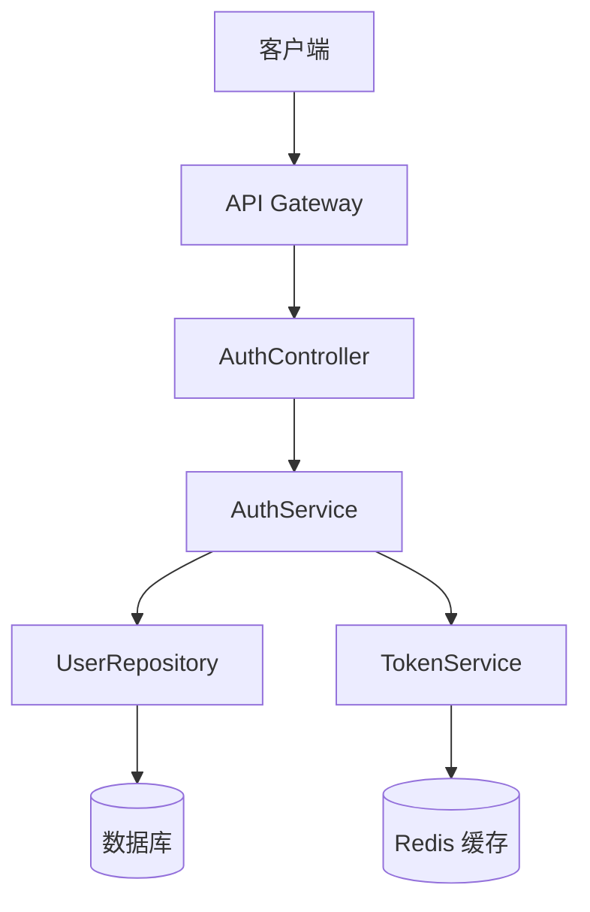
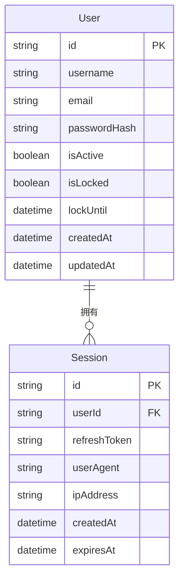
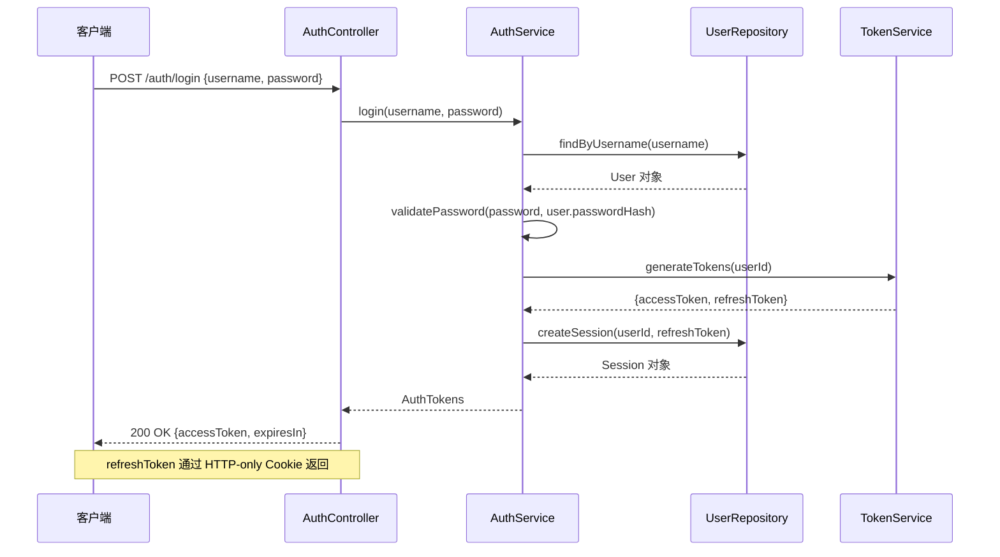
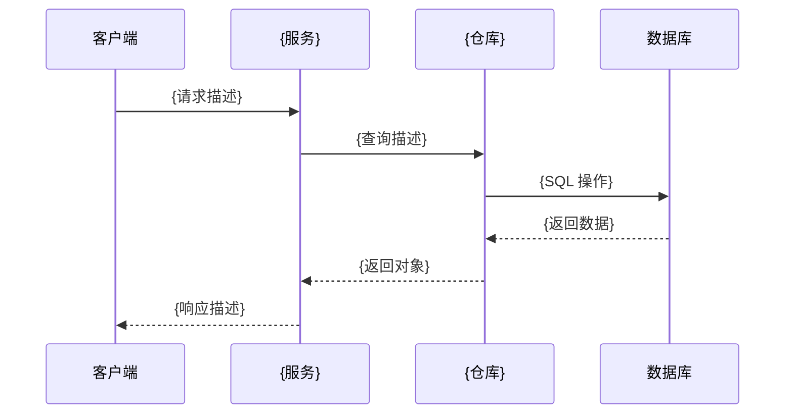
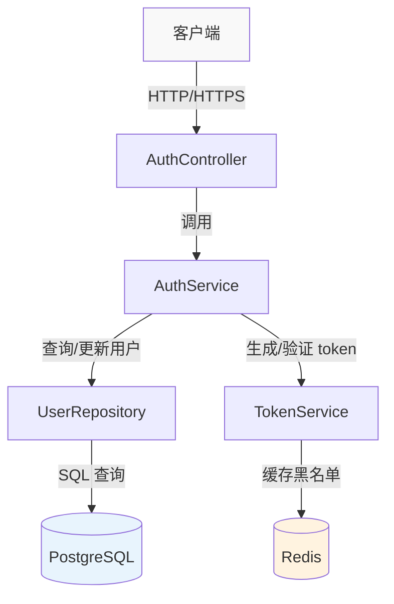
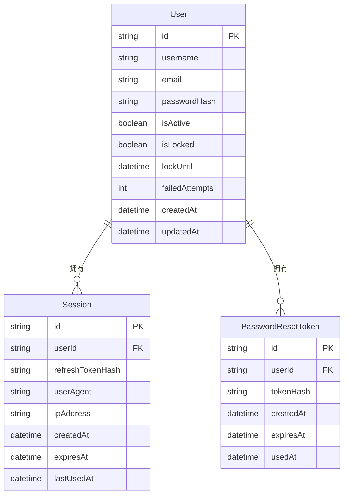
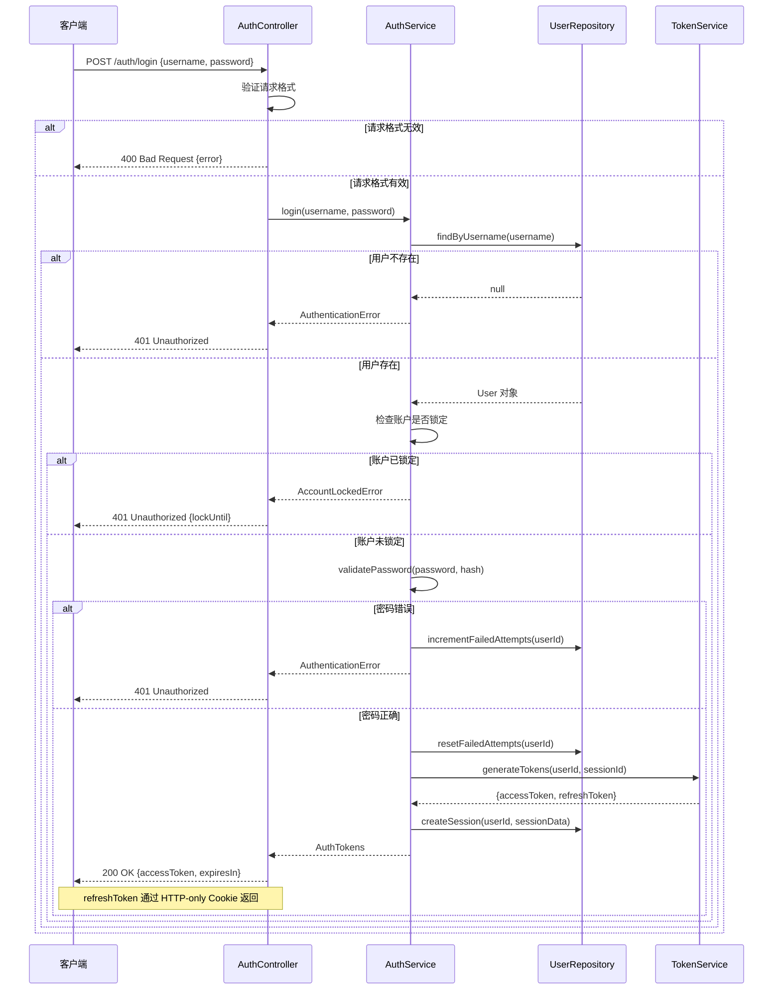
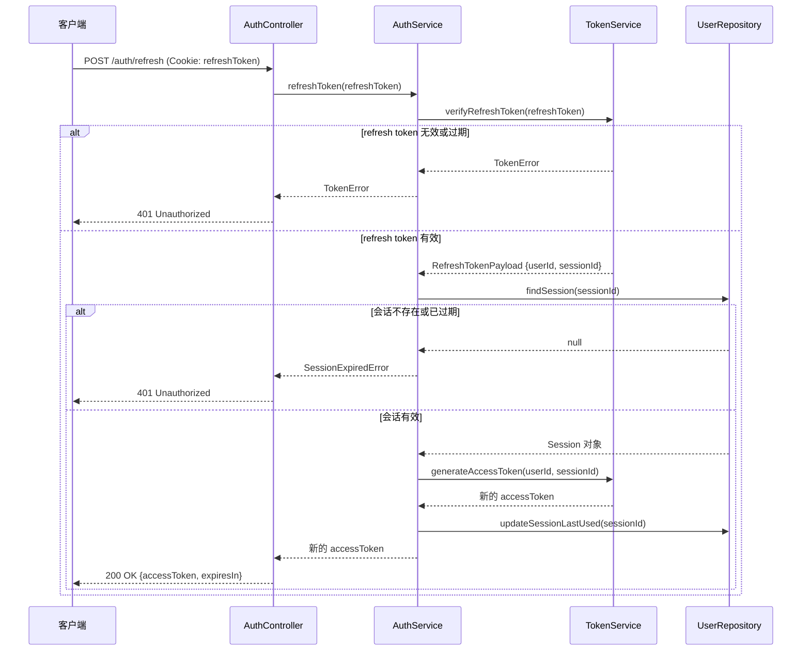

## 5. 设计阶段

设计阶段是 Spec 工作流的第二个阶段，目标是规划如何实现需求。设计文档（`design.md`）将需求转化为具体的技术方案，包括系统架构、组件设计、数据模型和测试策略。

### 5.1 设计文档结构

`design.md` 是设计阶段的核心产出物。一个完整的设计文档必须包含以下章节：

#### 5.1.1 必需章节概览

| 章节 | 说明 | 是否必需 |
|------|------|---------|
| 概述（Overview） | 功能目标、设计原则、核心决策 | 必需 |
| 架构（Architecture） | 系统组件、模块划分、架构图 | 必需 |
| 组件和接口（Components and Interfaces） | 各组件的职责、API 和接口定义 | 必需 |
| 数据模型（Data Model） | 数据结构、类型定义、关系图 | 必需 |
| 错误处理（Error Handling） | 错误场景、错误类型、处理策略 | 必需 |
| 测试策略（Testing Strategy） | 测试方法、正确性属性、覆盖率目标 | 必需 |
| 实现考虑（Implementation Considerations） | 技术选择、性能、可维护性、兼容性 | 必需 |
| 序列图（Sequence Diagrams） | 关键流程的交互时序 | 推荐 |

#### 5.1.2 概述章节（Overview）

**目的**：提供设计的高层次概述，帮助读者快速理解设计目标和核心决策。

**内容要求**：
- 说明功能的核心目标（1-3 个）
- 列出主要的设计原则（如完整性、清晰性、可维护性）
- 说明关键的技术选择和理由
- 可选：说明设计的约束条件

**示例**：
```markdown
## 概述

本功能为用户认证系统提供安全、可扩展的实现方案。

### 核心目标

1. **安全性**：使用行业标准的加密和令牌机制保护用户凭证
2. **可扩展性**：支持水平扩展，满足高并发需求
3. **可维护性**：清晰的模块划分，便于独立测试和更新

### 设计原则

- **最小权限**：每个组件只拥有完成其职责所需的最小权限
- **防御性设计**：假设输入可能是恶意的，对所有输入进行验证
- **无状态认证**：使用 JWT 实现无状态认证，便于水平扩展
```

#### 5.1.3 架构章节（Architecture）

**目的**：描述系统的整体结构，包括主要组件、模块划分和它们之间的关系。

**内容要求**：
- 列出所有主要组件及其职责
- 说明组件之间的依赖关系
- 提供架构图（推荐使用 Mermaid 或 ASCII 图）
- 说明数据流向

**架构图格式**：

推荐使用 **Mermaid** 绘制架构图，支持以下图表类型：

1. **组件图**（使用 `graph` 或 `flowchart`）：展示组件之间的关系



2. **ASCII 架构图**：适用于简单的层次结构

```
┌─────────────────────────────────────────┐
│              客户端层                    │
│  Web Browser / Mobile App / API Client  │
└─────────────────────┬───────────────────┘
                      │ HTTP/HTTPS
┌─────────────────────▼───────────────────┐
│              API 层                      │
│  AuthController / SessionController     │
└─────────────────────┬───────────────────┘
                      │
┌─────────────────────▼───────────────────┐
│              服务层                      │
│  AuthService / TokenService             │
└──────────┬──────────────────┬───────────┘
           │                  │
┌──────────▼──────┐  ┌────────▼──────────┐
│   数据访问层     │  │    缓存层          │
│  UserRepository │  │  Redis / Memcached │
└──────────┬──────┘  └───────────────────┘
           │
┌──────────▼──────┐
│    数据库层      │
│  PostgreSQL     │
└─────────────────┘
```

**示例**：
```markdown
## 架构

### 系统组件

用户认证系统由以下四个主要组件构成：

1. **AuthController**：处理 HTTP 请求，负责路由和请求/响应格式化
2. **AuthService**：实现核心认证逻辑，包括凭证验证和会话管理
3. **UserRepository**：封装数据库访问，提供用户数据的 CRUD 操作
4. **TokenService**：负责 JWT token 的生成、验证和刷新

### 架构图

\`\`\`mermaid
graph TD
    Client[客户端] -->|HTTP 请求| AuthController
    AuthController -->|调用| AuthService
    AuthService -->|查询用户| UserRepository
    AuthService -->|生成/验证 token| TokenService
    UserRepository -->|SQL 查询| DB[(PostgreSQL)]
    TokenService -->|缓存 token| Cache[(Redis)]
\`\`\`
```

#### 5.1.4 组件和接口章节（Components and Interfaces）

**目的**：详细描述每个组件的职责、输入/输出接口和内部逻辑。

**内容要求**：
- 为每个主要组件提供独立的小节
- 说明组件的职责（Responsibilities）
- 定义组件的接口（API、函数签名、数据结构）
- 说明组件的依赖关系
- 提供关键方法的说明

**接口定义格式**：

使用 TypeScript 接口或伪代码定义接口，保持语言无关性：

```typescript
// 服务接口示例
interface AuthService {
  // 验证用户凭证，成功返回 token 对，失败抛出异常
  login(username: string, password: string): Promise<AuthTokens>;
  
  // 使用 refresh token 获取新的 access token
  refreshToken(refreshToken: string): Promise<string>;
  
  // 登出，使 token 失效
  logout(accessToken: string): Promise<void>;
  
  // 验证 access token 的有效性
  validateToken(accessToken: string): Promise<TokenPayload>;
}

// 数据结构示例
interface AuthTokens {
  accessToken: string;   // JWT access token，有效期 15 分钟
  refreshToken: string;  // Refresh token，有效期 7 天
  expiresIn: number;     // access token 过期时间（秒）
}
```

**示例**：
```markdown
## 组件和接口

### 1. AuthController

**职责**：处理认证相关的 HTTP 请求，负责请求验证、响应格式化和错误处理。

**接口**：
- `POST /auth/login` - 用户登录
- `POST /auth/logout` - 用户登出
- `POST /auth/refresh` - 刷新 access token
- `POST /auth/reset-password` - 请求密码重置

**输入验证**：
- 验证请求体的 JSON 格式
- 验证必需字段的存在性
- 验证字段类型和格式

### 2. AuthService

**职责**：实现核心认证业务逻辑。

**接口**：
\`\`\`typescript
interface AuthService {
  login(credentials: LoginCredentials): Promise<AuthTokens>;
  logout(userId: string, tokenId: string): Promise<void>;
  refreshToken(refreshToken: string): Promise<string>;
  validateToken(token: string): Promise<TokenPayload>;
}
\`\`\`

**依赖**：UserRepository, TokenService
```

#### 5.1.5 数据模型章节（Data Model）

**目的**：定义系统使用的数据结构、类型和关系。

**内容要求**：
- 定义所有核心数据实体
- 说明实体之间的关系
- 提供字段类型和约束说明
- 可选：提供实体关系图（ER 图）

**数据模型格式**：

使用 TypeScript 接口或类定义数据模型：

```typescript
// 数据模型示例
interface User {
  id: string;           // UUID v4，主键
  username: string;     // 唯一，3-50 个字符，只允许字母数字和连字符
  email: string;        // 唯一，有效的电子邮件格式
  passwordHash: string; // bcrypt 哈希，不在 API 响应中返回
  isActive: boolean;    // 账户是否激活
  isLocked: boolean;    // 账户是否被锁定
  lockUntil: Date | null; // 锁定到期时间
  createdAt: Date;      // 创建时间
  updatedAt: Date;      // 最后更新时间
}

interface Session {
  id: string;           // UUID v4，主键
  userId: string;       // 外键，关联 User.id
  refreshToken: string; // 哈希后的 refresh token
  userAgent: string;    // 客户端 User-Agent
  ipAddress: string;    // 客户端 IP 地址
  createdAt: Date;      // 创建时间
  expiresAt: Date;      // 过期时间
}
```

**实体关系图**（使用 Mermaid）：



#### 5.1.6 错误处理章节（Error Handling）

**目的**：定义系统的错误处理策略，包括错误类型、错误消息和处理方式。

**内容要求**：
- 列出所有可能的错误场景
- 定义错误类型和错误码
- 说明每种错误的处理方式
- 提供错误响应格式

**示例**：
```markdown
## 错误处理

### 错误类型

| 错误场景 | HTTP 状态码 | 错误码 | 处理方式 |
|---------|-----------|--------|---------|
| 凭证无效 | 401 | AUTH_001 | 返回通用错误消息，不透露具体原因 |
| 账户被锁定 | 401 | AUTH_002 | 返回锁定时间信息 |
| Token 过期 | 401 | AUTH_003 | 提示客户端刷新 token |
| Token 无效 | 401 | AUTH_004 | 要求重新登录 |
| 请求频率超限 | 429 | AUTH_005 | 返回重试等待时间 |

### 错误响应格式

\`\`\`json
{
  "error": {
    "code": "AUTH_001",
    "message": "Invalid username or password",
    "requestId": "req-uuid-here"
  }
}
\`\`\`
```

#### 5.1.7 测试策略章节（Testing Strategy）

**目的**：定义如何验证设计的正确性，包括测试方法、正确性属性和覆盖率目标。

**内容要求**：
- 说明测试方法（单元测试、集成测试、属性测试）
- 定义正确性属性（Correctness Properties）
- 说明何时使用属性测试（Property-Based Testing）
- 设定测试覆盖率目标

**正确性属性格式**：

正确性属性描述系统在任意输入下都应满足的不变量：

```markdown
### 正确性属性

1. **Token 验证的幂等性**（Idempotence）
   - 属性：多次验证同一个有效 token 应当返回相同的结果
   - 测试方法：属性测试，生成随机有效 token，验证多次调用结果一致

2. **密码哈希的单向性**（Invariant）
   - 属性：对于任意密码，`hash(password) != password`
   - 测试方法：属性测试，生成随机密码，验证哈希值不等于原始密码

3. **会话创建和销毁的对称性**（Round Trip）
   - 属性：创建会话后立即销毁，系统状态应恢复到创建前
   - 测试方法：集成测试，验证会话的完整生命周期
```

**示例**：
```markdown
## 测试策略

### 测试方法

1. **单元测试**：测试各组件的独立功能
   - AuthService 的凭证验证逻辑
   - TokenService 的 token 生成和验证
   - 密码哈希和验证函数

2. **集成测试**：测试组件之间的交互
   - 完整的登录流程（从 HTTP 请求到数据库操作）
   - Token 刷新流程
   - 会话管理流程

3. **属性测试**：验证系统的通用属性
   - Token 验证的幂等性
   - 密码哈希的单向性

### 覆盖率目标

- 单元测试覆盖率：≥ 90%
- 集成测试：覆盖所有主要用户流程
- 属性测试：覆盖所有正确性属性
```

#### 5.1.8 实现考虑章节（Implementation Considerations）

**目的**：记录影响实现的技术决策、约束条件和注意事项。

**内容要求**：
- 说明技术选择及其理由
- 说明性能考虑（如缓存策略、数据库索引）
- 说明可维护性考虑（如代码组织、文档）
- 说明兼容性考虑（如环境要求、向后兼容性）
- 说明安全考虑（如密钥管理、数据保护）

**实现考虑的典型内容**：

```markdown
## 实现考虑

### 技术选择

**JWT 库**：使用 `jsonwebtoken`（Node.js）
- 理由：成熟、广泛使用、支持 RS256 和 HS256 算法
- 替代方案：`jose`（更现代，支持 Web Crypto API）

**密码哈希**：使用 `bcrypt`
- 理由：行业标准，内置 salt，可调节计算成本
- 替代方案：`argon2`（更现代，但依赖原生模块）

### 性能考虑

- **Token 验证缓存**：将已验证的 token 缓存在 Redis 中（TTL = token 剩余有效期），避免重复验证
- **数据库索引**：在 `users.email`、`users.username` 和 `sessions.userId` 上创建索引
- **连接池**：使用数据库连接池（最大连接数 = CPU 核心数 × 2）

### 安全考虑

- **密钥管理**：JWT 签名密钥通过环境变量注入，不硬编码在代码中
- **Token 轮换**：每次刷新 token 时，同时使旧的 refresh token 失效
- **日志脱敏**：日志中不记录密码、token 等敏感信息

### 可维护性

- **模块化设计**：每个组件独立可测试，通过依赖注入解耦
- **错误类型化**：使用自定义错误类（如 `AuthenticationError`、`TokenExpiredError`）便于错误处理
- **配置外部化**：所有可配置参数（token 有效期、锁定时间等）通过配置文件管理
```

#### 5.1.9 序列图（Sequence Diagrams）

序列图用于展示关键流程中各组件之间的交互时序，帮助理解复杂的多步骤操作。

**何时使用序列图**：
- 涉及多个组件的复杂交互流程
- 需要明确展示操作顺序的场景
- 异步操作或事件驱动的流程
- 需要展示错误处理路径的场景

**序列图格式**：

使用 **Mermaid** 的 `sequenceDiagram` 语法绘制序列图：



**序列图语法说明**：

```
sequenceDiagram
    participant A as 参与者A的显示名称
    participant B as 参与者B的显示名称
    
    A->>B: 同步调用（实线箭头）
    B-->>A: 返回值（虚线箭头）
    A-)B: 异步调用（实线开放箭头）
    
    Note over A,B: 跨越多个参与者的注释
    Note right of A: 单个参与者的注释
    
    alt 条件成立
        A->>B: 条件分支1
    else 条件不成立
        A->>B: 条件分支2
    end
    
    loop 循环条件
        A->>B: 循环操作
    end
```

**示例：登录流程序列图**

```markdown
### 登录流程

\`\`\`mermaid
sequenceDiagram
    participant C as 客户端
    participant AC as AuthController
    participant AS as AuthService
    participant UR as UserRepository
    participant TS as TokenService

    C->>AC: POST /auth/login
    AC->>AC: 验证请求格式
    
    alt 请求格式无效
        AC-->>C: 400 Bad Request
    else 请求格式有效
        AC->>AS: login(username, password)
        AS->>UR: findByUsername(username)
        
        alt 用户不存在
            UR-->>AS: null
            AS-->>AC: AuthenticationError
            AC-->>C: 401 Unauthorized
        else 用户存在
            UR-->>AS: User 对象
            AS->>AS: validatePassword(password, hash)
            
            alt 密码错误
                AS->>UR: incrementFailedAttempts(userId)
                AS-->>AC: AuthenticationError
                AC-->>C: 401 Unauthorized
            else 密码正确
                AS->>TS: generateTokens(userId)
                TS-->>AS: {accessToken, refreshToken}
                AS->>UR: createSession(userId, refreshToken)
                AS-->>AC: AuthTokens
                AC-->>C: 200 OK {accessToken}
            end
        end
    end
\`\`\`
```

#### 5.1.10 设计文档检查清单

在完成设计文档后，使用以下检查清单验证质量：

- [ ] 概述章节清楚地说明了设计目标和原则
- [ ] 架构章节包含架构图（Mermaid 或 ASCII）
- [ ] 所有主要组件都有职责说明和接口定义
- [ ] 数据模型定义了所有核心数据结构
- [ ] 错误处理章节覆盖了主要错误场景
- [ ] 测试策略章节定义了正确性属性
- [ ] 实现考虑章节记录了关键技术决策
- [ ] 复杂流程有对应的序列图
- [ ] 设计与需求文档中的验收标准对应
- [ ] 接口定义清晰，足以指导实现
- [ ] 文档使用中文描述，术语和代码保持英文

### 5.2 design.md 模板

本节提供 `design.md` 文档的标准模板，包含所有必需章节和格式规范。

#### 5.2.1 模板结构

````markdown
# 设计文档：{功能名称}

## 概述

{简要描述设计目标、核心决策和设计原则。1-3 段文字。}

### 核心目标

1. **{目标1}**：{说明}
2. **{目标2}**：{说明}
3. **{目标3}**：{说明}

### 设计原则

- **{原则1}**：{说明}
- **{原则2}**：{说明}

## 架构

### 系统组件

{描述主要组件及其职责。}

1. **{组件1}**：{职责说明}
2. **{组件2}**：{职责说明}
3. **{组件3}**：{职责说明}

### 架构图

```mermaid
graph TD
    A[{组件A}] --> B[{组件B}]
    B --> C[{组件C}]
    C --> D[({数据存储})]
```

### 数据流

{描述数据在系统中的流向。}

## 组件和接口

### 1. {组件名称}

**职责**：{组件的主要职责}

**接口**：
```typescript
interface {ComponentName} {
  {methodName}({param}: {Type}): Promise<{ReturnType}>;
}
```

**依赖**：{依赖的其他组件}

### 2. {组件名称}

**职责**：{组件的主要职责}

**接口**：
```typescript
interface {ComponentName} {
  {methodName}({param}: {Type}): Promise<{ReturnType}>;
}
```

**依赖**：{依赖的其他组件}

## 数据模型

### {实体名称}

```typescript
interface {EntityName} {
  id: string;           // UUID v4，主键
  {field1}: {Type};     // {字段说明}
  {field2}: {Type};     // {字段说明}
  createdAt: Date;      // 创建时间
  updatedAt: Date;      // 最后更新时间
}
```

### 实体关系图

```mermaid
erDiagram
    {Entity1} {
        string id PK
        string {field1}
        datetime createdAt
    }
    {Entity2} {
        string id PK
        string {entity1Id} FK
        string {field1}
    }
    {Entity1} ||--o{ {Entity2} : "{关系描述}"
```

## 序列图

### {流程名称}



## 错误处理

### 错误类型

| 错误场景 | HTTP 状态码 | 错误码 | 处理方式 |
|---------|-----------|--------|---------|
| {错误场景1} | {状态码} | {错误码} | {处理方式} |
| {错误场景2} | {状态码} | {错误码} | {处理方式} |

### 错误响应格式

```json
{
  "error": {
    "code": "{ERROR_CODE}",
    "message": "{错误消息}",
    "requestId": "{请求ID}"
  }
}
```

## 测试策略

### 测试方法

1. **单元测试**：{说明测试范围}
2. **集成测试**：{说明测试范围}
3. **属性测试**：{说明测试范围，如适用}

### 正确性属性

1. **{属性名称}**（{属性类型：Invariant/Round Trip/Idempotence 等}）
   - 属性：{描述系统应满足的不变量}
   - 测试方法：{如何验证此属性}

2. **{属性名称}**（{属性类型}）
   - 属性：{描述}
   - 测试方法：{如何验证}

### 覆盖率目标

- 单元测试覆盖率：≥ {目标百分比}%
- 集成测试：覆盖所有主要用户流程
- 属性测试：覆盖所有正确性属性

## 实现考虑

### 技术选择

**{技术/库名称}**：
- 理由：{选择理由}
- 替代方案：{其他选项}

### 性能考虑

- **{性能优化点1}**：{说明}
- **{性能优化点2}**：{说明}

### 安全考虑

- **{安全措施1}**：{说明}
- **{安全措施2}**：{说明}

### 可维护性

- **{可维护性措施1}**：{说明}
- **{可维护性措施2}**：{说明}

### 兼容性

- **环境要求**：{说明}
- **向后兼容性**：{说明}
````

#### 5.2.2 章节填写指南

| 章节 | 最少内容 | 推荐内容 |
|------|---------|---------|
| 概述 | 1 段说明 + 核心目标 | 核心目标 + 设计原则 + 约束条件 |
| 架构 | 组件列表 + 架构图 | 组件列表 + Mermaid 图 + 数据流说明 |
| 组件和接口 | 每个组件的职责 + 接口 | 职责 + TypeScript 接口 + 依赖关系 |
| 数据模型 | 核心数据结构 | TypeScript 接口 + ER 图 |
| 序列图 | 主要流程的序列图 | 所有关键流程（含错误路径）的序列图 |
| 错误处理 | 错误类型表 | 错误类型表 + 错误响应格式 |
| 测试策略 | 测试方法 + 正确性属性 | 测试方法 + 正确性属性 + 覆盖率目标 |
| 实现考虑 | 技术选择 | 技术选择 + 性能 + 安全 + 可维护性 |

### 5.3 design.md 完整示例

以下是一个完整的 `design.md` 文档示例，展示用户认证系统的设计文档填写效果。

````markdown
# 设计文档：用户认证系统

## 概述

本功能为电商平台实现安全、可扩展的用户认证系统。系统采用 JWT（JSON Web Token）无状态认证机制，结合 Redis 缓存和 PostgreSQL 持久化存储，提供高性能的认证服务。

### 核心目标

1. **安全性**：使用行业标准的加密和令牌机制保护用户凭证，防止常见攻击（暴力破解、会话劫持等）
2. **可扩展性**：无状态 JWT 认证支持水平扩展，满足高并发需求
3. **可维护性**：清晰的模块划分和依赖注入，便于独立测试和更新

### 设计原则

- **最小权限**：每个组件只拥有完成其职责所需的最小权限
- **防御性设计**：假设所有输入可能是恶意的，对所有输入进行严格验证
- **无状态认证**：使用 JWT 实现无状态认证，access token 不存储在服务端
- **失败安全**：认证失败时返回通用错误消息，不透露具体失败原因

## 架构

### 系统组件

用户认证系统由以下四个主要组件构成：

1. **AuthController**：处理 HTTP 请求，负责路由、请求验证和响应格式化
2. **AuthService**：实现核心认证业务逻辑，包括凭证验证、会话管理和 token 操作
3. **UserRepository**：封装数据库访问，提供用户数据和会话数据的 CRUD 操作
4. **TokenService**：负责 JWT token 的生成、验证、刷新和撤销

### 架构图



### 数据流

**登录流程**：客户端 → AuthController（验证请求格式）→ AuthService（验证凭证）→ UserRepository（查询用户）→ TokenService（生成 token）→ 客户端

**请求验证流程**：客户端（携带 token）→ AuthController（提取 token）→ TokenService（验证签名和有效期）→ 业务处理

## 组件和接口

### 1. AuthController

**职责**：处理认证相关的 HTTP 请求，负责请求格式验证、响应格式化和错误处理。

**接口**：
- `POST /auth/register` - 用户注册
- `POST /auth/login` - 用户登录
- `POST /auth/logout` - 用户登出
- `POST /auth/refresh` - 刷新 access token
- `POST /auth/reset-password/request` - 请求密码重置
- `POST /auth/reset-password/confirm` - 确认密码重置

**依赖**：AuthService

### 2. AuthService

**职责**：实现核心认证业务逻辑，协调 UserRepository 和 TokenService 完成认证操作。

**接口**：
```typescript
interface AuthService {
  // 注册新用户，返回用户信息（不含密码）
  register(data: RegisterData): Promise<UserProfile>;

  // 验证凭证，成功返回 token 对，失败抛出 AuthenticationError
  login(credentials: LoginCredentials): Promise<AuthTokens>;

  // 使当前 token 失效，删除会话记录
  logout(userId: string, tokenId: string): Promise<void>;

  // 使用 refresh token 获取新的 access token
  refreshToken(refreshToken: string): Promise<string>;

  // 验证 access token，返回 token 载荷
  validateToken(accessToken: string): Promise<TokenPayload>;

  // 发起密码重置流程，发送重置邮件
  requestPasswordReset(email: string): Promise<void>;

  // 使用重置令牌设置新密码
  confirmPasswordReset(token: string, newPassword: string): Promise<void>;
}
```

**依赖**：UserRepository, TokenService

### 3. UserRepository

**职责**：封装所有数据库访问操作，提供用户和会话数据的持久化接口。

**接口**：
```typescript
interface UserRepository {
  // 根据用户名查找用户
  findByUsername(username: string): Promise<User | null>;

  // 根据邮箱查找用户
  findByEmail(email: string): Promise<User | null>;

  // 创建新用户
  create(data: CreateUserData): Promise<User>;

  // 更新用户信息
  update(userId: string, data: Partial<User>): Promise<User>;

  // 创建会话记录
  createSession(userId: string, sessionData: CreateSessionData): Promise<Session>;

  // 删除会话记录
  deleteSession(sessionId: string): Promise<void>;

  // 删除用户的所有会话
  deleteAllSessions(userId: string): Promise<void>;

  // 记录登录失败次数
  incrementFailedAttempts(userId: string): Promise<number>;

  // 重置登录失败次数
  resetFailedAttempts(userId: string): Promise<void>;
}
```

**依赖**：PostgreSQL 数据库连接

### 4. TokenService

**职责**：负责 JWT token 的生成、验证和管理，维护 token 黑名单。

**接口**：
```typescript
interface TokenService {
  // 生成 access token 和 refresh token 对
  generateTokens(userId: string, sessionId: string): AuthTokens;

  // 验证 access token 的签名和有效期
  verifyAccessToken(token: string): TokenPayload;

  // 验证 refresh token
  verifyRefreshToken(token: string): RefreshTokenPayload;

  // 将 token 加入黑名单（用于登出）
  blacklistToken(tokenId: string, expiresAt: Date): Promise<void>;

  // 检查 token 是否在黑名单中
  isBlacklisted(tokenId: string): Promise<boolean>;
}
```

**依赖**：Redis 缓存

## 数据模型

### User（用户）

```typescript
interface User {
  id: string;              // UUID v4，主键
  username: string;        // 唯一，3-50 个字符，只允许字母数字和连字符
  email: string;           // 唯一，有效的电子邮件格式
  passwordHash: string;    // bcrypt 哈希，不在 API 响应中返回
  isActive: boolean;       // 账户是否激活（邮箱验证后为 true）
  isLocked: boolean;       // 账户是否被锁定
  lockUntil: Date | null;  // 锁定到期时间，null 表示未锁定
  failedAttempts: number;  // 连续登录失败次数
  createdAt: Date;         // 创建时间
  updatedAt: Date;         // 最后更新时间
}
```

### Session（会话）

```typescript
interface Session {
  id: string;           // UUID v4，主键
  userId: string;       // 外键，关联 User.id
  refreshTokenHash: string; // 哈希后的 refresh token
  userAgent: string;    // 客户端 User-Agent
  ipAddress: string;    // 客户端 IP 地址
  createdAt: Date;      // 创建时间
  expiresAt: Date;      // 过期时间（7 天后）
  lastUsedAt: Date;     // 最后使用时间
}
```

### PasswordResetToken（密码重置令牌）

```typescript
interface PasswordResetToken {
  id: string;        // UUID v4，主键
  userId: string;    // 外键，关联 User.id
  tokenHash: string; // 哈希后的重置令牌
  createdAt: Date;   // 创建时间
  expiresAt: Date;   // 过期时间（1 小时后）
  usedAt: Date | null; // 使用时间，null 表示未使用
}
```

### 实体关系图



## 序列图

### 登录流程



### Token 刷新流程



## 错误处理

### 错误类型

| 错误场景 | HTTP 状态码 | 错误码 | 处理方式 |
|---------|-----------|--------|---------|
| 凭证无效（用户名或密码错误） | 401 | AUTH_001 | 返回通用错误消息，不透露具体原因 |
| 账户被锁定 | 401 | AUTH_002 | 返回锁定到期时间 |
| 账户未激活 | 401 | AUTH_003 | 提示用户验证邮箱 |
| Access token 过期 | 401 | AUTH_004 | 提示客户端使用 refresh token 刷新 |
| Access token 无效 | 401 | AUTH_005 | 要求重新登录 |
| Refresh token 无效或过期 | 401 | AUTH_006 | 要求重新登录 |
| 请求频率超限 | 429 | AUTH_007 | 返回重试等待时间（Retry-After 头） |
| 请求格式无效 | 400 | AUTH_008 | 返回字段验证错误详情 |
| 重置令牌无效或过期 | 400 | AUTH_009 | 提示用户重新申请重置链接 |

### 错误响应格式

```json
{
  "error": {
    "code": "AUTH_001",
    "message": "Invalid username or password",
    "requestId": "req-550e8400-e29b"
  }
}
```

**安全原则**：认证失败时，始终返回通用错误消息（如 "Invalid username or password"），不透露是用户名不存在还是密码错误，防止用户名枚举攻击。

## 测试策略

### 测试方法

1. **单元测试**：测试各组件的独立功能
   - AuthService 的凭证验证逻辑（含账户锁定逻辑）
   - TokenService 的 token 生成、验证和黑名单管理
   - 密码哈希和验证函数
   - 输入验证逻辑

2. **集成测试**：测试组件之间的交互
   - 完整的登录流程（从 HTTP 请求到数据库操作）
   - Token 刷新流程
   - 密码重置流程
   - 账户锁定和解锁流程

3. **属性测试**：验证系统的通用属性（使用 fast-check 或 Hypothesis）
   - Token 验证的幂等性
   - 密码哈希的单向性

### 正确性属性

1. **Token 验证的幂等性**（Idempotence）
   - 属性：对于任意有效的 access token，多次调用 `validateToken` 应返回相同的载荷
   - 测试方法：属性测试，生成随机用户 ID 和会话 ID，生成 token 后多次验证，断言结果一致

2. **密码哈希的单向性**（Invariant）
   - 属性：对于任意密码字符串 `p`，`hash(p) !== p`
   - 测试方法：属性测试，生成随机字符串，验证哈希值不等于原始值

3. **登录-登出的状态一致性**（Round Trip）
   - 属性：用户登录后立即登出，其 token 应立即失效
   - 测试方法：集成测试，登录获取 token，登出后尝试使用该 token 访问受保护资源，断言返回 401

4. **账户锁定的不变性**（Invariant）
   - 属性：账户锁定期间，无论输入什么凭证，登录都应失败
   - 测试方法：属性测试，锁定账户后生成随机凭证尝试登录，断言始终返回 401

### 覆盖率目标

- 单元测试覆盖率：≥ 90%
- 集成测试：覆盖所有主要用户流程（登录、登出、刷新、重置密码）
- 属性测试：覆盖所有 4 个正确性属性

## 实现考虑

### 技术选择

**JWT 库**：使用 `jsonwebtoken`（Node.js）
- 理由：成熟、广泛使用、支持 RS256 和 HS256 算法
- 替代方案：`jose`（更现代，支持 Web Crypto API，但 API 较复杂）

**密码哈希**：使用 `bcrypt`
- 理由：行业标准，内置 salt，可调节计算成本（cost factor）
- 替代方案：`argon2`（更现代，内存硬化，但依赖原生模块，部署复杂）

**缓存**：使用 Redis 存储 token 黑名单
- 理由：高性能、支持 TTL 自动过期、分布式部署友好
- 替代方案：内存缓存（不支持多实例部署）

### 性能考虑

- **Token 验证缓存**：将已验证的 token 载荷缓存在 Redis 中（TTL = token 剩余有效期），避免重复解析 JWT
- **数据库索引**：在 `users.email`、`users.username` 和 `sessions.userId` 上创建索引，加速查询
- **连接池**：使用数据库连接池（最大连接数 = CPU 核心数 × 2），避免频繁建立连接
- **bcrypt 成本因子**：设置为 12，在安全性和性能之间取得平衡（约 300ms/次哈希）

### 安全考虑

- **密钥管理**：JWT 签名密钥通过环境变量注入，不硬编码在代码中；生产环境使用 RS256 非对称加密
- **Token 轮换**：每次刷新 token 时，同时使旧的 refresh token 失效，防止 token 重放攻击
- **日志脱敏**：日志中不记录密码、token 等敏感信息；IP 地址在存储前进行哈希处理
- **HTTPS 强制**：所有认证相关端点强制使用 HTTPS，防止中间人攻击
- **Cookie 安全**：refresh token cookie 设置 `HttpOnly`、`Secure`、`SameSite=Strict` 标志

### 可维护性

- **模块化设计**：每个组件独立可测试，通过依赖注入解耦，便于替换实现
- **错误类型化**：使用自定义错误类（`AuthenticationError`、`TokenExpiredError`、`AccountLockedError`）便于精确错误处理
- **配置外部化**：所有可配置参数（token 有效期、锁定时间、bcrypt 成本因子等）通过配置文件管理，无需修改代码

### 兼容性

- **环境要求**：Node.js 18+，PostgreSQL 14+，Redis 7+
- **向后兼容性**：token 格式变更时，通过 token 版本字段（`ver`）支持平滑迁移，旧版 token 在过期前继续有效
````


