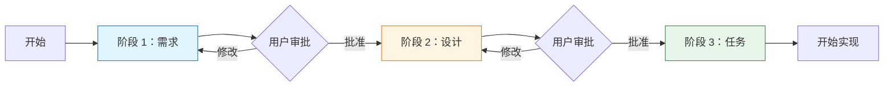
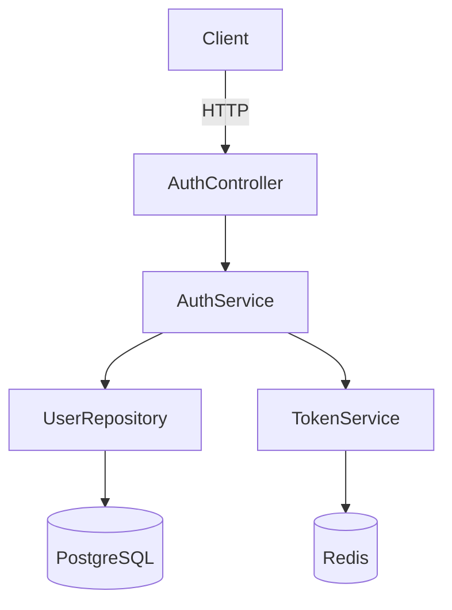
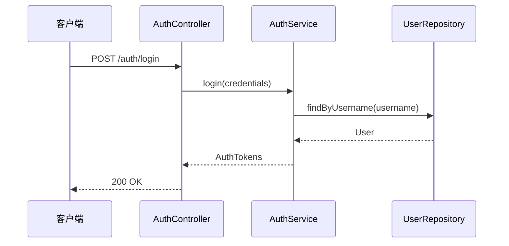
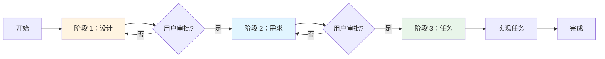
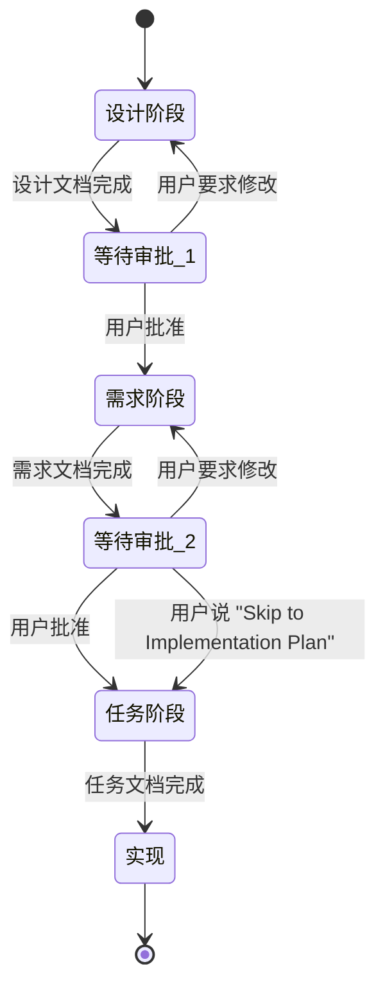
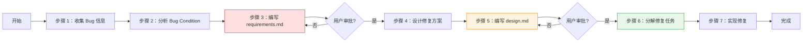

## 8. 工作流变体

Spec 工作流提供三种主要变体，适用于不同的开发场景。本章详细说明每种变体的工作流程、阶段步骤和转换规则。

### 8.1 Requirements-First 工作流

Requirements-First（需求优先）工作流是最常用的变体，适用于需求明确、业务逻辑清晰的功能开发场景。工作流按照**需求 → 设计 → 任务**的顺序推进。

#### 8.1.1 适用场景

- 需求来自明确的业务目标或用户故事
- 功能边界清晰，可以在设计之前完整描述"要做什么"
- 需要需求文档作为合同或规范（如与外部团队协作）
- 团队成员需要先理解业务需求，再讨论技术方案

**配置文件**：

```json
{
  "specId": "your-uuid-here",
  "workflowType": "requirements-first",
  "specType": "feature"
}
```

#### 8.1.2 三个阶段概览



| 阶段 | 产出物 | 核心活动 | 结束条件 |
|------|--------|---------|---------|
| 阶段 1：需求 | `requirements.md` | 定义术语、编写用户故事、制定验收标准 | 用户批准需求文档 |
| 阶段 2：设计 | `design.md` | 架构设计、组件定义、序列图、测试策略 | 用户批准设计文档 |
| 阶段 3：任务 | `tasks.md` | 任务分解、编号、依赖关系、需求引用 | 开始实现 |

#### 8.1.3 阶段 1：需求阶段详细步骤

**目标**：明确要构建什么，产出完整的 `requirements.md`。

**步骤 1：初始化 spec 目录**

```bash
mkdir -p .agents/specs/{feature-name}
cd .agents/specs/{feature-name}
```

创建 `.config.agent`：

```json
{
  "specId": "生成的 UUID v4",
  "workflowType": "requirements-first",
  "specType": "feature"
}
```

**步骤 2：与用户澄清需求**

在开始编写文档之前，向用户提出澄清问题：

- 这个功能的核心业务目标是什么？
- 主要用户是谁？他们的使用场景是什么？
- 有哪些已知的约束或限制？
- 是否有需要集成的现有系统？
- 有哪些不在范围内的内容（Out of Scope）？

**步骤 3：编写术语表**

在 `requirements.md` 中定义所有关键术语，确保文档中的术语使用一致：

```markdown
## 术语表

- **User**（用户）: 已注册并通过邮箱验证的系统账户持有者
- **Session**（会话）: 用户成功登录后创建的认证状态，包含 access token 和 refresh token
- **Access_Token**（访问令牌）: 短期有效的 JWT token，用于验证 API 请求
```

**步骤 4：编写用户故事和验收标准**

使用 EARS 模式（详见第 4 章）为每个需求编写验收标准：

```markdown
### 需求 1：用户登录

**用户故事**：作为注册用户，我希望能够使用用户名和密码登录系统，以便访问我的个人账户。

#### 验收标准

1. WHEN 用户提交有效的用户名和密码 THEN 系统应当验证凭证并返回 access token
2. WHEN 用户提交无效的凭证 THEN 系统应当返回 401 错误并显示通用错误消息
3. IF 用户连续 3 次登录失败 THEN 系统应当锁定账户 15 分钟
4. THE 系统应当在 200 毫秒内响应登录请求（95% 的情况下）
```

**步骤 5：应用 INCOSE 质量规则验证**

检查每条需求是否满足以下质量标准（详见第 4 章）：

- ✅ **Unambiguous**：没有模糊词语（"快速"、"高效"、"用户友好"）
- ✅ **Verifiable**：可以通过测试验证
- ✅ **Singular**：每条需求只描述一个行为
- ✅ **Complete**：包含所有必要的前提条件和后置条件
- ✅ **Consistent**：与其他需求不冲突

**步骤 6：停止并等待用户审批**

完成 `requirements.md` 后，向用户展示文档并明确请求审批：

```
需求文档已完成。请审阅以下内容：

[展示 requirements.md 的主要内容]

请确认：
1. 所有需求是否准确反映了你的期望？
2. 是否有遗漏的需求？
3. 是否有需要修改的验收标准？

批准后，我将开始设计阶段。
```

> ⚠️ **重要**：代理必须在此停止，等待用户明确批准后才能进入设计阶段。

#### 8.1.4 阶段 2：设计阶段详细步骤

**目标**：规划如何实现需求，产出完整的 `design.md`。

**前提条件**：需求文档已获得用户批准。

**步骤 1：设计系统架构**

基于需求文档，设计系统的整体架构：

- 识别主要组件（服务、模块、层次）
- 定义组件之间的职责边界
- 选择技术栈和关键依赖
- 绘制架构图（使用 Mermaid）

```markdown
## 架构

### 系统组件

1. **AuthController**：处理 HTTP 请求，负责路由和响应格式化
2. **AuthService**：实现核心认证业务逻辑
3. **UserRepository**：封装数据库访问
4. **TokenService**：负责 JWT token 的生成和验证

### 架构图


```

**步骤 2：定义组件接口**

为每个组件定义清晰的接口（API、方法签名、数据结构）：

```markdown
## 组件和接口

### AuthService

```typescript
interface AuthService {
  login(credentials: LoginCredentials): Promise<AuthTokens>;
  logout(userId: string, tokenId: string): Promise<void>;
  refreshToken(refreshToken: string): Promise<string>;
}
```
```

**步骤 3：绘制序列图**

为关键流程绘制序列图，展示组件之间的交互：

```markdown
## 序列图

### 登录流程


```

**步骤 4：定义正确性属性**

识别系统中需要通过属性测试验证的正确性属性（详见第 7 章）：

```markdown
## 正确性属性

1. **Token 验证的幂等性**：多次验证同一个有效 token 应返回相同结果
2. **密码哈希的单向性**：对于任意密码 p，hash(p) !== p
3. **登录-登出的状态一致性**：登出后 token 立即失效
```

**步骤 5：制定测试策略**

说明如何测试系统，包括单元测试、集成测试和属性测试的范围：

```markdown
## 测试策略

1. **单元测试**：测试 AuthService 的凭证验证逻辑、TokenService 的 token 操作
2. **集成测试**：测试完整的登录流程（HTTP 请求到数据库操作）
3. **属性测试**：验证 token 幂等性和密码哈希单向性
```

**步骤 6：停止并等待用户审批**

完成 `design.md` 后，向用户展示设计并请求审批：

```
设计文档已完成。请审阅以下内容：

[展示 design.md 的主要内容]

请确认：
1. 架构设计是否满足所有需求？
2. 组件划分是否合理？
3. 是否有技术风险或需要调整的地方？

批准后，我将开始任务分解阶段。
```

> ⚠️ **重要**：代理必须在此停止，等待用户明确批准后才能进入任务阶段。
>
> **例外情况**：如果用户回复"Skip to Implementation Plan"，代理可以直接进入任务阶段而不停止。

#### 8.1.5 阶段 3：任务阶段详细步骤

**目标**：将设计分解为可执行的离散任务，产出完整的 `tasks.md`。

**前提条件**：设计文档已获得用户批准（或用户明确要求跳过审批）。

**步骤 1：识别实现模块**

基于设计文档，识别主要的实现模块，每个模块对应一个顶级任务：

- 数据库层（schema、repository）
- 服务层（业务逻辑）
- API 层（控制器、路由）
- 测试（单元测试、集成测试）

**步骤 2：分解子任务**

将每个模块分解为具体的子任务，每个子任务应该：

- 足够小，可以在一次对话中完成
- 有明确的完成标准
- 引用相关需求（`_需求: X.X_`）

**步骤 3：确定任务顺序和依赖**

按照依赖关系排列任务：

- 被依赖的任务排在前面（如先实现数据层，再实现服务层）
- 在适当位置插入 Checkpoint 任务
- 标记可选任务（使用 `*` 后缀）

**步骤 4：创建任务依赖图**

在 `tasks.md` 末尾添加 JSON 格式的任务依赖图，说明哪些任务可以并行执行：

```json
{
  "waves": [
    { "id": 0, "tasks": ["1.1", "1.2"] },
    { "id": 1, "tasks": ["2.1", "2.2"] },
    { "id": 2, "tasks": ["3"] }
  ]
}
```

**步骤 5：验证需求覆盖**

检查所有需求是否都被至少一个任务引用：

- 遍历 `requirements.md` 中的所有验收标准
- 确认每条标准都在某个子任务的 `_需求: X.X_` 中被引用
- 如有遗漏，添加相应的任务

**步骤 6：开始实现**

任务文档完成后，代理可以开始逐一实现子任务。任务阶段不需要用户审批即可开始实现（但用户可以随时提供反馈）。

#### 8.1.6 阶段转换规则

Requirements-First 工作流的阶段转换遵循以下规则：

**规则 1：完成每个阶段后必须停止**

代理在完成需求文档或设计文档后，必须停止并等待用户审批，不得自动进入下一阶段。

```
✅ 正确行为：
代理：需求文档已完成，请审阅并批准后我将开始设计阶段。
用户：[审阅后] 批准，请继续。
代理：[开始设计阶段]

❌ 错误行为：
代理：需求文档已完成，现在开始设计阶段...
[未等待用户批准直接继续]
```

**规则 2：整合所有用户反馈后才能继续**

如果用户在审批时提出修改意见，代理必须整合所有反馈并更新文档，然后再次请求审批：

```
用户：需求 2.3 的验收标准不够清晰，请修改。
代理：[修改需求 2.3]
代理：已更新需求 2.3，请再次审阅。
用户：[审阅后] 批准。
代理：[开始设计阶段]
```

**规则 3："Skip to Implementation Plan" 例外**

如果用户在设计阶段审批时回复"Skip to Implementation Plan"，代理可以直接进入任务阶段而不停止：

```
代理：设计文档已完成，请审阅...
用户：Skip to Implementation Plan
代理：[直接开始任务分解，不再等待设计审批]
```

**规则 4：发现缺口时提供返回选项**

如果在设计阶段发现需求有缺口，或在任务阶段发现设计有缺口，代理应提供返回到先前阶段的选项：

```
代理：在设计过程中，我发现需求文档中没有说明密码重置功能的超时时间。
     有两个选项：
     A. 返回需求阶段，补充密码重置超时需求
     B. 在设计文档中做出合理假设（超时时间为 1 小时），继续设计阶段
     请选择处理方式。
```

#### 8.1.7 完整工作流示例

以下是一个完整的 Requirements-First 工作流示例，展示代理与用户的交互过程：

```
[开始]
代理：我将使用 Requirements-First 工作流为"用户认证"功能创建 spec。
     首先，我需要了解一些信息：
     1. 这个认证系统需要支持哪些登录方式？
     2. 是否需要多因素认证？
     3. 有哪些安全要求？

用户：支持用户名/密码登录，不需要多因素认证，需要账户锁定机制。

[阶段 1：需求]
代理：[创建 .agents/specs/user-authentication/ 目录和 .config.agent]
代理：[编写 requirements.md，包含术语表、用户故事和验收标准]
代理：需求文档已完成，请审阅：
     [展示 requirements.md 内容]
     批准后我将开始设计阶段。

用户：需求 1.3 的锁定时间改为 30 分钟。

代理：[更新需求 1.3]
代理：已更新，请再次确认。

用户：批准。

[阶段 2：设计]
代理：[编写 design.md，包含架构图、组件接口、序列图和测试策略]
代理：设计文档已完成，请审阅：
     [展示 design.md 内容]
     批准后我将开始任务分解。

用户：设计看起来不错，批准。

[阶段 3：任务]
代理：[编写 tasks.md，包含任务列表和依赖图]
代理：任务文档已完成，共 15 个子任务，分为 4 个模块。
     现在开始实现第一个任务：1.1 创建数据库 schema。

[开始实现]
```


### 8.2 Design-First 工作流

Design-First（设计优先）工作流适用于技术驱动的功能开发场景，例如性能优化、架构重构、技术债务清理等。工作流按照**设计 → 需求 → 任务**的顺序推进——先从技术方案出发，再反推和验证需求。

配置文件中 `workflowType` 设置为 `"design-first"`：

```json
{
  "specId": "f47ac10b-58cc-4372-a567-0e02b2c3d479",
  "workflowType": "design-first",
  "specType": "feature"
}
```

#### 8.2.1 适用场景

- 技术方案已经明确，需要从设计中反推业务需求
- 重构或架构改进项目（如将单体应用拆分为微服务）
- 性能优化项目（如引入缓存层、数据库索引优化）
- 技术债务清理（如替换过时的依赖库、统一 API 风格）
- 原型驱动开发（先有技术原型，再明确需求边界）
- 基础设施变更（如迁移到新的云服务、更换消息队列）

**不适用场景**：

- 需求来自明确的业务目标或用户故事 → 使用 Requirements-First
- 修复已知 bug → 使用 Bugfix 工作流

#### 8.2.2 三个阶段概览



| 阶段 | 产出物 | 主要内容 | 结束条件 |
|------|--------|---------|---------|
| 阶段 1：设计 | `design.md` | 技术方案、架构图、组件接口、正确性属性 | 用户批准设计 |
| 阶段 2：需求 | `requirements.md` | 从设计反推的需求、验收标准、约束条件 | 用户批准需求 |
| 阶段 3：任务 | `tasks.md` | 任务分解、编号、依赖关系、需求引用 | 开始实现 |

#### 8.2.3 阶段 1：设计阶段详细步骤

**目标**：明确技术方案，产出完整的 `design.md`。

**步骤 1：初始化 spec 目录**

```bash
mkdir -p .agents/specs/{feature-name}
```

创建 `.config.agent` 文件：

```json
{
  "specId": "<uuid-v4>",
  "workflowType": "design-first",
  "specType": "feature"
}
```

**步骤 2：了解技术背景**

代理应主动询问以下信息：

- 当前系统的技术栈和架构
- 变更的技术动机（性能问题、可维护性、扩展性等）
- 已知的技术约束（不能更改的接口、必须保持的兼容性等）
- 预期的技术目标（性能指标、代码质量指标等）

**步骤 3：编写设计文档**

`design.md` 应包含以下章节：

1. **概述**：技术方案的目标和背景
2. **架构**：系统架构图（使用 Mermaid）
3. **组件和接口**：各组件的职责和接口定义
4. **数据模型**：数据结构和存储方案
5. **序列图**：关键流程的交互图（使用 Mermaid）
6. **正确性属性**：可验证的技术属性（用于属性测试）
7. **测试策略**：单元测试、集成测试、属性测试计划
8. **迁移策略**（如适用）：从旧方案迁移到新方案的步骤
9. **实现考虑**：技术选型理由、性能考虑、兼容性处理

**步骤 4：停止并等待用户审批**

设计文档完成后，代理必须停止并展示文档内容，等待用户审批：

```
设计文档已完成，请审阅 design.md：
[展示 design.md 内容]

请确认以下内容：
1. 技术方案是否符合预期？
2. 架构设计是否合理？
3. 是否有遗漏的技术考虑？

批准后我将进入需求阶段，从设计中反推业务需求。
```

> ⚠️ **重要**：代理必须在此停止，等待用户明确批准后才能进入需求阶段。

#### 8.2.4 阶段 2：需求阶段详细步骤

**目标**：从设计中反推和验证需求，产出完整的 `requirements.md`。

Design-First 工作流中的需求阶段与 Requirements-First 不同——需求是从已有的设计中**反推**出来的，用于验证设计的完整性和合理性，而不是驱动设计。

**步骤 1：从设计中提取需求**

分析 `design.md` 中的每个组件和接口，提取隐含的需求：

- 每个组件的功能需求（它必须做什么）
- 性能需求（响应时间、吞吐量、资源限制）
- 可靠性需求（错误处理、重试机制、降级策略）
- 兼容性需求（向后兼容、接口稳定性）
- 安全需求（认证、授权、数据保护）

**步骤 2：编写需求文档**

`requirements.md` 应包含以下内容：

1. **术语表**：定义设计文档中使用的关键技术术语
2. **需求列表**：使用 EARS 模式编写从设计反推的需求
3. **约束条件**：技术约束和非功能性需求
4. **验收标准**：每个需求的可验证标准

**示例**：从"引入 Redis 缓存层"的设计中反推需求：

```markdown
### 需求 1：缓存读取

**用户故事**：作为系统，我需要在返回数据前检查缓存，以便减少数据库查询次数。

#### 验收标准

1. WHEN 系统收到数据查询请求 THEN 系统应当首先检查 Redis 缓存
2. WHEN 缓存命中 THEN 系统应当直接返回缓存数据，不查询数据库
3. WHEN 缓存未命中 THEN 系统应当查询数据库并将结果写入缓存
4. THE 缓存条目应当在 TTL 过期后自动失效

### 需求 2：缓存一致性

**用户故事**：作为系统，我需要在数据更新时同步更新缓存，以便保证数据一致性。

#### 验收标准

1. WHEN 数据库记录被更新 THEN 系统应当使对应的缓存条目失效
2. WHEN 数据库记录被删除 THEN 系统应当删除对应的缓存条目
3. IF 缓存更新失败 THEN 系统应当记录错误日志并继续正常运行
```

**步骤 3：验证需求与设计的一致性**

检查需求文档是否：
- 覆盖了设计中所有组件的功能
- 包含了设计中提到的所有性能指标
- 反映了设计中的错误处理策略
- 没有与设计相矛盾的内容

**步骤 4：停止并等待用户审批**

需求文档完成后，代理必须停止并展示文档内容，等待用户审批：

```
需求文档已完成，请审阅 requirements.md：
[展示 requirements.md 内容]

这些需求是从设计文档中反推得出的，用于验证设计的完整性。
请确认：
1. 需求是否完整覆盖了设计的功能？
2. 是否有遗漏的业务约束或非功能性需求？
3. 需求与设计是否一致？

批准后我将进入任务阶段。
```

> ⚠️ **重要**：代理必须在此停止，等待用户明确批准后才能进入任务阶段。

> **例外情况**：如果用户回复"Skip to Implementation Plan"，代理可以直接进入任务阶段而不停止。

#### 8.2.5 阶段 3：任务阶段详细步骤

**目标**：将设计分解为可执行的离散任务，产出完整的 `tasks.md`。

Design-First 工作流的任务阶段与 Requirements-First 相同，但任务分解的依据主要来自设计文档，需求文档用于确保可追溯性。

**步骤 1：分解设计为任务**

按照设计文档中的组件和模块，将实现工作分解为具体任务：

- 每个组件对应一个顶级任务（如 `1. 实现缓存服务`）
- 每个组件的子功能对应子任务（如 `1.1 实现缓存读取逻辑`）
- 迁移步骤单独列为任务（如 `4. 数据迁移`）
- 测试任务与实现任务并列（如 `1.2 编写缓存服务单元测试`）

**步骤 2：添加需求引用**

每个子任务应引用相关需求，确保可追溯性：

```markdown
- [ ] 1.1 实现缓存读取逻辑
  - 检查 Redis 缓存是否存在对应 key
  - 缓存命中时直接返回，缓存未命中时查询数据库
  - _需求: 1.1, 1.2, 1.3_
```

**步骤 3：标记任务依赖**

在任务文档末尾添加依赖图，说明任务之间的执行顺序：

```json
{
  "waves": [
    { "id": 0, "tasks": ["1.1"] },
    { "id": 1, "tasks": ["1.2", "2.1"] },
    { "id": 2, "tasks": ["3.1"] },
    { "id": 3, "tasks": ["4.1"] }
  ]
}
```

**步骤 4：开始实现**

任务文档完成后，代理可以开始逐一实现子任务。任务阶段不需要用户审批即可开始实现（但用户可以随时提供反馈）。

#### 8.2.6 阶段转换规则

Design-First 工作流的阶段转换遵循以下规则：



**规则汇总**：

| 转换点 | 触发条件 | 代理行为 |
|--------|---------|---------|
| 设计 → 需求 | 设计文档完成 | 停止，展示文档，等待用户批准 |
| 需求 → 任务 | 需求文档完成 | 停止，展示文档，等待用户批准 |
| 需求 → 任务（快速） | 用户说"Skip to Implementation Plan" | 直接进入任务阶段，不停止 |
| 任务 → 实现 | 任务文档完成 | 直接开始实现，无需审批 |
| 任意阶段 → 上一阶段 | 发现设计或需求有缺口 | 提示用户，提供返回选项 |

**返回上一阶段**：

如果在需求阶段发现设计有重大缺陷，代理应提示用户：

```
在编写需求文档时，我发现设计中存在以下问题：
1. 缓存失效策略未明确定义
2. 并发写入场景下的一致性保证缺失

建议返回设计阶段补充这些内容。是否需要修改设计文档？
```

#### 8.2.7 与 Requirements-First 工作流的主要区别

| 对比维度 | Requirements-First | Design-First |
|---------|-------------------|--------------|
| **起点** | 业务需求、用户故事 | 技术方案、架构设计 |
| **阶段顺序** | 需求 → 设计 → 任务 | 设计 → 需求 → 任务 |
| **需求的作用** | 驱动设计 | 验证设计的完整性 |
| **设计的作用** | 实现需求的方案 | 出发点，定义技术边界 |
| **适用场景** | 业务功能开发 | 技术重构、性能优化 |
| **配置文件** | `"workflowType": "requirements-first"` | `"workflowType": "design-first"` |
| **需求文档** | 先于设计编写 | 从设计中反推 |
| **用户参与** | 需求阶段需要大量用户输入 | 设计阶段需要大量用户输入 |

**核心区别**：在 Requirements-First 中，需求是"因"，设计是"果"；在 Design-First 中，设计是"因"，需求是对设计的"验证和文档化"。

#### 8.2.8 完整工作流示例

以下是一个完整的 Design-First 工作流示例，展示代理与用户的交互过程：

```
[开始]
用户：我们需要将现有的数据库查询层重构为带缓存的架构，使用 Redis。

代理：我将使用 Design-First 工作流为"缓存层重构"功能创建 spec。
     首先，我需要了解一些技术背景：
     1. 当前数据库查询的性能瓶颈在哪里？
     2. 哪些数据适合缓存（读多写少）？
     3. 对缓存一致性有什么要求？
     4. 是否有现有的 Redis 实例可以使用？

用户：主要是用户资料查询太慢，读写比约 10:1，需要最终一致性，已有 Redis 集群。

[阶段 1：设计]
代理：[创建 .agents/specs/cache-layer-refactor/ 目录和 .config.agent]
代理：[编写 design.md，包含缓存架构图、CacheService 接口、序列图和正确性属性]
代理：设计文档已完成，请审阅：
     [展示 design.md 内容]
     批准后我将进入需求阶段，从设计中反推业务需求。

用户：设计看起来不错，但需要添加缓存预热策略。

代理：[更新 design.md，添加缓存预热章节]
代理：已更新，请再次确认。

用户：批准。

[阶段 2：需求]
代理：[分析 design.md，提取隐含需求，编写 requirements.md]
代理：需求文档已完成，请审阅：
     [展示 requirements.md 内容]
     这些需求从设计中反推，用于验证设计的完整性。

用户：需要添加一条需求：缓存命中率必须达到 80% 以上。

代理：[更新 requirements.md，添加性能需求]
代理：已更新，批准后我将开始任务分解。

用户：批准。

[阶段 3：任务]
代理：[编写 tasks.md，包含任务列表和依赖图]
代理：任务文档已完成，共 12 个子任务，分为 3 个模块：
     1. CacheService 实现（4 个子任务）
     2. 数据访问层集成（4 个子任务）
     3. 缓存预热和监控（4 个子任务）
     现在开始实现第一个任务：1.1 创建 CacheService 接口。

[开始实现]
```


### 8.3 Bugfix 工作流

Bugfix 工作流专门用于修复已知 bug，其核心是**精确描述 bug condition（bug 条件）**，而不是描述新功能需求。通过三个维度的分析——当前行为、预期行为、不变行为——确保修复准确、范围最小化，并且不引入新的问题。

配置文件中 `specType` 设置为 `"bugfix"`，**不需要** `workflowType` 字段：

```json
{
  "specId": "7c9e6679-7425-40de-944b-e07fc1f90ae7",
  "specType": "bugfix"
}
```

#### 8.3.1 Bug Condition 方法论

**什么是 Bug Condition？**

Bug condition（bug 条件）是对 bug 的精确描述，包含三个维度：

1. **当前行为（Current Behavior）**：系统实际表现出的错误行为——在什么输入或操作下，系统做了什么错误的事情
2. **预期行为（Expected Behavior）**：系统应该表现出的正确行为——在相同的输入或操作下，系统应该做什么
3. **不变行为（Invariant Behavior）**：修复过程中不应该改变的行为——哪些现有功能必须保持不变，防止修复引入新 bug

**为什么使用 Bug Condition 而不是直接修复？**

直接修复 bug 的常见问题：

- **范围蔓延**：修复过程中顺手改了其他代码，引入新问题
- **修复不完整**：只修复了表面症状，没有解决根本原因
- **回归风险**：修复破坏了其他功能，但没有意识到
- **难以验证**：不清楚修复是否真正解决了问题

Bug condition 方法论通过精确定义"什么是 bug"和"什么不是 bug"，解决上述问题：

- **精确范围**：只修复 bug condition 描述的问题，不做额外改动
- **可验证性**：预期行为提供了明确的验证标准
- **防止回归**：不变行为分析确保修复不破坏现有功能
- **根因分析**：三个维度的分析迫使开发者深入理解 bug 的本质

**三个维度的详细说明**

**维度 1：当前行为（Current Behavior）**

描述系统实际表现出的错误行为，需要包含：

- **触发条件**：什么操作或输入会触发这个 bug
- **错误表现**：系统做了什么错误的事情（错误消息、错误结果、崩溃等）
- **复现步骤**：如何稳定地复现这个 bug
- **影响范围**：哪些用户或场景受到影响

```markdown
**当前行为示例**：
当用户在登录表单中输入包含特殊字符（如 `'` 或 `"`)的密码时，
系统返回 500 Internal Server Error，而不是正常处理登录请求。
复现步骤：
1. 打开登录页面
2. 输入用户名：testuser
3. 输入密码：pass'word
4. 点击登录按钮
5. 观察到 500 错误
```

**维度 2：预期行为（Expected Behavior）**

描述系统应该表现出的正确行为，需要包含：

- **正确结果**：在相同触发条件下，系统应该做什么
- **验证标准**：如何判断修复是否成功
- **边界条件**：修复后应该处理哪些相关的边界情况

```markdown
**预期行为示例**：
当用户输入包含特殊字符的密码时，系统应当：
1. 正确处理密码中的特殊字符（不将其解释为 SQL 语法）
2. 验证密码是否与数据库中存储的哈希值匹配
3. 如果密码正确，正常完成登录流程
4. 如果密码错误，返回标准的"用户名或密码错误"提示
```

**维度 3：不变行为（Invariant Behavior）**

描述修复过程中不应该改变的行为，这是防止引入新 bug 的关键：

- **现有功能**：哪些功能在修复前是正常工作的，修复后必须继续正常工作
- **性能指标**：修复不应该显著降低系统性能
- **接口兼容性**：修复不应该改变公共 API 的行为
- **数据完整性**：修复不应该影响现有数据的正确性

```markdown
**不变行为示例**：
修复不应该影响以下现有功能：
1. 使用普通字母数字密码的用户登录流程（必须继续正常工作）
2. 密码错误时的账户锁定机制（3 次失败后锁定 15 分钟）
3. 登录成功后的 session 创建和 token 生成
4. 登录日志记录功能
5. 登录接口的响应时间（不应超过 200ms）
```

#### 8.3.2 Bugfix Spec 文档结构

Bugfix spec 使用与 feature spec 相同的目录结构，但文件内容有所不同：

```
.agents/specs/{bug-name}/
├── .config.agent          # specType 为 "bugfix"，无 workflowType
├── requirements.md        # 包含 bug condition 分析（三个维度）
├── design.md              # 修复方案设计
└── tasks.md               # 修复任务分解
```

**`.config.agent` 配置**

Bugfix spec 的配置文件只需要 `specId` 和 `specType` 两个字段：

```json
{
  "specId": "7c9e6679-7425-40de-944b-e07fc1f90ae7",
  "specType": "bugfix"
}
```

**注意**：不需要 `workflowType` 字段，因为 bugfix 有自己固定的工作流（Bug 分析 → 设计 → 任务）。

**`requirements.md` 的特殊格式**

Bugfix 的 `requirements.md` 以 bug condition 分析为核心，格式如下：

```markdown
# Bug 分析：{bug 名称}

## Bug 信息

- **Bug ID**：{issue 编号或内部 ID}
- **严重程度**：Critical / High / Medium / Low
- **影响版本**：{受影响的版本}
- **报告日期**：{日期}

## Bug Condition 分析

### 当前行为（Current Behavior）

{描述系统实际表现出的错误行为}

**触发条件**：
{什么操作或输入会触发这个 bug}

**复现步骤**：
1. {步骤 1}
2. {步骤 2}
3. {步骤 3}

**错误表现**：
{系统做了什么错误的事情}

### 预期行为（Expected Behavior）

{描述系统应该表现出的正确行为}

**正确结果**：
{在相同触发条件下，系统应该做什么}

**验证标准**：
{如何判断修复是否成功}

### 不变行为（Invariant Behavior）

修复过程中，以下行为必须保持不变：

1. {不变行为 1}
2. {不变行为 2}
3. {不变行为 3}

## 根因分析

{对 bug 根本原因的分析，说明为什么会出现当前行为}

## 修复范围

修复应当**仅限于**解决上述 bug condition，不应包含：
- {不在范围内的改动 1}
- {不在范围内的改动 2}
```

**`design.md` 的内容**

Bugfix 的 `design.md` 专注于修复方案，应包含：

1. **修复方案概述**：选择的修复方法及其理由
2. **代码变更范围**：需要修改的文件和函数
3. **修复实现细节**：具体的代码变更说明
4. **测试策略**：
   - 如何验证 bug 已修复（针对预期行为）
   - 如何验证不变行为未被破坏（回归测试）
   - 是否需要属性测试（如果 bug 涉及边界条件）

**`tasks.md` 的内容**

Bugfix 的 `tasks.md` 通常比 feature spec 更简洁，任务分解应包含：

1. **编写 bug 复现测试**：先写一个能复现 bug 的测试（测试驱动修复）
2. **实现修复**：按照 design.md 中的方案修改代码
3. **验证不变行为**：运行回归测试，确保不变行为未被破坏
4. **更新文档**（如适用）：更新受影响的文档或注释

#### 8.3.3 Bugfix 工作流步骤

Bugfix 工作流按照**Bug 分析 → 设计 → 任务**的顺序推进。



**步骤 1：收集 Bug 信息**

在开始分析之前，收集以下信息：

- **复现步骤**：如何稳定地触发这个 bug
- **错误信息**：错误消息、堆栈跟踪、日志输出
- **环境信息**：操作系统、浏览器版本、应用版本
- **影响范围**：哪些用户或场景受到影响
- **发现时间**：bug 是什么时候开始出现的（帮助定位引入 bug 的变更）

向用户提出澄清问题：

```
为了准确分析这个 bug，我需要了解以下信息：
1. 能否提供稳定复现这个 bug 的步骤？
2. 错误发生时有什么具体的错误消息或日志？
3. 这个 bug 是什么时候开始出现的？之前是否正常工作？
4. 哪些用户或场景受到影响？
5. 是否有已知的临时解决方案（workaround）？
```

**步骤 2：分析 Bug Condition（三个维度）**

基于收集到的信息，分析 bug 的三个维度：

- **当前行为**：精确描述 bug 的触发条件和错误表现
- **预期行为**：明确系统应该如何正确处理这种情况
- **不变行为**：列出修复时必须保持不变的现有功能

**步骤 3：编写 `requirements.md`**

创建 spec 目录和配置文件，然后编写包含 bug condition 分析的 `requirements.md`：

```bash
mkdir -p .agents/specs/{bug-name}
```

`.config.agent`：
```json
{
  "specId": "<uuid-v4>",
  "specType": "bugfix"
}
```

完成 `requirements.md` 后，停止并等待用户审批：

```
Bug 分析文档已完成，请审阅 requirements.md：
[展示 requirements.md 内容]

请确认：
1. 当前行为的描述是否准确？
2. 预期行为是否符合你的期望？
3. 不变行为列表是否完整？

批准后，我将开始设计修复方案。
```

> ⚠️ **重要**：代理必须在此停止，等待用户明确批准后才能进入设计阶段。

**步骤 4：设计修复方案**

基于 bug condition 分析，设计最小化的修复方案：

- 定位 bug 的根本原因（哪个函数、哪行代码）
- 选择修复方法（修改逻辑、添加验证、修复边界条件等）
- 评估修复对不变行为的影响
- 规划测试策略（如何验证修复有效且不引入回归）

**步骤 5：编写 `design.md`**

将修复方案文档化，完成后停止并等待用户审批：

```
修复方案设计已完成，请审阅 design.md：
[展示 design.md 内容]

请确认：
1. 修复方案是否准确解决了 bug condition？
2. 修复范围是否最小化（没有不必要的改动）？
3. 测试策略是否足够覆盖预期行为和不变行为？

批准后，我将开始任务分解。
```

> ⚠️ **重要**：代理必须在此停止，等待用户明确批准后才能进入任务阶段。

**步骤 6：分解修复任务**

将修复工作分解为具体任务，编写 `tasks.md`：

```markdown
# 修复计划：{bug 名称}

## 任务

- [ ] 1. 编写 bug 复现测试
  - [ ] 1.1 编写能复现当前错误行为的测试用例
    - 测试应当在修复前失败，修复后通过
    - _需求: bug condition - 当前行为_

- [ ] 2. 实现修复
  - [ ] 2.1 {具体的代码修改任务}
    - {修改说明}
    - _需求: bug condition - 预期行为_

- [ ] 3. 验证不变行为
  - [ ] 3.1 运行现有回归测试套件
    - 确认所有不变行为测试通过
    - _需求: bug condition - 不变行为_
  - [ ] 3.2 手动验证关键不变行为场景
    - {需要手动验证的场景列表}
```

**步骤 7：实现修复**

按照任务列表逐一实现修复，遵循以下原则：

- **最小化修改**：只修改 bug condition 描述的问题，不做额外改动
- **测试驱动**：先写复现测试，再实现修复，确保测试从失败变为通过
- **验证不变行为**：每次修改后运行回归测试，确保不变行为未被破坏

#### 8.3.4 Bugfix Requirements.md 模板

以下是一个完整的 bugfix `requirements.md` 模板：

```markdown
# Bug 分析：{bug 名称}

## Bug 信息

- **Bug ID**：{issue 编号}
- **严重程度**：{Critical / High / Medium / Low}
- **影响版本**：{版本号}
- **报告日期**：{YYYY-MM-DD}
- **环境**：{操作系统、浏览器、运行环境等}

## Bug Condition 分析

### 当前行为（Current Behavior）

**触发条件**：
{描述触发 bug 的具体操作或输入}

**复现步骤**：
1. {步骤 1}
2. {步骤 2}
3. {步骤 3}
4. 观察到：{错误表现}

**错误表现**：
{详细描述系统的错误行为，包括错误消息、错误结果或异常状态}

**错误日志**（如有）：
```
{粘贴相关的错误日志或堆栈跟踪}
```

### 预期行为（Expected Behavior）

**正确结果**：
{描述在相同触发条件下，系统应该做什么}

**验证标准**：
1. {验证标准 1：如何判断修复是否成功}
2. {验证标准 2}
3. {验证标准 3}

### 不变行为（Invariant Behavior）

修复过程中，以下行为必须保持不变：

1. {不变行为 1：描述必须继续正常工作的功能}
2. {不变行为 2}
3. {不变行为 3}
4. {性能指标：如响应时间不应超过 Xms}

## 根因分析

**根本原因**：
{分析 bug 的根本原因，说明为什么会出现当前行为}

**相关代码位置**：
- `{文件路径}:{行号}` - {说明}

## 修复范围

**在范围内**：
- {需要修改的内容 1}
- {需要修改的内容 2}

**不在范围内**（不应在此次修复中改动）：
- {不应改动的内容 1}
- {不应改动的内容 2}
```

#### 8.3.5 完整 Bugfix 工作流示例

以下是一个完整的 bugfix 工作流示例，展示代理与用户的交互过程：

**场景**：修复登录时密码包含特殊字符导致 500 错误的 bug。

```
[开始]
用户：我们有一个 bug：用户输入包含单引号的密码时，登录接口返回 500 错误。

代理：我将使用 Bugfix 工作流来分析和修复这个问题。
     首先，我需要收集更多信息：
     1. 能否提供稳定复现这个 bug 的步骤？
     2. 500 错误时有什么具体的错误日志？
     3. 这个 bug 是什么时候开始出现的？
     4. 是否所有包含特殊字符的密码都会触发，还是只有单引号？

用户：复现步骤：输入密码 pass'word 然后点击登录。
     日志显示：ERROR: syntax error at or near "word" - 看起来是 SQL 注入问题。
     一直都有这个问题，刚发现。所有特殊字符都可能有问题。

[步骤 1-2：收集信息并分析 Bug Condition]
代理：[分析三个维度]
     当前行为：密码中的单引号被直接拼接到 SQL 查询中，导致 SQL 语法错误
     预期行为：密码应当作为参数化查询的参数传递，不被解释为 SQL 语法
     不变行为：普通密码登录、账户锁定机制、session 创建等必须继续正常工作

[步骤 3：编写 requirements.md]
代理：[创建 .agents/specs/fix-login-sql-injection/ 目录]
代理：[编写 requirements.md，包含完整的 bug condition 分析]
代理：Bug 分析文档已完成，请审阅：

     ## Bug Condition 分析

     ### 当前行为
     当用户输入包含单引号（'）或其他 SQL 特殊字符的密码时，
     系统将密码直接拼接到 SQL 查询字符串中，导致 SQL 语法错误，
     返回 500 Internal Server Error。

     ### 预期行为
     系统应当使用参数化查询（Parameterized Query）处理密码，
     将密码作为查询参数而非 SQL 语句的一部分，
     正确验证密码并返回相应的登录结果。

     ### 不变行为
     1. 使用普通字母数字密码的登录流程必须继续正常工作
     2. 密码错误时的 401 响应和错误消息必须保持不变
     3. 账户锁定机制（3 次失败后锁定 15 分钟）必须继续工作
     4. 登录成功后的 session 创建和 token 生成必须正常
     5. 登录接口响应时间不应超过 200ms

     请确认分析是否准确，批准后我将设计修复方案。

用户：分析准确，批准。

[步骤 4-5：设计修复方案]
代理：[分析代码，定位 SQL 拼接问题]
代理：[编写 design.md，说明将 SQL 拼接改为参数化查询的方案]
代理：修复方案设计已完成，请审阅：

     ## 修复方案

     **根本原因**：`auth/repository.js` 第 42 行使用字符串拼接构建 SQL 查询：
     ```javascript
     // 当前代码（有问题）
     const query = `SELECT * FROM users WHERE username='${username}' AND password_hash='${hash}'`;
     ```

     **修复方案**：改为参数化查询：
     ```javascript
     // 修复后代码
     const query = 'SELECT * FROM users WHERE username=$1 AND password_hash=$2';
     const params = [username, hash];
     ```

     **修复范围**：仅修改 `auth/repository.js` 第 42 行，不涉及其他文件。

     请确认修复方案，批准后我将开始任务分解。

用户：批准。

[步骤 6：分解修复任务]
代理：[编写 tasks.md]
代理：任务文档已完成，共 3 个任务：
     1. 编写 bug 复现测试（测试包含特殊字符密码的登录）
     2. 将 SQL 拼接改为参数化查询
     3. 运行回归测试验证不变行为

[步骤 7：实现修复]
代理：开始实现任务 1.1：编写 bug 复现测试...
```

#### 8.3.6 Bugfix 工作流的关键原则

**原则 1：修复范围最小化**

Bugfix 的核心原则是**只修复 bug condition 描述的问题**，不做额外改动。即使在修复过程中发现了其他问题，也应该：

- 记录发现的其他问题（创建新的 bug 报告）
- 在当前 spec 中只修复已分析的 bug condition
- 避免"顺手"修改其他代码

**原则 2：不变行为分析是防止回归的关键**

不变行为分析不是可选的——它是防止修复引入新 bug 的核心机制。在编写不变行为列表时，应该：

- 列出所有与 bug 相关的功能（即使看起来不受影响）
- 包含性能指标（修复不应该显著降低性能）
- 包含接口兼容性（修复不应该改变 API 行为）

**原则 3：测试驱动修复**

推荐使用测试驱动的方式实现修复：

1. 先编写一个能复现 bug 的测试（此时测试应该失败）
2. 实现修复（使测试通过）
3. 运行回归测试（确保不变行为未被破坏）

这种方式确保修复是可验证的，并且防止 bug 在未来重新出现。

**原则 4：Bugfix Spec 不使用 workflowType**

Bugfix spec 的配置文件中不需要 `workflowType` 字段，因为 bugfix 有固定的工作流（Bug 分析 → 设计 → 任务）。如果配置文件中包含 `workflowType`，代理应当忽略它。

```json
// ✅ 正确的 bugfix 配置
{
  "specId": "7c9e6679-7425-40de-944b-e07fc1f90ae7",
  "specType": "bugfix"
}

// ❌ 不推荐（包含不必要的 workflowType）
{
  "specId": "7c9e6679-7425-40de-944b-e07fc1f90ae7",
  "workflowType": "requirements-first",
  "specType": "bugfix"
}
```

#### 8.3.7 与 Feature 工作流的主要区别

| 对比维度 | Feature 工作流 | Bugfix 工作流 |
|---------|--------------|--------------|
| **目标** | 实现新功能 | 修复已知 bug |
| **配置文件** | 需要 `workflowType` | 不需要 `workflowType` |
| **需求文档** | 用户故事 + 验收标准 | Bug condition 分析（三个维度） |
| **设计重点** | 如何实现功能 | 如何最小化修复 bug |
| **任务重点** | 功能实现任务 | 复现测试 + 修复 + 回归验证 |
| **范围控制** | 功能边界 | 修复范围最小化 |
| **不变行为** | 不适用 | 核心分析维度，防止回归 |
| **测试策略** | 验证新功能 | 验证修复 + 回归测试 |


