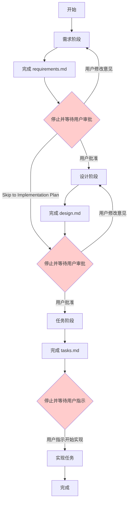
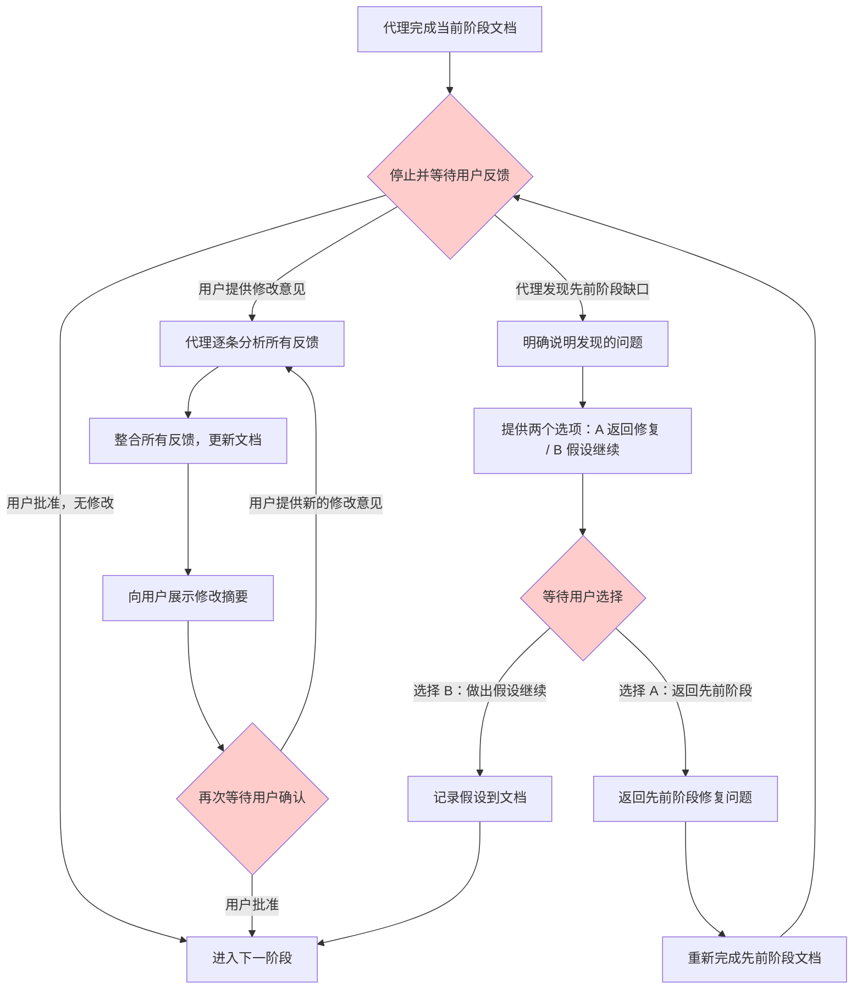

## 9. 阶段转换规则

本章定义代理在 Spec 工作流各阶段之间转换时必须遵守的规则，包括停止规则、审批规则和例外情况。

### 9.1 停止和审批规则

_需求引用: 8.1, 8.2, 8.4_

#### 9.1.1 停止规则

**代理必须在完成每个阶段的文档后立即停止执行，等待用户审批。**

具体而言，在以下时机代理必须停止：

- **需求阶段结束时**：完成 `requirements.md`（或 `bugfix.md`）的编写后，代理必须停止，不得自行进入设计阶段
- **设计阶段结束时**：完成 `design.md` 的编写后，代理必须停止，不得自行进入任务阶段
- **任务阶段结束时**：完成 `tasks.md` 的编写后，代理必须停止，等待用户指示开始实现

停止时，代理应当明确告知用户：

1. 当前阶段已完成
2. 产出物的位置（文件路径）
3. 下一阶段是什么
4. 等待用户的批准或反馈

**示例停止消息**：

```
需求文档已完成，保存在 .agent/specs/user-authentication/requirements.md。

文档包含以下内容：
- 术语表（5 个术语）
- 需求 1：用户登录（5 条验收标准）
- 需求 2：会话管理（4 条验收标准）
- 需求 3：密码重置（6 条验收标准）

下一步是设计阶段（design.md）。

请审阅需求文档，如有修改意见请告知，或回复"批准"继续进入设计阶段。
```

#### 9.1.2 审批规则

**代理必须等待用户明确批准后，才能进入下一阶段。**

用户批准的形式包括但不限于：

- 回复"批准"、"approve"、"ok"、"继续"等表示同意的词语
- 提供修改意见后说明"修改后继续"
- 明确指示进入下一阶段（如"开始设计"）

在等待批准期间，代理应当：

- **不得**自行进入下一阶段
- **不得**假设用户已批准
- **应当**响应用户的修改请求，更新当前阶段文档后再次等待批准

如果用户提供了修改意见，代理应当：

1. 整合所有用户反馈，更新当前阶段文档
2. 告知用户已完成修改
3. 再次等待用户批准

#### 9.1.3 "Skip to Implementation Plan"例外

**当用户在需求阶段回复"Skip to Implementation Plan"时，代理可以跳过设计阶段，直接从需求阶段进入任务阶段，无需额外停止等待。**

此例外规则的适用条件：

- 用户必须在需求阶段（即代理等待需求审批时）发出此指令
- 指令内容为"Skip to Implementation Plan"（不区分大小写）
- 代理在收到此指令后，可以连续完成设计文档和任务文档，中间无需停止

**例外流程示意**：

```
[正常流程]
需求阶段 → 停止等待 → 用户批准 → 设计阶段 → 停止等待 → 用户批准 → 任务阶段

[Skip to Implementation Plan 例外]
需求阶段 → 停止等待 → 用户回复 "Skip to Implementation Plan"
         → 设计阶段（不停止）→ 任务阶段 → 停止等待用户指示开始实现
```

**注意**：即使使用此例外，代理在完成任务文档后仍然必须停止，等待用户指示开始实现任务。

#### 9.1.4 阶段转换流程图



#### 9.1.5 规则总结

| 规则 | 说明 |
|------|------|
| **停止规则** | 每个阶段文档完成后必须停止，不得自行进入下一阶段 |
| **审批规则** | 必须等待用户明确批准后才能继续 |
| **反馈整合** | 收到修改意见后，整合反馈并更新文档，再次等待批准 |
| **Skip 例外** | 用户回复"Skip to Implementation Plan"时，可跳过设计阶段直接进入任务阶段 |
| **实现前停止** | 任务文档完成后仍需停止，等待用户指示开始实现 |

### 9.2 反馈整合规则

_需求引用: 8.3, 8.5_

#### 9.2.1 反馈整合规则

**代理在收到用户反馈后，必须整合所有反馈意见，不得遗漏任何一条。**

具体规则如下：

- **完整整合**：代理必须整合用户提供的**所有**反馈意见，不得选择性地忽略任何一条
- **更新文档**：整合反馈后，必须更新当前阶段的文档（`requirements.md`、`design.md` 或 `tasks.md`）
- **展示修改**：更新完成后，必须再次向用户展示修改内容，并等待用户确认
- **禁止跳过**：不得在反馈未完全整合的情况下进入下一阶段

**反馈整合流程**：

1. 用户提供反馈意见（可能包含多条）
2. 代理逐条分析所有反馈
3. 代理更新当前阶段文档，整合所有修改
4. 代理向用户展示修改摘要（哪些内容被修改、如何修改）
5. 代理再次等待用户批准

**示例反馈整合消息**：

```
已根据您的反馈更新需求文档，具体修改如下：

1. **需求 1.2（会话超时）**：将超时时间从 30 分钟改为 60 分钟 ✓
2. **需求 2.1（密码强度）**：添加了"至少包含一个特殊字符"的要求 ✓
3. **术语表**：添加了"Session Token"的定义 ✓

所有 3 条反馈已整合完毕。请审阅更新后的文档，如无问题请回复"批准"继续进入设计阶段。
```

#### 9.2.2 返回先前阶段的选项

**当代理在当前阶段发现先前阶段存在缺口或问题时，必须提供返回先前阶段的选项。**

**触发场景**：

- **设计阶段发现需求缺口**：在编写 `design.md` 时，发现 `requirements.md` 遗漏了某个功能需求（例如：设计时发现需要缓存层，但需求文档中没有相关性能需求）
- **任务阶段发现设计缺口**：在编写 `tasks.md` 时，发现 `design.md` 存在缺口（例如：某个组件的接口未定义，导致无法分解为具体任务）
- **实现过程中发现根本性问题**：在实现任务时，发现需求或设计存在根本性问题（例如：需求相互矛盾，或设计方案在技术上不可行）

**提供返回选项时，代理应当**：

1. **明确说明问题**：清楚描述在当前阶段发现了什么问题，以及它属于哪个先前阶段的缺口
2. **提供两个选项**：
   - **选项 A**：返回先前阶段修复问题（推荐）
   - **选项 B**：在当前阶段做出合理假设继续
3. **等待用户选择**：不得自行决定，必须等待用户明确选择

**示例返回选项消息**：

```
在设计阶段，我发现需求文档存在一个缺口：

**问题**：用户认证功能需要支持"记住我"（Remember Me）选项，这会影响 token 的有效期设计。
但当前需求文档（需求 1.2）中没有提及此功能，导致无法确定 token 有效期的设计方案。

请选择处理方式：

**选项 A（推荐）：返回需求阶段**
- 在 requirements.md 中添加"记住我"功能的需求
- 明确 token 有效期的业务规则
- 完成后重新进入设计阶段

**选项 B：在当前阶段做出假设继续**
- 假设"记住我"功能不在本次 spec 范围内
- 设计中使用固定的 token 有效期（30 分钟）
- 在设计文档中记录此假设，供后续参考

请告知您的选择（A 或 B）。
```

#### 9.2.3 反馈整合流程图



#### 9.2.4 规则总结

| 规则 | 说明 |
|------|------|
| **完整整合** | 必须整合用户提供的所有反馈，不得遗漏任何一条 |
| **更新文档** | 整合反馈后，必须更新当前阶段的文档 |
| **展示修改** | 更新完成后，必须向用户展示修改摘要并等待确认 |
| **禁止跳过** | 不得在反馈未完全整合的情况下进入下一阶段 |
| **识别缺口** | 在当前阶段发现先前阶段缺口时，必须主动提出 |
| **提供选项** | 发现缺口时，必须提供"返回修复"和"假设继续"两个选项 |
| **等待选择** | 不得自行决定如何处理缺口，必须等待用户明确选择 |


