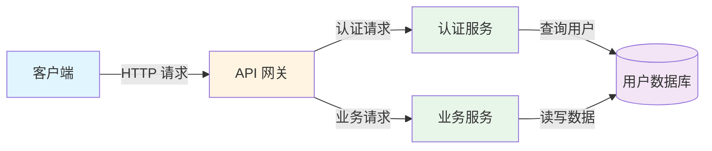
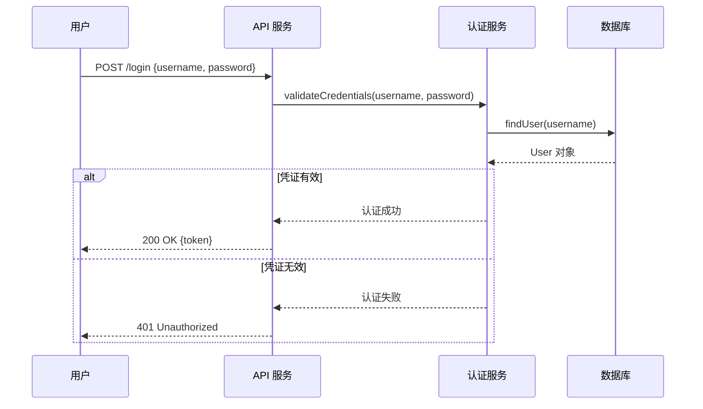

## 10. 最佳实践

本章汇总了在 Spec 工作流各阶段中积累的实践经验，帮助通用编码代理和开发者编写更高质量的需求、设计和任务文档。

### 10.1 需求编写技巧

#### 10.1.1 正确选择和应用 EARS 模式

选择合适的 EARS 模式是编写清晰需求的第一步。以下是常见的选择误区和正确做法：

**误区 1：将所有需求都写成 Event-driven 模式**

```
❌ WHEN the system starts THEN the system SHALL encrypt all data at rest
❌ WHEN a user is logged in THEN the system SHALL display the dashboard
```

**问题**：第一个需求是系统的持续性约束，应使用 Ubiquitous 模式；第二个需求描述的是状态下的行为，应使用 State-driven 模式。

```
✅ THE system SHALL encrypt all data at rest using AES-256 encryption
✅ WHILE a user session is active the system SHALL display the user dashboard
```

**误区 2：将错误处理写成 Event-driven 模式**

```
❌ WHEN a user enters wrong password THEN the system SHALL show an error
```

**问题**：密码错误是一个"不期望事件"，应使用 Unwanted event 模式，更清晰地表达这是异常情况。

```
✅ IF a user enters incorrect credentials THEN the system SHALL display an authentication error message
```

**EARS 模式快速选择口诀**：
- 总是成立 → **Ubiquitous**（THE system SHALL）
- 事件触发 → **Event-driven**（WHEN...THEN）
- 状态持续 → **State-driven**（WHILE...SHALL）
- 错误异常 → **Unwanted event**（IF...THEN）
- 功能开关 → **Optional feature**（WHERE...SHALL）
- 多条件组合 → **Complex**（WHEN...WHILE...）

#### 10.1.2 遵循 INCOSE 质量规则的实践技巧

**技巧 1：用数字消除模糊性（Unambiguous 规则）**

每当你写出"快速"、"高效"、"及时"、"大量"等形容词时，立即用具体数字替换：

| 模糊表达 | 具体表达 |
|---------|---------|
| 快速响应 | 在 200ms 内响应 |
| 高可用性 | 99.9% 月度可用性 |
| 支持大量用户 | 支持 10,000 并发用户 |
| 定期备份 | 每 24 小时备份一次 |
| 较小的文件 | 不超过 10MB 的文件 |

**技巧 2：为每个需求设计验证方法（Verifiable 规则）**

在写完需求后，立即问自己："如何测试这个需求？"如果无法回答，需求可能不够具体：

```
❌ THE system SHALL be user-friendly
→ 如何测试"用户友好"？无法测试，需求无效。

✅ THE system SHALL allow users to complete the registration process in under 3 minutes
→ 如何测试？计时用户完成注册流程，验证时间 < 3 分钟。✓
```

**技巧 3：一次只写一件事（Singular 规则）**

检查需求中是否包含"并且"、"同时"、"以及"等连接词。如果有，通常意味着需要拆分：

```
❌ WHEN a user registers THEN the system SHALL create an account, send a verification email, 
   and log the registration event

✅ WHEN a user submits a registration form THEN the system SHALL create a new user account
✅ WHEN a user account is created THEN the system SHALL send a verification email to the provided address
✅ WHEN a user account is created THEN the system SHALL log the registration event with timestamp
```

**技巧 4：建立需求编号体系（Traceable 规则）**

使用层次化编号确保可追溯性：

```markdown
### 需求 1：用户认证

#### 需求 1.1：用户登录
WHEN a user submits valid credentials THEN the system SHALL authenticate the user

#### 需求 1.2：会话管理
WHILE a user session is active the system SHALL maintain authentication state

#### 需求 1.3：登录失败处理
IF a user enters incorrect credentials three times THEN the system SHALL lock the account
```

#### 10.1.3 常见需求编写错误及避免方法

**错误 1：需求包含实现细节**

```
❌ WHEN a user logs in THEN the system SHALL call AuthService.authenticate() 
   and store the JWT token in Redis with a 30-minute TTL

✅ WHEN a user logs in with valid credentials THEN the system SHALL create 
   an authenticated session valid for 30 minutes
```

**规则**：需求描述"做什么"（What），设计文档描述"怎么做"（How）。

---

**错误 2：需求使用被动语态导致主体不明**

```
❌ The data should be validated before processing
→ 谁来验证？什么数据？什么时候验证？

✅ WHEN a user submits a form THEN the system SHALL validate all required fields 
   before processing the submission
```

---

**错误 3：需求中包含"应该"（should）而非"应当"（shall）**

在 EARS 模式中，使用 **SHALL** 表示强制性需求，使用 **SHOULD** 表示推荐性需求。混用会导致歧义：

```
❌ THE system should encrypt passwords
→ "should" 表示可选，密码加密是强制要求

✅ THE system SHALL hash all passwords using bcrypt before storage
```

---

**错误 4：遗漏错误处理需求**

很多开发者只写"正常路径"需求，忽略错误处理。使用 Unwanted event 模式补充：

```
# 正常路径（已有）
WHEN a user uploads a file THEN the system SHALL store the file and return a success response

# 错误处理（容易遗漏）
IF a user uploads a file exceeding 10MB THEN the system SHALL reject the upload and return HTTP 413
IF a user uploads a file with an unsupported format THEN the system SHALL reject the upload and return HTTP 415
IF the storage service is unavailable THEN the system SHALL return HTTP 503 and log the error
```

---

**错误 5：术语不一致**

在需求文档中，同一概念使用不同名称会造成混乱：

```
❌ 需求 1.1：用户登录后，系统应当创建 session
❌ 需求 1.2：当 user session 过期时...
❌ 需求 1.3：如果 authentication token 无效...
→ "session"、"user session"、"authentication token" 是同一个概念吗？

✅ 在术语表中定义：
   - Session：用户认证后创建的会话对象，包含 token 和过期时间
   
✅ 然后在所有需求中统一使用 "Session"
```

**最佳实践**：在开始编写需求之前，先完善术语表，确保所有关键概念都有明确定义。

### 10.2 设计文档技巧

#### 10.2.1 如何组织设计文档结构

一个好的设计文档应该回答以下问题：

1. **概述**：这个功能是什么？解决什么问题？
2. **架构**：系统由哪些组件构成？它们如何协作？
3. **组件和接口**：每个组件的职责是什么？接口如何定义？
4. **数据模型**：数据如何组织和存储？
5. **测试策略**：如何验证设计的正确性？

**结构化设计文档的好处**：

- 代理可以按章节逐步实现，降低复杂度
- 开发者可以快速定位特定信息
- 便于审查和发现设计缺陷

**推荐的章节顺序**：

```markdown
## 概述
（1-2 段，说明功能目标和设计方向）

## 架构
（系统组件图，说明各组件职责和关系）

## 组件和接口
（每个组件的详细说明，包括接口定义）

## 数据模型
（数据结构定义，使用 TypeScript 接口或类图）

## 序列图
（关键流程的时序图）

## 正确性属性
（Correctness Properties，用于属性测试）

## 测试策略
（单元测试、集成测试、属性测试的策略）

## 错误处理
（错误场景和处理方式）

## 实现考虑
（技术选择、性能、安全等注意事项）
```

#### 10.2.2 如何有效使用 Mermaid 图表

Mermaid 图表是设计文档的重要组成部分，但要避免过度使用或使用不当。

**架构图（flowchart）最佳实践**：

```
✅ 好的架构图：
- 显示主要组件（3-7 个）
- 显示组件间的数据流向
- 使用清晰的标签说明关系
- 使用颜色区分不同类型的组件

❌ 避免：
- 图表过于复杂（超过 10 个节点）
- 缺少标签，关系不明确
- 包含实现细节（如具体的函数调用）
```

**示例：好的架构图**



**序列图（sequenceDiagram）最佳实践**：

```
✅ 好的序列图：
- 聚焦于一个具体的用户场景或流程
- 显示关键的消息交换
- 包含错误路径（使用 alt/else）
- 参与者数量控制在 3-5 个

❌ 避免：
- 试图在一个图中展示所有场景
- 包含过多的内部实现细节
- 忽略错误处理路径
```

**示例：好的序列图**



#### 10.2.3 如何描述组件接口和数据模型

**组件接口描述技巧**：

使用 TypeScript 接口或伪代码定义组件接口，明确输入、输出和错误情况：

```typescript
// ✅ 好的接口定义：清晰、完整、包含错误情况
interface AuthenticationService {
  /**
   * 验证用户凭证
   * @param username 用户名
   * @param password 明文密码
   * @returns 认证成功时返回 Session 对象
   * @throws InvalidCredentialsError 凭证无效时
   * @throws AccountLockedError 账户被锁定时
   */
  authenticate(username: string, password: string): Promise<Session>;

  /**
   * 验证 Session token 的有效性
   * @param token JWT token 字符串
   * @returns token 有效时返回 true，否则返回 false
   */
  validateToken(token: string): Promise<boolean>;
}
```

**数据模型描述技巧**：

```typescript
// ✅ 好的数据模型：包含字段说明、类型约束和关系
interface User {
  id: string;           // UUID v4，主键
  username: string;     // 3-50 个字符，唯一
  passwordHash: string; // bcrypt 哈希值
  email: string;        // 有效的电子邮件地址，唯一
  createdAt: Date;      // 账户创建时间
  failedLoginCount: number; // 连续登录失败次数，范围 0-5
  lockedUntil: Date | null; // 账户锁定截止时间，null 表示未锁定
}

interface Session {
  token: string;        // JWT token
  userId: string;       // 关联的用户 ID
  expiresAt: Date;      // token 过期时间
  createdAt: Date;      // session 创建时间
}
```

**避免的数据模型错误**：

```typescript
// ❌ 不好的数据模型：字段含义不明，缺少约束
interface User {
  id: any;
  name: string;
  pass: string;
  data: object;
  flag: boolean;
}
```

#### 10.2.4 正确性属性（Correctness Properties）的编写

正确性属性是设计文档中用于指导属性测试的关键部分。编写时遵循以下原则：

**原则 1：属性应该是普遍成立的**

```
✅ 好的属性：
- "对任意有效 token，validateToken(token) 应当返回 true"
- "对任意用户，序列化后再反序列化应当得到相同的用户对象"

❌ 不好的属性（只对特定输入成立）：
- "对用户 ID 为 '123' 的用户，查询应当返回正确结果"
```

**原则 2：属性应该可以自动验证**

```
✅ 可自动验证：
- Round-trip：parse(serialize(x)) === x
- Idempotence：f(f(x)) === f(x)
- Invariant：排序后数组长度不变

❌ 难以自动验证：
- "系统应当提供良好的用户体验"
- "代码应当易于维护"
```

**原则 3：为每个属性标注对应的需求**

```markdown
## 正确性属性

1. **Token 验证幂等性**（对应需求 1.2）
   - 对任意有效 token，多次调用 `validateToken(token)` 应当返回相同结果
   - 属性类型：Idempotence

2. **密码哈希不可逆性**（对应需求 1.3）
   - 对任意密码，`hashPassword(password)` 的结果不应等于原始密码
   - 属性类型：Invariant

3. **用户序列化 Round-trip**（对应需求 2.1）
   - 对任意用户对象，`deserialize(serialize(user))` 应当等于原始用户对象
   - 属性类型：Round Trip
```

### 10.3 任务分解技巧

#### 10.3.1 如何将需求分解为可执行任务

任务分解是将抽象的需求转化为具体实现步骤的过程。好的任务分解应该让代理能够独立完成每个任务，而不需要猜测。

**分解原则**：

1. **从设计文档出发**：每个设计组件对应一组任务
2. **自底向上**：先实现基础组件，再实现依赖它们的高层组件
3. **测试与实现并行**：每个实现任务后面跟着对应的测试任务

**示例：从设计到任务的分解过程**

设计文档中有以下组件：
- `UserRepository`（数据访问层）
- `AuthenticationService`（业务逻辑层）
- `AuthController`（API 层）

对应的任务分解：

```markdown
- [ ] 1. 实现数据访问层
  - [ ] 1.1 创建 User 数据模型
    - 定义 User 接口（id, username, passwordHash, email 等字段）
    - 创建数据库迁移脚本
    - _需求: 1.1_
  
  - [ ] 1.2 实现 UserRepository
    - 实现 findByUsername(username) 方法
    - 实现 findById(id) 方法
    - 实现 create(userData) 方法
    - 实现 updateFailedLoginCount(userId, count) 方法
    - _需求: 1.1, 1.3_

- [ ] 2. 实现业务逻辑层
  - [ ] 2.1 实现密码哈希工具
    - 实现 hashPassword(password) 函数（使用 bcrypt）
    - 实现 verifyPassword(password, hash) 函数
    - _需求: 1.3_
  
  - [ ] 2.2 实现 AuthenticationService
    - 实现 authenticate(username, password) 方法
    - 实现账户锁定逻辑（3 次失败后锁定 15 分钟）
    - 实现 validateToken(token) 方法
    - _需求: 1.1, 1.2, 1.3_

- [ ] 3. 实现 API 层
  - [ ] 3.1 实现 AuthController
    - 实现 POST /login 端点
    - 实现请求参数验证
    - 实现错误响应格式
    - _需求: 1.1, 1.2, 1.3_
```

#### 10.3.2 如何设置合理的任务粒度

任务粒度是任务分解中最难把握的部分。粒度太粗，代理无法明确知道要做什么；粒度太细，任务列表变得繁琐。

**判断任务粒度是否合适的标准**：

| 标准 | 说明 |
|------|------|
| **时间估算** | 单个子任务应该在 30 分钟到 4 小时内完成 |
| **独立性** | 每个子任务应该可以独立完成，不依赖同级任务 |
| **可验证性** | 每个子任务完成后应该有明确的验证方式 |
| **单一职责** | 每个子任务只做一件事 |

**粒度过粗的示例**：

```markdown
❌ - [ ] 1.1 实现用户认证功能
   （太模糊，代理不知道从哪里开始）
```

**粒度过细的示例**：

```markdown
❌ - [ ] 1.1 创建 auth.ts 文件
   - [ ] 1.2 在 auth.ts 中添加 import 语句
   - [ ] 1.3 在 auth.ts 中定义 AuthService 类
   - [ ] 1.4 在 AuthService 类中添加构造函数
   （过于细碎，增加管理负担）
```

**粒度合适的示例**：

```markdown
✅ - [ ] 1.1 创建 AuthenticationService 类
   - 定义类结构和构造函数（注入 UserRepository 和 TokenService 依赖）
   - 实现 authenticate(username, password) 方法
   - 实现 validateToken(token) 方法
   - 添加单元测试覆盖正常路径和错误路径
   - _需求: 1.1, 1.2_
```

**特殊情况：属性测试任务**

属性测试任务应该单独列出，并明确说明要测试的属性：

```markdown
- [ ] 2.3 为 AuthenticationService 编写属性测试
  - 测试 Token 验证幂等性：多次验证同一 token 结果一致
  - 测试密码哈希不可逆性：哈希值不等于原始密码
  - 使用 fast-check 框架
  - _需求: 1.2, 1.3_
```

#### 10.3.3 如何建立任务依赖关系

明确的任务依赖关系可以帮助代理按正确顺序执行任务，避免因依赖缺失导致的错误。

**依赖关系的表达方式**：

**方式 1：通过任务编号隐式表达**

任务编号本身就暗示了顺序：1.x 在 2.x 之前，1.1 在 1.2 之前。

**方式 2：在任务描述中显式说明**

```markdown
- [ ] 2.2 实现 AuthenticationService
  - 依赖：1.2（UserRepository）和 2.1（密码哈希工具）必须先完成
  - 实现 authenticate(username, password) 方法
  - _需求: 1.1_
```

**方式 3：使用依赖图（推荐用于复杂项目）**

在 `tasks.md` 末尾添加依赖图：

```json
{
  "waves": [
    { "id": 0, "tasks": ["1.1"] },
    { "id": 1, "tasks": ["1.2", "2.1"] },
    { "id": 2, "tasks": ["2.2"] },
    { "id": 3, "tasks": ["3.1"] },
    { "id": 4, "tasks": ["2.3", "3.2"] }
  ]
}
```

**依赖图说明**：
- 同一 wave 中的任务可以并行执行
- 后续 wave 的任务必须等待前一 wave 完成
- 这种结构让代理清楚地知道执行顺序

**常见的依赖关系模式**：

```
数据模型 → 数据访问层 → 业务逻辑层 → API 层 → 集成测试

工具函数 → 核心服务 → 控制器 → 端到端测试

配置 → 基础设施 → 应用层 → 验证测试
```

#### 10.3.4 任务分解的常见错误

**错误 1：忘记测试任务**

```markdown
❌ 只有实现任务，没有测试任务：
- [ ] 1.1 实现 UserRepository
- [ ] 1.2 实现 AuthenticationService
- [ ] 1.3 实现 AuthController

✅ 实现和测试并行：
- [ ] 1.1 实现 UserRepository
  - 实现 CRUD 方法
  - 添加单元测试
  - _需求: 1.1_
- [ ] 1.2 实现 AuthenticationService
  - 实现认证逻辑
  - 添加单元测试和属性测试
  - _需求: 1.1, 1.2_
```

---

**错误 2：任务缺少需求引用**

```markdown
❌ 没有需求引用，无法追溯：
- [ ] 1.1 实现用户登录功能

✅ 有需求引用，可追溯：
- [ ] 1.1 实现用户登录功能
  - 实现凭证验证逻辑
  - 实现 session 创建
  - _需求: 1.1, 1.2_
```

---

**错误 3：任务顺序与依赖关系不一致**

```markdown
❌ 任务 1.1 依赖任务 2.1，但 2.1 排在后面：
- [ ] 1.1 实现 AuthenticationService（依赖 UserRepository）
- [ ] 2.1 实现 UserRepository

✅ 依赖项排在前面：
- [ ] 1.1 实现 UserRepository
- [ ] 2.1 实现 AuthenticationService（依赖 1.1）
```

---

**错误 4：遗漏 Checkpoint 任务**

对于复杂的 spec，在关键节点添加 Checkpoint 任务，确保阶段性验证：

```markdown
- [ ] 3. Checkpoint - 验证数据层实现
  - 确认所有数据模型已定义
  - 确认所有 Repository 方法已实现并通过测试
  - 确认数据库迁移脚本可以正常执行
  - 如有问题，询问用户
```

Checkpoint 任务的作用：
- 在继续下一阶段之前验证当前阶段的完整性
- 为用户提供审查和反馈的机会
- 避免在错误的基础上继续构建


