# AGENTS.md - Spec 工作流指南

## 1. 介绍

### 1.1 什么是 Spec 工作流

**Spec 工作流**是一种结构化的软件开发方法论，通过三个明确的阶段来组织和管理软件功能的开发：

1. **需求/Bug 分析阶段**：明确要构建什么或要修复什么
2. **设计阶段**：规划如何实现需求或修复
3. **任务阶段**：将设计分解为可执行的离散任务

这种方法论的核心优势在于：

- **清晰性**：每个阶段都有明确的产出物和验收标准
- **可追溯性**：从需求到设计再到任务，形成完整的追溯链
- **协作性**：结构化的文档便于团队成员和 AI 代理理解和协作
- **质量保证**：通过阶段性审查确保每个环节的质量

### 1.2 目标受众

本文档专为**通用编码代理**（Generic Coding Agents）设计，包括但不限于：

- Claude、GPT-4 等大语言模型驱动的编码助手
- Cursor、GitHub Copilot 等 AI 辅助开发工具
- 其他基于 AI 的代码生成和开发工具

如果你是一个通用编码代理，本文档将指导你：

- 如何组织和管理 spec 文件
- 如何引导用户完成需求、设计和任务阶段
- 如何编写高质量的需求、设计和任务文档
- 如何应用属性测试（Property-Based Testing）等最佳实践

### 1.3 `.agent` 目录：通用代理的工作空间

为了避免与 Kiro（一个专门的 AI 开发环境）的目录结构冲突，本文档规定通用编码代理使用 **`.agent`** 目录来存储所有 spec 相关文件。

#### 目录结构

```
.agent/
└── specs/
    └── {feature-name}/
        ├── .config.agent
        ├── requirements.md
        ├── design.md
        └── tasks.md
```

**关键点**：

- **`.agent` 目录**：通用代理的专用工作空间
- **`specs/` 子目录**：存储所有 spec 项目
- **`{feature-name}/` 目录**：每个功能或 bug 修复的独立目录
  - 使用 **kebab-case** 命名约定（例如：`user-authentication`、`fix-login-bug`）
  - 名称应简洁且描述性强
- **必需文件**：
  - `.config.agent`：spec 配置文件（JSON 格式）
  - `requirements.md`：需求文档
  - `design.md`：设计文档
  - `tasks.md`：任务文档

### 1.4 与 Kiro 的关系

**Kiro** 是一个专门的 AI 开发环境，它使用 **`.kiro`** 目录来管理自己的 spec 文件。

#### 目录隔离

```
项目根目录/
├── .agent/          # 通用代理使用
│   └── specs/
│       └── feature-a/
│           ├── .config.agent
│           ├── requirements.md
│           ├── design.md
│           └── tasks.md
│
├── .kiro/           # Kiro 使用
│   └── specs/
│       └── feature-b/
│           ├── .config.kiro
│           ├── requirements.md
│           ├── design.md
│           └── tasks.md
│
└── src/             # 实际代码
```

**重要说明**：

- `.agent` 和 `.kiro` 目录**完全独立**，互不干扰
- Kiro 继续使用 `.kiro` 目录，不受 `.agent` 目录影响
- 通用代理使用 `.agent` 目录，不应访问或修改 `.kiro` 目录
- 两种代理可以在同一项目中**并行工作**，各自管理不同的功能

### 1.5 文档结构

本文档的组织结构如下：

- **第 2 章：快速开始** - 创建第一个 spec 的实践指南
- **第 3 章：目录结构和配置** - 详细的目录规范和配置文件格式
- **第 4 章：需求阶段** - EARS 模式、INCOSE 规则和需求文档模板
- **第 5 章：设计阶段** - 设计文档结构、架构图和测试策略
- **第 6 章：任务阶段** - 任务格式、跟踪和实现指南
- **第 7 章：属性测试指南** - 正确性模式、PBT 决策和特殊要求
- **第 8 章：工作流变体** - Requirements-First、Design-First 和 Bugfix 工作流
- **第 9 章：阶段转换规则** - 停止、审批和反馈整合规则
- **第 10 章：最佳实践** - 需求、设计和任务的编写技巧
- **第 11 章：常见问题** - 常见错误和解决方法
- **第 12 章：参考** - 快速参考表和完整示例

### 1.6 如何使用本文档

**对于通用编码代理**：

1. 首先阅读**第 2 章（快速开始）**，了解基本工作流
2. 根据用户需求选择合适的工作流变体（第 8 章）
3. 在每个阶段参考相应章节（第 4-6 章）编写文档
4. 应用属性测试指南（第 7 章）确保代码质量
5. 遵循阶段转换规则（第 9 章）与用户协作

**对于开发者**：

1. 阅读**第 2 章（快速开始）**，了解如何与代理协作
2. 在每个阶段审查代理生成的文档
3. 提供反馈和批准，推动工作流前进
4. 参考**第 11 章（常见问题）**解决遇到的问题

---

**准备好了吗？** 让我们从第 2 章开始，创建你的第一个 spec！

## 2. 快速开始

本章将指导你创建第一个 spec，了解基本的目录结构和工作流程。无论你是通用编码代理还是开发者，这个快速开始指南都将帮助你快速上手。

### 2.1 创建第一个 Spec

让我们通过一个实际示例来创建你的第一个 spec。假设我们要为一个项目添加"用户认证"功能。

#### 步骤 1：确定功能名称

首先，为你的功能选择一个清晰、描述性的名称，并将其转换为 kebab-case 格式：

- **功能描述**：User Authentication（用户认证）
- **Kebab-case 名称**：`user-authentication`

**命名提示**：
- 使用小写字母
- 单词之间用连字符（`-`）分隔
- 保持简洁但具有描述性
- 避免使用缩写（除非是广泛认可的术语）

#### 步骤 2：创建目录结构

在项目根目录下，创建 spec 目录结构：

```bash
# 创建 spec 目录
mkdir -p .agent/specs/user-authentication

# 进入目录
cd .agent/specs/user-authentication
```

#### 步骤 3：创建必需文件

在 spec 目录中创建四个必需文件：

```bash
# 创建配置文件
touch .config.agent

# 创建文档文件
touch requirements.md
touch design.md
touch tasks.md
```

#### 步骤 4：初始化配置文件

编辑 `.config.agent` 文件，添加以下 JSON 内容：

```json
{
  "specId": "a1b2c3d4-e5f6-4a7b-8c9d-0e1f2a3b4c5d",
  "workflowType": "requirements-first",
  "specType": "feature"
}
```

**字段说明**：
- `specId`：使用 UUID v4 格式的唯一标识符（可以使用在线 UUID 生成器）
- `workflowType`：选择 `"requirements-first"` 或 `"design-first"`（详见第 8 章）
- `specType`：对于新功能使用 `"feature"`，对于 bug 修复使用 `"bugfix"`

#### 步骤 5：初始化文档文件

为每个文档文件添加基本结构：

**requirements.md**：
```markdown
# 需求文档：用户认证

## 术语表

（待补充）

## 需求

（待补充）
```

**design.md**：
```markdown
# 设计文档：用户认证

## 概述

（待补充）

## 架构

（待补充）
```

**tasks.md**：
```markdown
# 实现计划：用户认证

## 概述

（待补充）

## 任务

（待补充）
```

#### 步骤 6：验证结构

检查你的目录结构是否正确：

```bash
# 从项目根目录运行
tree .agent/specs/user-authentication
```

你应该看到：

```
.agent/specs/user-authentication/
├── .config.agent
├── requirements.md
├── design.md
└── tasks.md
```

恭喜！你已经成功创建了第一个 spec 的基本结构。

### 2.2 目录结构示例

为了更好地理解 spec 的组织方式，让我们看一个包含多个 spec 的完整项目示例：

```
my-project/                          # 项目根目录
├── .agent/                          # 通用代理的工作空间
│   └── specs/                       # 所有 spec 的容器
│       ├── user-authentication/     # Spec 1: 用户认证
│       │   ├── .config.agent
│       │   ├── requirements.md
│       │   ├── design.md
│       │   └── tasks.md
│       │
│       ├── payment-processing/      # Spec 2: 支付处理
│       │   ├── .config.agent
│       │   ├── requirements.md
│       │   ├── design.md
│       │   └── tasks.md
│       │
│       └── fix-login-timeout/       # Spec 3: 修复登录超时 bug
│           ├── .config.agent
│           ├── requirements.md      # 对于 bugfix，这里是 bugfix.md
│           ├── design.md
│           └── tasks.md
│
├── .kiro/                           # Kiro 的工作空间（如果使用 Kiro）
│   └── specs/                       # Kiro 管理的 spec（独立于 .agent）
│       └── another-feature/
│           ├── .config.kiro
│           ├── requirements.md
│           ├── design.md
│           └── tasks.md
│
├── src/                             # 实际源代码
│   ├── auth/
│   ├── payment/
│   └── ...
│
├── tests/                           # 测试代码
│   ├── auth.test.js
│   └── ...
│
└── package.json                     # 项目配置
```

**关键观察**：

1. **隔离性**：`.agent` 和 `.kiro` 目录完全独立
2. **一致性**：每个 spec 都有相同的四个文件
3. **命名规范**：所有 spec 目录都使用 kebab-case
4. **清晰性**：目录名称清楚地描述了功能或 bug

### 2.3 基本工作流概览

Spec 工作流包含三个主要阶段。以下是每个阶段的简要概述：

#### 阶段 1：需求/Bug 分析

**目标**：明确要构建什么或要修复什么

**产出物**：`requirements.md`（或 `bugfix.md` 用于 bug 修复）

**关键活动**：
1. 定义术语表（确保所有人对关键术语有共同理解）
2. 编写用户故事（描述功能的业务价值）
3. 定义验收标准（明确功能的成功标准）
4. 使用 EARS 模式编写需求（详见第 4 章）
5. 应用 INCOSE 质量规则验证需求（详见第 4 章）

**示例需求**：
```markdown
### 需求 1：用户登录

**用户故事**：作为注册用户，我希望能够使用用户名和密码登录系统，以便访问我的个人账户。

#### 验收标准

1. WHEN 用户输入有效的用户名和密码 THEN 系统应当验证凭证并授予访问权限
2. WHEN 用户输入无效的凭证 THEN 系统应当显示错误消息并拒绝访问
3. THE 系统应当在 3 次失败尝试后锁定账户 15 分钟
```

**阶段结束**：代理停止并等待用户审批

#### 阶段 2：设计

**目标**：规划如何实现需求

**产出物**：`design.md`

**关键活动**：
1. 设计系统架构（组件、模块、层次）
2. 定义组件和接口（API、数据结构）
3. 绘制序列图（交互流程）
4. 定义正确性属性（Correctness Properties）
5. 制定测试策略（单元测试、集成测试、属性测试）

**示例设计片段**：
```markdown
## 架构

用户认证系统包含以下组件：

1. **AuthenticationController**：处理 HTTP 请求
2. **AuthenticationService**：实现认证逻辑
3. **UserRepository**：访问用户数据
4. **TokenService**：生成和验证 JWT token

## 正确性属性

1. **Token 验证的幂等性**：多次验证同一个有效 token 应当返回相同结果
2. **密码哈希的单向性**：无法从哈希值反推原始密码
```

**阶段结束**：代理停止并等待用户审批

#### 阶段 3：任务

**目标**：将设计分解为可执行的离散任务

**产出物**：`tasks.md`

**关键活动**：
1. 将设计分解为具体的实现任务
2. 为每个任务分配编号（1.1, 1.2, 2.1 等）
3. 标记任务依赖关系
4. 引用相关需求（确保可追溯性）
5. 标记可选任务（使用 `*` 后缀）

**示例任务列表**：
```markdown
## 任务

- [ ] 1. 实现认证服务
  - [ ] 1.1 创建 AuthenticationService 类
    - 实现 login(username, password) 方法
    - 实现 validateToken(token) 方法
    - _需求: 1.1, 1.2_
  
  - [ ] 1.2 实现密码哈希功能
    - 使用 bcrypt 库
    - 添加 salt 生成
    - _需求: 1.3_

- [ ] 2. 实现 token 管理
  - [ ] 2.1 创建 TokenService 类
    - 实现 JWT token 生成
    - 实现 token 验证
    - _需求: 1.4_
```

**阶段结束**：开始实现任务

#### 工作流可视化

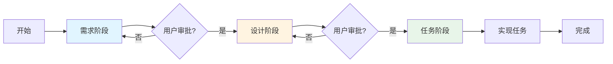

#### 阶段转换规则

**重要规则**：

1. **停止并等待**：代理必须在完成每个阶段后停止，等待用户审批
2. **整合反馈**：代理必须整合所有用户反馈后才能继续
3. **例外情况**：如果用户回复"Skip to Implementation Plan"，代理可以直接从设计阶段进入任务阶段而不停止
4. **返回选项**：如果在后续阶段发现需求或设计有缺口，代理应提供返回到先前阶段的选项

### 2.4 选择工作流变体

Spec 工作流有三种主要变体，适用于不同的场景：

#### Requirements-First 工作流

**适用场景**：
- 需求明确，业务逻辑复杂
- 需要详细的需求文档作为合同或规范
- 团队成员需要先理解"要做什么"再考虑"怎么做"

**流程**：需求 → 设计 → 任务

**示例场景**：为电商平台添加支付处理功能

#### Design-First 工作流

**适用场景**：
- 技术方案明确，但需求细节需要从设计中推导
- 原型驱动开发
- 重构或架构改进项目

**流程**：设计 → 需求 → 任务

**示例场景**：将单体应用重构为微服务架构

#### Bugfix 工作流

**适用场景**：
- 修复已知 bug
- 需要明确当前行为、预期行为和不变行为

**流程**：Bug 分析 → 设计 → 任务

**特殊文件**：使用 `bugfix.md` 替代 `requirements.md`

**示例场景**：修复用户登录超时问题

**如何选择**：

- 如果你清楚地知道**要做什么**但不确定**怎么做** → 使用 Requirements-First
- 如果你有一个**技术方案**但需要明确**业务需求** → 使用 Design-First
- 如果你要**修复 bug** → 使用 Bugfix 工作流

详细的工作流变体说明请参见第 8 章。

### 2.5 下一步

现在你已经了解了基本的 spec 创建流程和工作流概览，接下来可以：

1. **深入学习目录结构**：阅读第 3 章了解详细的目录规范和配置文件格式
2. **学习需求编写**：阅读第 4 章了解 EARS 模式和 INCOSE 质量规则
3. **学习设计文档**：阅读第 5 章了解如何编写高质量的设计文档
4. **学习任务分解**：阅读第 6 章了解如何将设计分解为可执行任务
5. **了解属性测试**：阅读第 7 章了解何时以及如何使用属性测试

**快速参考**：

- 需要创建 spec？→ 参考 2.1 节
- 不确定目录结构？→ 参考 2.2 节
- 不知道从哪个阶段开始？→ 参考 2.4 节
- 想看完整示例？→ 跳到第 12 章

---

**提示**：如果你是通用编码代理，建议将本章内容作为与用户开始新 spec 时的参考指南。如果你是开发者，可以将本章作为快速入门教程。

## 3. 目录结构和配置

### 3.1 概述

Spec 工作流使用专用的 `.agent` 目录来组织所有规格说明文件。这个目录结构与 Kiro 的 `.kiro` 目录完全独立，两者可以在同一项目中并存而互不干扰。

### 3.2 基本目录结构

每个 spec（规格说明）都存储在以下路径中：

```
.agent/specs/{feature-name}/
```

其中 `{feature-name}` 是功能的名称，必须使用 **kebab-case** 命名约定。

### 3.3 命名约定

**Kebab-case 规则**：
- 全部使用小写字母
- 单词之间使用连字符（`-`）分隔
- 不使用空格、下划线或大写字母

**正确示例**：
- `user-authentication`
- `payment-processing`
- `data-export-feature`
- `api-rate-limiting`

**错误示例**：
- ❌ `UserAuthentication`（使用了大写字母）
- ❌ `user_authentication`（使用了下划线）
- ❌ `user authentication`（使用了空格）
- ❌ `userAuth`（使用了驼峰命名）

### 3.4 必需文件

每个 spec 目录必须包含以下文件：

1. **`.config.agent`** - 配置文件（JSON 格式）
   - 包含 spec 的元数据
   - 定义工作流类型和 spec 类型

2. **`requirements.md`** - 需求文档
   - 包含用户故事
   - 包含验收标准
   - 包含术语表

3. **`design.md`** - 设计文档
   - 包含架构设计
   - 包含组件和接口定义
   - 包含测试策略

4. **`tasks.md`** - 任务文档
   - 包含实现任务列表
   - 包含任务依赖关系
   - 用于跟踪实现进度

### 3.5 完整目录结构图

```
项目根目录/
├── .agent/                          # 通用代理的 spec 目录
│   └── specs/                       # 所有 spec 的容器目录
│       ├── user-authentication/     # 示例：用户认证功能 spec
│       │   ├── .config.agent        # 配置文件
│       │   ├── requirements.md      # 需求文档
│       │   ├── design.md            # 设计文档
│       │   └── tasks.md             # 任务文档
│       │
│       ├── payment-processing/      # 示例：支付处理功能 spec
│       │   ├── .config.agent
│       │   ├── requirements.md
│       │   ├── design.md
│       │   └── tasks.md
│       │
│       └── api-rate-limiting/       # 示例：API 限流功能 spec
│           ├── .config.agent
│           ├── requirements.md
│           ├── design.md
│           └── tasks.md
│
└── .kiro/                           # Kiro 的 spec 目录（独立存在）
    └── specs/                       # Kiro 使用相同的结构
        └── {feature-name}/          # 但完全独立于 .agent 目录
            ├── .config.kiro
            ├── requirements.md
            ├── design.md
            └── tasks.md
```

### 3.6 目录结构流程图

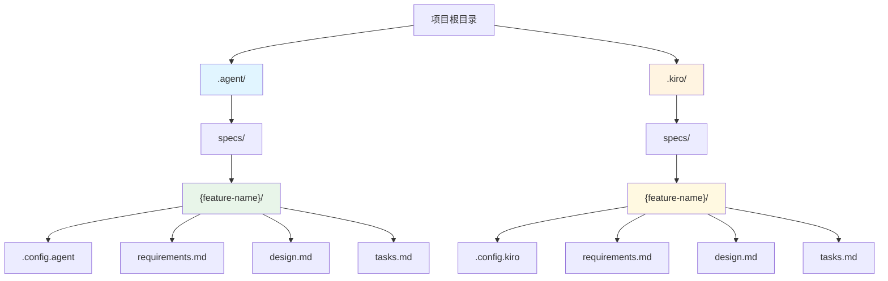

### 3.7 创建新 Spec 的步骤

当你需要为新功能创建 spec 时，按照以下步骤操作：

1. **确定功能名称**
   - 选择一个描述性的名称
   - 转换为 kebab-case 格式
   - 例如："User Authentication" → `user-authentication`

2. **创建目录结构**
   ```bash
   mkdir -p .agent/specs/{feature-name}
   ```

3. **创建必需文件**
   ```bash
   cd .agent/specs/{feature-name}
   touch .config.agent
   touch requirements.md
   touch design.md
   touch tasks.md
   ```

4. **初始化配置文件**
   - 参见下一章节的配置文件格式说明

### 3.8 与 Kiro 的关系

**重要说明**：
- `.agent` 目录专供通用编码代理使用
- `.kiro` 目录专供 Kiro 使用
- 两个目录可以在同一项目中共存
- 它们完全独立，互不干扰
- Kiro 不会读取或修改 `.agent` 目录
- 通用代理不应该读取或修改 `.kiro` 目录

这种设计允许开发者在同一项目中同时使用 Kiro 和其他 AI 编码助手，每个工具都有自己独立的工作空间。

## 配置文件格式

### `.config.agent` 文件

每个 spec 目录必须包含一个 `.config.agent` 配置文件，用于存储 spec 的元数据和工作流信息。

### JSON 结构

`.config.agent` 文件使用 JSON 格式，包含以下字段：

```json
{
  "specId": "uuid-v4-string",
  "workflowType": "requirements-first" | "design-first",
  "specType": "feature" | "bugfix"
}
```

### 字段说明

#### `specId` 字段

- **类型**：字符串（String）
- **格式**：UUID v4（通用唯一标识符版本 4）
- **必需**：是
- **用途**：唯一标识该 spec，用于跟踪和引用

**UUID v4 格式**：
- 由 32 个十六进制字符组成
- 使用连字符分隔为 5 组：`xxxxxxxx-xxxx-4xxx-yxxx-xxxxxxxxxxxx`
- 第 13 位固定为 `4`（表示版本 4）
- 第 17 位为 `8`、`9`、`a` 或 `b` 之一

**示例**：
```
550e8400-e29b-41d4-a716-446655440000
f47ac10b-58cc-4372-a567-0e02b2c3d479
7c9e6679-7425-40de-944b-e07fc1f90ae7
```

**生成方法**：
- 在线工具：https://www.uuidgenerator.net/
- 命令行（Linux）：`uuidgen` 或 `cat /proc/sys/kernel/random/uuid`
- Python：`import uuid; str(uuid.uuid4())`
- JavaScript：`crypto.randomUUID()`
- Node.js：`require('crypto').randomUUID()`

#### `workflowType` 字段

- **类型**：字符串（String）
- **可选值**：`"requirements-first"` 或 `"design-first"`
- **必需**：仅对 `specType` 为 `"feature"` 的 spec 必需
- **用途**：指定功能开发的工作流类型

**工作流类型说明**：

1. **`"requirements-first"`**（需求优先）
   - 工作流顺序：需求 → 设计 → 任务
   - 适用场景：需求明确、用户故事清晰的功能
   - 优势：确保设计完全基于明确的需求

2. **`"design-first"`**（设计优先）
   - 工作流顺序：设计 → 需求 → 任务
   - 适用场景：技术探索、架构设计驱动的功能
   - 优势：允许先探索技术方案，再明确需求细节

**注意**：对于 `specType` 为 `"bugfix"` 的 spec，此字段可以省略或设为 `null`，因为 bugfix 有自己的固定工作流。

#### `specType` 字段

- **类型**：字符串（String）
- **可选值**：`"feature"` 或 `"bugfix"`
- **必需**：是
- **用途**：指定 spec 的类型

**Spec 类型说明**：

1. **`"feature"`**（功能）
   - 用于新功能开发
   - 需要指定 `workflowType`
   - 包含完整的需求、设计和任务文档

2. **`"bugfix"`**（Bug 修复）
   - 用于 bug 修复
   - 使用固定的 bugfix 工作流
   - 不需要指定 `workflowType`
   - 使用 bug condition 方法论（当前行为、预期行为、不变行为）

### 配置文件示例

#### 示例 1：Requirements-First 功能 Spec

```json
{
  "specId": "550e8400-e29b-41d4-a716-446655440000",
  "workflowType": "requirements-first",
  "specType": "feature"
}
```

**使用场景**：开发用户认证功能，需求明确，先编写需求文档。

#### 示例 2：Design-First 功能 Spec

```json
{
  "specId": "f47ac10b-58cc-4372-a567-0e02b2c3d479",
  "workflowType": "design-first",
  "specType": "feature"
}
```

**使用场景**：设计新的缓存架构，技术方案驱动，先探索设计。

#### 示例 3：Bugfix Spec

```json
{
  "specId": "7c9e6679-7425-40de-944b-e07fc1f90ae7",
  "specType": "bugfix"
}
```

**使用场景**：修复登录失败的 bug，使用 bugfix 工作流。

**注意**：Bugfix spec 不需要 `workflowType` 字段。

### 创建配置文件的步骤

当你为新 spec 创建配置文件时，按照以下步骤操作：

1. **生成 UUID v4**
   ```bash
   # Linux/WSL2
   uuidgen
   
   # 或使用 Python
   python3 -c "import uuid; print(uuid.uuid4())"
   
   # 或使用 Node.js
   node -e "console.log(require('crypto').randomUUID())"
   ```

2. **确定 spec 类型**
   - 新功能开发 → `"feature"`
   - Bug 修复 → `"bugfix"`

3. **确定工作流类型**（仅对 feature spec）
   - 需求明确 → `"requirements-first"`
   - 设计驱动 → `"design-first"`

4. **创建 JSON 文件**
   ```bash
   # 进入 spec 目录
   cd .agent/specs/{feature-name}
   
   # 创建配置文件
   cat > .config.agent << 'EOF'
   {
     "specId": "your-generated-uuid-here",
     "workflowType": "requirements-first",
     "specType": "feature"
   }
   EOF
   ```

5. **验证 JSON 格式**
   ```bash
   # 使用 jq 验证（如果已安装）
   jq . .config.agent
   
   # 或使用 Python
   python3 -c "import json; json.load(open('.config.agent'))"
   ```

### 配置文件验证规则

通用编码代理在读取 `.config.agent` 文件时，应验证以下规则：

1. **文件存在性**：`.config.agent` 文件必须存在于 spec 目录中
2. **JSON 格式**：文件内容必须是有效的 JSON
3. **必需字段**：
   - `specId` 字段必须存在且不为空
   - `specType` 字段必须存在且值为 `"feature"` 或 `"bugfix"`
4. **条件必需字段**：
   - 如果 `specType` 为 `"feature"`，则 `workflowType` 必须存在且值为 `"requirements-first"` 或 `"design-first"`
5. **UUID 格式**：`specId` 应符合 UUID v4 格式（可选验证，但推荐）

### 常见错误和解决方法

#### 错误 1：JSON 格式错误

**错误示例**：
```json
{
  "specId": "550e8400-e29b-41d4-a716-446655440000",
  "workflowType": "requirements-first",
  "specType": "feature",  // ❌ JSON 不支持注释
}  // ❌ 最后一个字段后不应有逗号
```

**正确示例**：
```json
{
  "specId": "550e8400-e29b-41d4-a716-446655440000",
  "workflowType": "requirements-first",
  "specType": "feature"
}
```

#### 错误 2：缺少必需字段

**错误示例**：
```json
{
  "specId": "550e8400-e29b-41d4-a716-446655440000",
  "specType": "feature"
}
```

**问题**：Feature spec 缺少 `workflowType` 字段。

**解决方法**：添加 `workflowType` 字段：
```json
{
  "specId": "550e8400-e29b-41d4-a716-446655440000",
  "workflowType": "requirements-first",
  "specType": "feature"
}
```

#### 错误 3：字段值无效

**错误示例**：
```json
{
  "specId": "550e8400-e29b-41d4-a716-446655440000",
  "workflowType": "design-driven",
  "specType": "feature"
}
```

**问题**：`workflowType` 值应为 `"design-first"`，而非 `"design-driven"`。

**解决方法**：使用正确的值：
```json
{
  "specId": "550e8400-e29b-41d4-a716-446655440000",
  "workflowType": "design-first",
  "specType": "feature"
}
```

#### 错误 4：Bugfix spec 包含 workflowType

**不推荐示例**：
```json
{
  "specId": "7c9e6679-7425-40de-944b-e07fc1f90ae7",
  "workflowType": "requirements-first",
  "specType": "bugfix"
}
```

**问题**：Bugfix spec 不需要 `workflowType` 字段。

**推荐示例**：
```json
{
  "specId": "7c9e6679-7425-40de-944b-e07fc1f90ae7",
  "specType": "bugfix"
}
```

### 配置文件的使用

通用编码代理应在以下场景中使用 `.config.agent` 文件：

1. **创建新 spec**：生成配置文件并初始化字段
2. **读取 spec**：解析配置文件以确定工作流类型
3. **验证 spec**：检查配置文件的完整性和正确性
4. **引用 spec**：使用 `specId` 唯一标识和引用 spec

### 与 Kiro 配置文件的区别

**`.config.agent` vs `.config.kiro`**：

| 特性 | `.config.agent` | `.config.kiro` |
|------|----------------|----------------|
| 使用者 | 通用编码代理 | Kiro |
| 位置 | `.agent/specs/{feature-name}/` | `.kiro/specs/{feature-name}/` |
| 格式 | JSON | JSON（可能有额外字段） |
| 字段 | `specId`, `workflowType`, `specType` | 可能包含 Kiro 特定字段 |
| 兼容性 | 通用标准 | Kiro 特定 |

**重要**：通用代理不应读取或修改 `.config.kiro` 文件，Kiro 也不应读取或修改 `.config.agent` 文件。

## 4. 需求阶段

### 4.1 EARS 模式（Easy Approach to Requirements Syntax）

EARS（Easy Approach to Requirements Syntax）是一种结构化的需求编写方法，通过使用标准化的语法模板来提高需求的清晰性和一致性。EARS 定义了 6 种基本模式，每种模式适用于不同类型的系统行为。

#### 4.1.1 Ubiquitous（普遍性需求）

**定义**：描述系统在所有情况下都必须满足的行为，没有任何前提条件或触发事件。

**语法模板**：
```
THE <system name> SHALL <system response>
```

**适用场景**：
- 系统的基本功能和持续性行为
- 不依赖于特定条件或事件的需求
- 系统的基本约束和限制

**示例**：

1. **用户界面需求**：
   ```
   THE system SHALL display all timestamps in UTC format
   ```

2. **性能需求**：
   ```
   THE API SHALL respond to health check requests within 100 milliseconds
   ```

3. **安全需求**：
   ```
   THE system SHALL encrypt all data at rest using AES-256 encryption
   ```

4. **数据完整性需求**：
   ```
   THE database SHALL maintain referential integrity for all foreign key relationships
   ```

#### 4.1.2 Event-driven（事件驱动需求）

**定义**：描述当特定事件或触发条件发生时，系统必须执行的响应行为。

**语法模板**：
```
WHEN <trigger event> THEN the <system name> SHALL <system response>
```

**适用场景**：
- 用户操作触发的行为
- 系统事件触发的响应
- 外部信号或消息触发的处理

**示例**：

1. **用户登录**：
   ```
   WHEN a user submits valid credentials THEN the system SHALL generate a JWT token and return it to the user
   ```

2. **文件上传**：
   ```
   WHEN a user uploads a file larger than 10MB THEN the system SHALL reject the upload and display an error message
   ```

3. **支付处理**：
   ```
   WHEN a payment transaction is completed THEN the system SHALL send a confirmation email to the user
   ```

4. **数据同步**：
   ```
   WHEN a database record is updated THEN the system SHALL publish a change event to the message queue
   ```

#### 4.1.3 State-driven（状态驱动需求）

**定义**：描述系统在特定状态下必须持续满足的行为，强调状态的持续性。

**语法模板**：
```
WHILE <system state> the <system name> SHALL <system response>
```

**适用场景**：
- 系统在特定模式或状态下的行为
- 持续性的监控和控制
- 状态相关的约束和限制

**示例**：

1. **用户会话管理**：
   ```
   WHILE a user session is active the system SHALL refresh the authentication token every 15 minutes
   ```

2. **维护模式**：
   ```
   WHILE the system is in maintenance mode the system SHALL return HTTP 503 status for all API requests
   ```

3. **数据处理**：
   ```
   WHILE a batch job is running the system SHALL prevent concurrent execution of the same job
   ```

4. **资源限制**：
   ```
   WHILE the database connection pool is at capacity the system SHALL queue new connection requests
   ```

#### 4.1.4 Unwanted event（不期望事件需求）

**定义**：描述当不期望的条件或错误发生时，系统必须采取的保护性或恢复性措施。

**语法模板**：
```
IF <unwanted condition or event> THEN the <system name> SHALL <system response>
```

**适用场景**：
- 错误处理和异常情况
- 安全威胁的响应
- 系统故障的恢复
- 输入验证失败的处理

**示例**：

1. **认证失败**：
   ```
   IF a user enters incorrect credentials three times consecutively THEN the system SHALL lock the account for 15 minutes
   ```

2. **数据验证错误**：
   ```
   IF an API request contains invalid JSON THEN the system SHALL return HTTP 400 status with a detailed error message
   ```

3. **系统资源耗尽**：
   ```
   IF available memory falls below 10% THEN the system SHALL trigger garbage collection and log a warning
   ```

4. **网络连接失败**：
   ```
   IF a database connection fails THEN the system SHALL retry up to 3 times with exponential backoff before returning an error
   ```

#### 4.1.5 Optional feature（可选特性需求）

**定义**：描述仅在特定功能或配置启用时才需要满足的行为。

**语法模板**：
```
WHERE <feature is included or configuration is set> the <system name> SHALL <system response>
```

**适用场景**：
- 可配置的功能模块
- 可选的集成和插件
- 基于许可证或订阅级别的功能
- 环境特定的行为

**示例**：

1. **功能开关**：
   ```
   WHERE the advanced analytics feature is enabled the system SHALL collect detailed user interaction metrics
   ```

2. **集成配置**：
   ```
   WHERE the email notification service is configured the system SHALL send email alerts for critical errors
   ```

3. **订阅级别**：
   ```
   WHERE the user has a premium subscription the system SHALL allow up to 100 API requests per minute
   ```

4. **环境配置**：
   ```
   WHERE the system is running in production mode the system SHALL disable debug logging
   ```

#### 4.1.6 Complex（复杂需求）

**定义**：结合多个条件（事件和状态）来描述更复杂的系统行为，通常组合 Event-driven 和 State-driven 模式。

**语法模板**：
```
WHEN <trigger event> WHILE <system state> the <system name> SHALL <system response>
```

或其他组合形式：
```
WHEN <trigger event> IF <condition> THEN the <system name> SHALL <system response>
```

```
WHILE <system state> IF <unwanted condition> THEN the <system name> SHALL <system response>
```

**适用场景**：
- 需要多个前提条件的复杂业务逻辑
- 状态和事件共同决定的行为
- 复杂的工作流和流程控制

**示例**：

1. **事件 + 状态组合**：
   ```
   WHEN a user attempts to modify a record WHILE the record is locked by another user THEN the system SHALL deny the modification and display a lock notification
   ```

2. **事件 + 条件组合**：
   ```
   WHEN a user submits an order IF the order total exceeds $10,000 THEN the system SHALL require manager approval before processing
   ```

3. **状态 + 不期望事件组合**：
   ```
   WHILE a file upload is in progress IF the network connection is lost THEN the system SHALL pause the upload and resume when connection is restored
   ```

4. **多条件复杂需求**：
   ```
   WHEN a user requests data export WHILE the system load is above 80% IF the export size exceeds 1GB THEN the system SHALL queue the request for off-peak processing
   ```

### 4.2 EARS 模式选择指南

选择合适的 EARS 模式对于编写清晰、准确的需求至关重要。以下是选择指南：

| 问题 | 推荐模式 |
|------|---------|
| 这个行为是否总是成立，没有任何前提条件？ | Ubiquitous |
| 这个行为是由特定事件触发的吗？ | Event-driven |
| 这个行为在特定状态下持续发生吗？ | State-driven |
| 这是对错误或异常情况的响应吗？ | Unwanted event |
| 这个行为仅在特定功能启用时才需要吗？ | Optional feature |
| 这个行为需要多个条件（事件+状态，或事件+条件）吗？ | Complex |

### 4.3 EARS 模式最佳实践

1. **优先使用简单模式**：如果可以用简单模式（Ubiquitous、Event-driven、State-driven）表达，避免使用 Complex 模式

2. **保持原子性**：每个需求应该描述一个单一的系统行为，如果需求过于复杂，考虑拆分为多个需求

3. **明确触发条件**：在 Event-driven 和 Complex 模式中，确保触发事件清晰、可观察、可测试

4. **区分状态和事件**：
   - **状态**是持续的条件（例如："用户已登录"、"系统处于维护模式"）
   - **事件**是瞬时的发生（例如："用户点击按钮"、"收到 API 请求"）

5. **使用一致的术语**：在所有需求中使用术语表中定义的标准术语

6. **避免实现细节**：EARS 需求应该描述"做什么"（what），而不是"怎么做"（how）

**不好的示例**（包含实现细节）：
```
WHEN a user logs in THEN the system SHALL call the AuthService.authenticate() method and store the token in Redis
```

**好的示例**（聚焦于行为）：
```
WHEN a user logs in with valid credentials THEN the system SHALL create an authenticated session and return an access token
```

### 4.4 INCOSE 质量规则

INCOSE（International Council on Systems Engineering，国际系统工程协会）定义了一套需求质量规则,用于确保需求具备成功系统开发所需的特征。这些规则帮助识别和消除需求中的常见问题,提高需求文档的整体质量。

#### 4.4.1 核心质量特征

INCOSE 定义了 15 个需求质量特征,其中以下 8 个是最关键的:

1. **Unambiguous**（明确的）
2. **Verifiable**（可验证的）
3. **Traceable**（可追溯的）
4. **Singular**（单一的）
5. **Necessary**（必要的）
6. **Complete**（完整的）
7. **Consistent**（一致的）
8. **Feasible**（可行的）

#### 4.4.2 规则 1：Unambiguous（明确性）

**定义**：需求必须只有一种解释方式,不能有歧义或多种理解。

**说明**：
- 避免使用模糊的词语（如"快速"、"高效"、"用户友好"）
- 使用精确的量化指标
- 避免使用可能有多种解释的术语
- 使用术语表中定义的标准术语

**违规示例**：
```
❌ THE system SHALL process requests quickly
```
**问题**："quickly"（快速）是模糊的,没有明确的标准。

**正确示例**：
```
✅ THE system SHALL process API requests within 200 milliseconds for 95% of requests
```
**改进**：使用具体的时间指标和百分比,消除歧义。

---

**违规示例**：
```
❌ THE system SHALL provide a good user experience
```
**问题**："good user experience"（良好的用户体验）是主观的,无法量化。

**正确示例**：
```
✅ THE system SHALL display search results within 2 seconds of user query submission
✅ THE system SHALL maintain a System Usability Scale (SUS) score above 80
```
**改进**：使用可测量的指标替代主观描述。

#### 4.4.3 规则 2：Verifiable（可验证性）

**定义**：需求必须可以通过测试、检查、分析或演示来验证是否满足。

**说明**：
- 每个需求都应该有明确的验证方法
- 避免使用无法测试的词语（如"最大化"、"最小化"、"优化"）
- 确保验证标准是客观的、可重复的
- 考虑验证的成本和可行性

**违规示例**：
```
❌ THE system SHALL maximize system uptime
```
**问题**："maximize"（最大化）没有明确的成功标准,无法验证何时达到要求。

**正确示例**：
```
✅ THE system SHALL maintain 99.9% uptime measured over each calendar month
```
**改进**：提供具体的可测量目标和测量方法。

---

**违规示例**：
```
❌ THE system SHALL be easy to maintain
```
**问题**："easy to maintain"（易于维护）是主观的,无法客观验证。

**正确示例**：
```
✅ THE system SHALL allow configuration changes without requiring code recompilation
✅ THE system SHALL provide automated deployment scripts that complete in under 10 minutes
```
**改进**：将抽象概念转化为具体的、可验证的行为。

#### 4.4.4 规则 3：Traceable（可追溯性）

**定义**：需求必须能够追溯到其来源（业务目标、用户需求、法规等）,并能够追踪到设计、实现和测试。

**说明**：
- 每个需求应该有唯一的标识符
- 需求应该引用其来源或依据
- 需求应该能够链接到相关的设计元素和测试用例
- 维护需求追溯矩阵

**违规示例**：
```
❌ The system must encrypt data
```
**问题**：没有标识符,没有说明为什么需要加密,无法追溯来源。

**正确示例**：
```
✅ **需求 1.3：数据加密**（来源：GDPR 第 32 条、安全策略 SP-2023-001）

THE system SHALL encrypt all personally identifiable information (PII) at rest using AES-256 encryption

_追溯：业务需求 BR-1.2, 安全标准 SEC-001_
```
**改进**：包含需求编号、来源引用和追溯信息。

---

**违规示例**：
```
❌ Users should be able to export data
```
**问题**：没有编号,没有上下文,无法追溯到业务需求或用户故事。

**正确示例**：
```
✅ **需求 2.5：数据导出**（来源：用户故事 US-12）

WHEN a user requests data export THEN the system SHALL generate a CSV file containing all user data within 30 seconds

_追溯：用户故事 US-12, 设计文档 DD-2.3, 测试用例 TC-25_
```
**改进**：明确的编号、来源和追溯链接。

#### 4.4.5 规则 4：Singular（单一性）

**定义**：每个需求应该只表达一个单一的条件或行为,不应该包含多个需求。

**说明**：
- 避免使用"and"、"or"连接多个不同的需求
- 每个需求应该独立可测试
- 如果需求包含多个条件,考虑拆分为多个需求
- 使用 EARS 模式保持需求的原子性

**违规示例**：
```
❌ WHEN a user logs in THEN the system SHALL authenticate the user, create a session, log the event, and send a notification email
```
**问题**：包含四个不同的行为,应该拆分为独立的需求。

**正确示例**：
```
✅ **需求 1.1：用户认证**
WHEN a user submits login credentials THEN the system SHALL validate the credentials against the user database

✅ **需求 1.2：会话创建**
WHEN user authentication succeeds THEN the system SHALL create a new session with a 30-minute timeout

✅ **需求 1.3：登录日志**
WHEN a user successfully logs in THEN the system SHALL log the event with timestamp and user ID

✅ **需求 1.4：登录通知**
WHEN a user successfully logs in from a new device THEN the system SHALL send a notification email to the user's registered email address
```
**改进**：将复合需求拆分为四个独立的、可单独测试的需求。

---

**违规示例**：
```
❌ THE system SHALL support CSV and JSON export formats and allow users to schedule exports
```
**问题**：包含两个不同的功能（格式支持和调度功能）。

**正确示例**：
```
✅ **需求 2.1：导出格式支持**
THE system SHALL support data export in CSV and JSON formats

✅ **需求 2.2：导出调度**
THE system SHALL allow users to schedule automated data exports on daily, weekly, or monthly intervals
```
**改进**：拆分为两个独立的需求,每个关注一个功能。

#### 4.4.6 规则 5：Necessary（必要性）

**定义**：每个需求都必须有明确的业务价值或技术必要性,不应包含不必要的需求。

**说明**：
- 每个需求应该能够追溯到业务目标或用户需求
- 避免"镀金"（添加不必要的功能）
- 质疑每个需求的存在理由
- 如果无法解释需求的必要性,考虑删除它

**违规示例**：
```
❌ THE system SHALL display a loading animation with a spinning logo
```
**问题**：过于具体的实现细节,可能不是真正必要的需求。

**正确示例**：
```
✅ THE system SHALL provide visual feedback to users during operations that take longer than 1 second to complete
```
**改进**：关注真正的需求（用户反馈）,而不是具体的实现方式。

---

**违规示例**：
```
❌ THE system SHALL use a blue color scheme for all buttons
```
**问题**：这是设计决策,不是功能需求,除非有特定的业务或可访问性理由。

**正确示例**：
```
✅ THE system SHALL maintain a minimum contrast ratio of 4.5:1 between text and background colors to meet WCAG 2.1 Level AA standards
```
**改进**：关注必要的可访问性需求,而不是任意的设计选择。

#### 4.4.7 规则 6：Complete（完整性）

**定义**：需求必须包含所有必要的信息,不应遗漏关键细节。

**说明**：
- 需求应该回答"谁"、"什么"、"何时"、"在什么条件下"
- 包含所有必要的前提条件和后置条件
- 定义所有相关的边界条件和限制
- 不应该有待定（TBD）或待确定（TBC）的内容

**违规示例**：
```
❌ WHEN a user uploads a file THEN the system SHALL validate the file
```
**问题**：没有说明验证什么（文件类型？大小？内容？）,验证失败时怎么办。

**正确示例**：
```
✅ WHEN a user uploads a file THEN the system SHALL validate that:
   - The file size does not exceed 10MB
   - The file format is one of: PDF, DOCX, TXT, or CSV
   - The file name contains only alphanumeric characters, hyphens, and underscores

IF validation fails THEN the system SHALL reject the upload and display an error message indicating the specific validation failure
```
**改进**：明确所有验证标准和失败处理。

---

**违规示例**：
```
❌ THE system SHALL send notifications to users
```
**问题**：缺少关键信息：什么时候发送？通过什么渠道？什么内容？

**正确示例**：
```
✅ WHEN a user's account balance falls below $10 THEN the system SHALL send an email notification to the user's registered email address within 5 minutes, containing the current balance and a link to add funds
```
**改进**：包含触发条件、通知渠道、时间要求和内容要求。

#### 4.4.8 规则 7：Consistent（一致性）

**定义**：需求不应与其他需求或已知约束相冲突。

**说明**：
- 需求之间不应有逻辑矛盾
- 使用一致的术语和定义
- 确保需求与系统约束和外部标准一致
- 定期审查需求集以识别冲突

**违规示例**：
```
❌ 需求 1.1: THE system SHALL store all user data in the cloud
❌ 需求 1.2: THE system SHALL operate without internet connectivity
```
**问题**：两个需求相互矛盾,无法同时满足。

**正确示例**：
```
✅ 需求 1.1: THE system SHALL synchronize user data to cloud storage when internet connectivity is available
✅ 需求 1.2: THE system SHALL cache user data locally and operate in offline mode when internet connectivity is unavailable
```
**改进**：解决冲突,明确在线和离线模式的行为。

---

**违规示例**：
```
❌ 需求 2.1: THE system SHALL complete user authentication within 500 milliseconds
❌ 需求 2.2: THE system SHALL perform multi-factor authentication including SMS verification for all login attempts
```
**问题**：SMS 验证通常需要几秒钟,与 500 毫秒的要求不一致。

**正确示例**：
```
✅ 需求 2.1: THE system SHALL complete initial credential validation within 500 milliseconds
✅ 需求 2.2: WHEN multi-factor authentication is enabled THEN the system SHALL send an SMS verification code within 10 seconds and allow up to 5 minutes for user verification
```
**改进**：区分不同的认证阶段,设置合理的时间要求。

#### 4.4.9 规则 8：Feasible（可行性）

**定义**：需求必须在给定的技术、时间和资源约束下可以实现。

**说明**：
- 考虑技术限制和物理定律
- 评估实现成本和时间
- 确保需求不违反已知的技术约束
- 与技术团队验证可行性

**违规示例**：
```
❌ THE system SHALL predict user behavior with 100% accuracy
```
**问题**：100% 准确的预测在实践中是不可能的,违反了统计学和机器学习的基本原理。

**正确示例**：
```
✅ THE system SHALL predict user purchase intent with a minimum accuracy of 75% as measured against historical conversion data
```
**改进**：设置现实可达的目标,基于行业标准和历史数据。

---

**违规示例**：
```
❌ THE system SHALL process 1 million transactions per second on a single server
```
**问题**：对于大多数硬件配置,这个性能目标是不现实的。

**正确示例**：
```
✅ THE system SHALL process at least 10,000 transactions per second using a horizontally scalable architecture with load balancing across multiple servers
```
**改进**：设置可行的性能目标,并说明实现方式（水平扩展）。

### 4.5 INCOSE 质量规则应用指南

#### 4.5.1 需求审查检查清单

在编写或审查需求时,使用以下检查清单确保符合 INCOSE 质量规则：

**明确性检查**：
- [ ] 需求中是否有模糊的词语（快速、高效、用户友好等）？
- [ ] 所有量化指标是否明确？
- [ ] 术语是否在术语表中定义？

**可验证性检查**：
- [ ] 如何验证这个需求？（测试、检查、分析、演示）
- [ ] 验证标准是否客观且可重复？
- [ ] 是否避免了"最大化"、"最小化"等无法验证的词语？

**可追溯性检查**：
- [ ] 需求是否有唯一标识符？
- [ ] 需求是否引用了来源（用户故事、业务目标、法规）？
- [ ] 需求是否链接到相关的设计和测试？

**单一性检查**：
- [ ] 需求是否只表达一个条件或行为？
- [ ] 是否可以拆分为更小的独立需求？
- [ ] 需求是否可以独立测试？

**必要性检查**：
- [ ] 为什么需要这个需求？
- [ ] 需求是否追溯到业务目标或用户需求？
- [ ] 如果删除这个需求,会有什么影响？

**完整性检查**：
- [ ] 需求是否包含所有必要的信息？
- [ ] 是否定义了所有前提条件和后置条件？
- [ ] 是否有待定（TBD）的内容？

**一致性检查**：
- [ ] 需求是否与其他需求冲突？
- [ ] 术语使用是否一致？
- [ ] 需求是否与系统约束一致？

**可行性检查**：
- [ ] 需求在技术上可行吗？
- [ ] 需求在预算和时间约束内可实现吗？
- [ ] 是否与技术团队验证过可行性？

#### 4.5.2 常见质量问题和解决方法

| 问题类型 | 识别方法 | 解决方法 |
|---------|---------|---------|
| 模糊需求 | 包含"快速"、"高效"等词 | 用具体的量化指标替换 |
| 复合需求 | 包含多个"and"或"or" | 拆分为多个独立需求 |
| 不可验证 | 无法定义测试方法 | 添加可测量的验收标准 |
| 实现细节 | 指定具体技术或方法 | 重写为功能需求 |
| 缺少上下文 | 没有前提条件或触发事件 | 使用 EARS 模式添加上下文 |
| 不一致术语 | 同一概念使用不同词语 | 使用术语表标准化术语 |
| 过度约束 | 限制了实现选择 | 关注"做什么"而非"怎么做" |
| 缺少错误处理 | 只描述正常流程 | 添加异常和错误情况的需求 |

#### 4.5.3 质量改进示例

**原始需求**（存在多个质量问题）：
```
❌ The system should quickly process user requests and handle errors appropriately
```

**问题分析**：
- ❌ 不明确："quickly"（快速）是模糊的
- ❌ 不可验证：没有具体的性能指标
- ❌ 不单一：包含两个不同的需求（处理请求和错误处理）
- ❌ 不完整：没有说明什么类型的请求,什么类型的错误
- ❌ 使用"should"而非"SHALL"

**改进后的需求**：
```
✅ **需求 3.1：请求处理性能**
THE system SHALL process user API requests with a median response time of 200 milliseconds and 95th percentile response time of 500 milliseconds

✅ **需求 3.2：请求超时处理**
IF an API request processing exceeds 30 seconds THEN the system SHALL terminate the request and return HTTP 504 Gateway Timeout status

✅ **需求 3.3：错误响应格式**
WHEN an error occurs during request processing THEN the system SHALL return a JSON response containing an error code, error message, and request ID
```

**改进说明**：
- ✅ 明确：使用具体的时间指标（200ms、500ms、30s）
- ✅ 可验证：可以通过性能测试验证
- ✅ 单一：拆分为三个独立的需求
- ✅ 完整：明确了请求类型、超时值和错误响应格式
- ✅ 使用"SHALL"表示强制性需求

### 4.6 EARS 模式与 INCOSE 质量规则的结合

EARS 模式和 INCOSE 质量规则是互补的：

- **EARS 模式**提供了需求的**结构和语法**
- **INCOSE 质量规则**确保需求的**质量和特征**

**最佳实践**：

1. **先使用 EARS 模式**构建需求的基本结构
2. **然后应用 INCOSE 质量规则**检查和改进需求质量
3. **迭代优化**直到需求同时满足结构和质量要求

**示例工作流**：

```
步骤 1：使用 EARS 模式编写初始需求
WHEN a user uploads a file THEN the system SHALL process the file

步骤 2：应用 INCOSE 质量规则检查
- 明确性：❌ "process"（处理）是模糊的
- 完整性：❌ 缺少文件类型、大小限制、处理时间
- 可验证性：❌ 没有明确的验证标准

步骤 3：改进需求
WHEN a user uploads a file THEN the system SHALL:
- Validate the file format is one of: PDF, DOCX, or TXT
- Validate the file size does not exceed 10MB
- Extract text content from the file within 5 seconds
- Store the extracted text in the database

IF validation fails THEN the system SHALL reject the upload and return an error message indicating the specific validation failure

步骤 4：最终审查
✅ 使用 EARS Event-driven 模式
✅ 明确：所有操作都有具体定义
✅ 可验证：可以测试格式、大小、时间和存储
✅ 完整：包含正常流程和错误处理
✅ 单一：可以考虑拆分为多个需求以提高单一性
```

### 4.4 INCOSE 质量规则

INCOSE（International Council on Systems Engineering，国际系统工程理事会）定义了一套需求质量规则，用于确保需求的清晰性、完整性和可测试性。以下是核心质量规则及其说明。

#### 4.4.1 必要性（Necessary）

**规则**：每个需求都必须记录一个必要的能力、特性、约束或质量因素。

**说明**：需求应该描述系统真正需要的功能，而不是"锦上添花"的特性。

**违规示例**：
```
THE system SHALL have a beautiful user interface
```
**问题**："beautiful"（美观）是主观的，不是必要的功能需求。

**正确示例**：
```
THE system SHALL comply with WCAG 2.1 Level AA accessibility standards
```

#### 4.4.2 实现无关性（Implementation-free）

**规则**：需求应该描述"做什么"（what），而不是"怎么做"（how）。

**说明**：需求不应该规定具体的实现技术、算法或架构，这些属于设计阶段的决策。

**违规示例**：
```
THE system SHALL use PostgreSQL database to store user data
```
**问题**：规定了具体的数据库技术，限制了设计选择。

**正确示例**：
```
THE system SHALL persist user data with ACID transaction guarantees
```

**违规示例**：
```
WHEN a user submits a form THEN the system SHALL call the validateInput() function
```
**问题**：规定了具体的函数名称，这是实现细节。

**正确示例**：
```
WHEN a user submits a form THEN the system SHALL validate all input fields before processing
```

#### 4.4.3 明确性（Unambiguous）

**规则**：需求必须有且仅有一种解释，不能含糊不清。

**说明**：避免使用模糊的词语，如"快速"、"高效"、"用户友好"等，应该使用可量化的标准。

**违规示例**：
```
THE system SHALL respond quickly to user requests
```
**问题**："quickly"（快速）是模糊的，没有明确的标准。

**正确示例**：
```
THE system SHALL respond to user requests within 200 milliseconds for 95% of requests
```

**违规示例**：
```
THE system SHALL support many concurrent users
```
**问题**："many"（许多）是模糊的数量。

**正确示例**：
```
THE system SHALL support at least 10,000 concurrent users
```

#### 4.4.4 一致性（Consistent）

**规则**：需求不应该与其他需求冲突或矛盾。

**说明**：所有需求应该能够同时满足，不存在逻辑冲突。

**违规示例**：
```
需求 1: THE system SHALL encrypt all data in transit using TLS 1.3
需求 2: THE system SHALL support legacy clients using SSL 3.0
```
**问题**：TLS 1.3 和 SSL 3.0 不兼容，两个需求冲突。

**正确示例**：
```
需求 1: THE system SHALL encrypt all data in transit using TLS 1.2 or higher
需求 2: THE system SHALL reject connections from clients using SSL 3.0 or earlier
```

#### 4.4.5 完整性（Complete）

**规则**：需求集合应该完整地描述系统的所有必要功能，不遗漏关键行为。

**说明**：需求应该覆盖正常流程、异常流程、边界条件和错误处理。

**不完整示例**：
```
WHEN a user logs in with valid credentials THEN the system SHALL grant access
```
**问题**：只描述了成功情况，没有描述失败情况。

**完整示例**：
```
需求 1: WHEN a user logs in with valid credentials THEN the system SHALL grant access and create a session
需求 2: WHEN a user logs in with invalid credentials THEN the system SHALL deny access and display an error message
需求 3: IF a user enters incorrect credentials three times THEN the system SHALL lock the account for 15 minutes
```

#### 4.4.6 单一性（Singular）

**规则**：每个需求应该只描述一个单一的能力或约束。

**说明**：避免使用"and"、"or"将多个需求合并为一个，这会降低可追溯性和可测试性。

**违规示例**：
```
WHEN a user submits an order THEN the system SHALL validate the order, process the payment, update the inventory, and send a confirmation email
```
**问题**：一个需求描述了四个不同的行为。

**正确示例**：
```
需求 1: WHEN a user submits an order THEN the system SHALL validate the order data
需求 2: WHEN an order is validated THEN the system SHALL process the payment
需求 3: WHEN a payment is successful THEN the system SHALL update the inventory
需求 4: WHEN an order is completed THEN the system SHALL send a confirmation email to the user
```

#### 4.4.7 可行性（Feasible）

**规则**：需求必须在技术上和经济上可行。

**说明**：需求应该是可以实现的，不应该要求不可能或不切实际的功能。

**违规示例**：
```
THE system SHALL predict user behavior with 100% accuracy
```
**问题**：100% 准确预测是不可能的。

**正确示例**：
```
THE system SHALL predict user behavior with at least 85% accuracy based on historical data
```

#### 4.4.8 可追溯性（Traceable）

**规则**：每个需求应该有唯一的标识符，便于在设计、实现和测试中引用。

**说明**：使用编号系统（如 1.1, 1.2, 2.1）为每个需求分配唯一标识。

**示例**：
```markdown
### 需求 1：用户认证

#### 1.1 登录功能
WHEN a user submits valid credentials THEN the system SHALL authenticate the user and create a session

#### 1.2 登出功能
WHEN a user logs out THEN the system SHALL terminate the session and clear authentication tokens

### 需求 2：会话管理

#### 2.1 会话超时
WHILE a user session is inactive for 30 minutes the system SHALL automatically terminate the session
```

#### 4.4.9 可验证性（Verifiable）

**规则**：需求必须可以通过测试、检查、分析或演示来验证。

**说明**：需求应该定义明确的验收标准，使得可以客观地判断需求是否被满足。

**违规示例**：
```
THE system SHALL be user-friendly
```
**问题**："user-friendly"（用户友好）是主观的，无法客观验证。

**正确示例**：
```
THE system SHALL allow users to complete the checkout process in no more than 3 clicks
```

**违规示例**：
```
THE system SHALL be secure
```
**问题**："secure"（安全）过于宽泛，无法验证。

**正确示例**：
```
需求 1: THE system SHALL enforce password complexity requirements (minimum 12 characters, including uppercase, lowercase, numbers, and special characters)
需求 2: THE system SHALL implement rate limiting of 100 requests per minute per IP address
需求 3: THE system SHALL log all authentication attempts with timestamp and source IP
```

### 4.5 requirements.md 模板

本节提供 `requirements.md` 文档的标准模板，包含所有必需章节和格式规范。

#### 4.5.1 模板结构

```markdown
# 需求文档：{功能名称}

## 简介

{简要描述该功能的目的、背景和价值。1-2 段文字即可。}

## 术语表

{定义本文档中使用的关键术语和概念，确保所有人对术语有共同理解。}

- **术语1**（英文术语）: 定义说明
- **术语2**（英文术语）: 定义说明
- **术语3**（英文术语）: 定义说明

## 需求

### 需求 1: {需求名称}

**用户故事**: {使用"作为...我希望...以便..."格式描述业务价值}

#### 验收标准

1. {使用 EARS 模式编写的验收标准 1}
2. {使用 EARS 模式编写的验收标准 2}
3. {使用 EARS 模式编写的验收标准 3}

### 需求 2: {需求名称}

**用户故事**: {用户故事}

#### 验收标准

1. {验收标准 1}
2. {验收标准 2}
3. {验收标准 3}

{继续添加更多需求...}
```

#### 4.5.2 章节说明

##### 简介章节

**目的**：提供功能的高层次概述，帮助读者快速理解功能的背景和价值。

**内容要求**：
- 1-2 段文字
- 说明功能的目的和业务价值
- 说明功能的范围（包含什么，不包含什么）
- 可选：说明功能的利益相关者

**示例**：
```markdown
## 简介

本功能为电商平台添加用户认证系统，使用户能够安全地登录、管理会话和访问个人账户。认证系统是平台安全架构的核心组件，为后续的授权、个性化和订单管理功能提供基础。

该功能包括用户注册、登录、登出、会话管理和密码重置。不包括社交媒体登录（如 Google、Facebook 登录），这将在后续版本中实现。
```

##### 术语表章节

**目的**：定义文档中使用的关键术语，确保所有人对术语有共同理解，避免歧义。

**内容要求**：
- 使用项目符号列表
- 每个术语包含中文名称和英文名称（如果适用）
- 提供清晰、简洁的定义
- 按字母顺序或逻辑顺序排列

**格式**：
```markdown
- **术语中文名**（English Term）: 定义说明
```

**示例**：
```markdown
## 术语表

- **用户**（User）: 在系统中注册并拥有账户的个人
- **会话**（Session）: 用户登录后到登出或超时之间的时间段，期间用户保持认证状态
- **访问令牌**（Access Token）: 用于验证用户身份的短期凭证，通常为 JWT 格式
- **刷新令牌**（Refresh Token）: 用于获取新访问令牌的长期凭证，存储在安全的 HTTP-only cookie 中
- **凭证**（Credentials）: 用户用于认证的信息，通常包括用户名和密码
- **认证**（Authentication）: 验证用户身份的过程
- **授权**（Authorization）: 确定已认证用户可以访问哪些资源的过程
```

##### 需求章节

**目的**：详细描述系统必须满足的所有功能性和非功能性需求。

**内容要求**：
- 使用层次化的编号系统（需求 1, 需求 2, 需求 3...）
- 每个需求包含用户故事和验收标准
- 验收标准使用 EARS 模式编写
- 验收标准使用编号列表（1, 2, 3...）

**用户故事格式**：
```
作为 <角色>，我希望 <功能>，以便 <业务价值>
```

**示例**：
```markdown
## 需求

### 需求 1: 用户登录

**用户故事**: 作为注册用户，我希望能够使用用户名和密码登录系统，以便访问我的个人账户和订单历史。

#### 验收标准

1. WHEN a user submits valid credentials THEN the system SHALL authenticate the user and return an access token
2. WHEN a user submits invalid credentials THEN the system SHALL return an error message and deny access
3. IF a user enters incorrect credentials three times consecutively THEN the system SHALL lock the account for 15 minutes
4. THE system SHALL hash all passwords using bcrypt with a cost factor of at least 12
5. WHEN a user successfully logs in THEN the system SHALL create a session record with expiration time

### 需求 2: 会话管理

**用户故事**: 作为系统管理员，我希望系统能够自动管理用户会话的生命周期，以便确保安全性和资源的有效利用。

#### 验收标准

1. WHILE a user session is active the system SHALL refresh the access token every 15 minutes
2. WHILE a user session is inactive for 30 minutes the system SHALL automatically terminate the session
3. WHEN a user logs out THEN the system SHALL invalidate the access token and delete the session record
4. THE system SHALL limit each user to a maximum of 5 concurrent sessions
5. WHEN a user exceeds the session limit THEN the system SHALL terminate the oldest session

### 需求 3: 密码重置

**用户故事**: 作为忘记密码的用户，我希望能够通过电子邮件重置密码，以便重新获得账户访问权限。

#### 验收标准

1. WHEN a user requests a password reset THEN the system SHALL send a reset link to the user's registered email address
2. THE system SHALL generate a unique, time-limited reset token valid for 1 hour
3. WHEN a user clicks the reset link THEN the system SHALL verify the token and allow the user to set a new password
4. IF a reset token has expired THEN the system SHALL reject the reset request and prompt the user to request a new link
5. WHEN a user successfully resets their password THEN the system SHALL invalidate all existing sessions for that user
```

#### 4.5.3 完整示例：用户认证功能

以下是一个完整的 `requirements.md` 文档示例：

```markdown
# 需求文档：用户认证系统

## 简介

本功能为电商平台添加用户认证系统，使用户能够安全地登录、管理会话和访问个人账户。认证系统是平台安全架构的核心组件，为后续的授权、个性化和订单管理功能提供基础。

该功能包括用户注册、登录、登出、会话管理和密码重置。不包括社交媒体登录（如 Google、Facebook 登录）和多因素认证（MFA），这些将在后续版本中实现。

## 术语表

- **用户**（User）: 在系统中注册并拥有账户的个人
- **会话**（Session）: 用户登录后到登出或超时之间的时间段，期间用户保持认证状态
- **访问令牌**（Access Token）: 用于验证用户身份的短期凭证，采用 JWT 格式，有效期 15 分钟
- **刷新令牌**（Refresh Token）: 用于获取新访问令牌的长期凭证，存储在安全的 HTTP-only cookie 中，有效期 7 天
- **凭证**（Credentials）: 用户用于认证的信息，包括用户名（或电子邮件）和密码
- **认证**（Authentication）: 验证用户身份的过程
- **会话超时**（Session Timeout）: 用户在一段时间内没有活动后，系统自动终止会话的机制
- **密码哈希**（Password Hash）: 使用单向哈希算法（bcrypt）存储的密码，无法反向解密
- **重置令牌**（Reset Token）: 用于密码重置流程的一次性、时间限制的令牌

## 需求

### 需求 1: 用户注册

**用户故事**: 作为新用户，我希望能够创建账户，以便使用平台的功能和服务。

#### 验收标准

1. WHEN a user submits a registration form with valid data THEN the system SHALL create a new user account
2. THE system SHALL require the following fields for registration: email address, username, and password
3. THE system SHALL validate that the email address is in valid format
4. THE system SHALL validate that the username is unique and contains only alphanumeric characters and hyphens
5. THE system SHALL enforce password complexity requirements: minimum 12 characters, including at least one uppercase letter, one lowercase letter, one number, and one special character
6. IF a user attempts to register with an existing email or username THEN the system SHALL reject the registration and display an appropriate error message
7. WHEN a user successfully registers THEN the system SHALL send a verification email to the provided email address
8. THE system SHALL hash all passwords using bcrypt with a cost factor of at least 12 before storing

### 需求 2: 用户登录

**用户故事**: 作为注册用户，我希望能够使用用户名和密码登录系统，以便访问我的个人账户和订单历史。

#### 验收标准

1. WHEN a user submits valid credentials THEN the system SHALL authenticate the user and return an access token and refresh token
2. WHEN a user submits invalid credentials THEN the system SHALL return an error message "Invalid username or password" and deny access
3. IF a user enters incorrect credentials three times consecutively THEN the system SHALL lock the account for 15 minutes
4. WHEN a user's account is locked THEN the system SHALL display a message indicating the lockout duration
5. WHEN a user successfully logs in THEN the system SHALL create a session record with user ID, login timestamp, and expiration time
6. THE system SHALL return the access token in the response body and set the refresh token as an HTTP-only, secure cookie
7. THE system SHALL log all login attempts (successful and failed) with timestamp, username, and source IP address

### 需求 3: 会话管理

**用户故事**: 作为系统管理员，我希望系统能够自动管理用户会话的生命周期，以便确保安全性和资源的有效利用。

#### 验收标准

1. THE system SHALL set access token expiration to 15 minutes from issuance
2. THE system SHALL set refresh token expiration to 7 days from issuance
3. WHILE a user session is active the system SHALL allow the user to refresh the access token using a valid refresh token
4. WHEN a user requests a token refresh with a valid refresh token THEN the system SHALL issue a new access token
5. WHILE a user session is inactive for 30 minutes the system SHALL automatically terminate the session and invalidate the refresh token
6. THE system SHALL limit each user to a maximum of 5 concurrent sessions
7. WHEN a user exceeds the session limit THEN the system SHALL terminate the oldest session
8. WHEN a user logs out THEN the system SHALL invalidate the access token and refresh token and delete the session record

### 需求 4: 令牌验证

**用户故事**: 作为系统，我需要验证用户的访问令牌，以便确保只有已认证的用户可以访问受保护的资源。

#### 验收标准

1. WHEN a user makes a request to a protected endpoint with a valid access token THEN the system SHALL allow the request to proceed
2. WHEN a user makes a request with an expired access token THEN the system SHALL return HTTP 401 status with error message "Token expired"
3. WHEN a user makes a request with an invalid or malformed token THEN the system SHALL return HTTP 401 status with error message "Invalid token"
4. WHEN a user makes a request without an access token THEN the system SHALL return HTTP 401 status with error message "Authentication required"
5. THE system SHALL verify the token signature using the configured secret key
6. THE system SHALL extract the user ID from the validated token and make it available to the request handler

### 需求 5: 密码重置

**用户故事**: 作为忘记密码的用户，我希望能够通过电子邮件重置密码，以便重新获得账户访问权限。

#### 验收标准

1. WHEN a user requests a password reset THEN the system SHALL generate a unique reset token and send a reset link to the user's registered email address
2. THE system SHALL generate a cryptographically secure reset token with at least 32 bytes of entropy
3. THE system SHALL set the reset token expiration to 1 hour from generation
4. WHEN a user clicks the reset link with a valid token THEN the system SHALL display a password reset form
5. IF a reset token has expired THEN the system SHALL reject the reset request and display a message prompting the user to request a new link
6. WHEN a user submits a new password through the reset form THEN the system SHALL validate the password against complexity requirements
7. WHEN a user successfully resets their password THEN the system SHALL invalidate all existing sessions and refresh tokens for that user
8. WHEN a user successfully resets their password THEN the system SHALL send a confirmation email to the user
9. THE system SHALL allow only one active reset token per user at a time

### 需求 6: 账户安全

**用户故事**: 作为用户，我希望我的账户受到保护，以便防止未经授权的访问。

#### 验收标准

1. THE system SHALL implement rate limiting of 10 login attempts per IP address per minute
2. WHEN an IP address exceeds the rate limit THEN the system SHALL return HTTP 429 status and block further attempts for 5 minutes
3. THE system SHALL log all security-related events including: login attempts, password changes, password resets, and account lockouts
4. THE system SHALL store all passwords as bcrypt hashes with a cost factor of at least 12
5. THE system SHALL never return password hashes in API responses
6. THE system SHALL use HTTPS for all authentication-related endpoints
7. THE system SHALL set secure and HTTP-only flags on all authentication cookies
8. THE system SHALL implement CSRF protection for all state-changing operations

### 需求 7: 用户登出

**用户故事**: 作为用户，我希望能够安全地登出系统，以便在共享设备上保护我的账户。

#### 验收标准

1. WHEN a user logs out THEN the system SHALL invalidate the current access token
2. WHEN a user logs out THEN the system SHALL delete the refresh token cookie
3. WHEN a user logs out THEN the system SHALL delete the session record from the database
4. THE system SHALL provide a "logout from all devices" option that invalidates all sessions for the user
5. WHEN a user logs out from all devices THEN the system SHALL invalidate all access tokens and refresh tokens for that user
```

#### 4.5.4 编写需求文档的最佳实践

1. **从简介开始**：先写简介章节，明确功能的范围和目标，这有助于后续需求的聚焦

2. **建立术语表**：在编写需求之前，先定义关键术语，确保一致性

3. **使用用户故事**：每个需求都应该有用户故事，说明"谁需要这个功能"和"为什么需要"

4. **应用 EARS 模式**：所有验收标准都应该使用 EARS 模式，确保清晰和一致性

5. **覆盖正常和异常流程**：不要只描述"快乐路径"，也要包含错误处理和边界条件

6. **保持原子性**：每个验收标准应该描述一个单一的行为，避免使用"and"合并多个行为

7. **使用可验证的标准**：避免模糊的词语（如"快速"、"用户友好"），使用可量化的标准

8. **引用术语表**：在需求中使用术语表中定义的术语，保持一致性

9. **考虑安全性**：对于涉及认证、授权、数据处理的功能，明确安全需求

10. **迭代改进**：需求文档不是一次性完成的，根据反馈和发现的缺口持续改进

#### 4.5.5 需求文档检查清单

在完成需求文档后，使用以下检查清单验证质量：

- [ ] 简介章节清楚地说明了功能的目的和范围
- [ ] 术语表定义了所有关键术语
- [ ] 每个需求都有用户故事
- [ ] 每个需求都有至少 3 个验收标准
- [ ] 所有验收标准都使用 EARS 模式
- [ ] 需求覆盖了正常流程和异常流程
- [ ] 需求符合 INCOSE 质量规则（必要性、实现无关性、明确性等）
- [ ] 需求之间没有冲突或矛盾
- [ ] 所有需求都是可验证的（可以通过测试确认）
- [ ] 需求使用了术语表中定义的术语
- [ ] 文档格式一致，易于阅读

## 5. 设计阶段

设计阶段是 Spec 工作流的第二个阶段，目标是规划如何实现需求。设计文档（`design.md`）将需求转化为具体的技术方案，包括系统架构、组件设计、数据模型和测试策略。

### 5.1 设计文档结构

`design.md` 是设计阶段的核心产出物。一个完整的设计文档必须包含以下章节：

#### 5.1.1 必需章节概览

| 章节 | 说明 | 是否必需 |
|------|------|---------|
| 概述（Overview） | 功能目标、设计原则、核心决策 | 必需 |
| 架构（Architecture） | 系统组件、模块划分、架构图 | 必需 |
| 组件和接口（Components and Interfaces） | 各组件的职责、API 和接口定义 | 必需 |
| 数据模型（Data Model） | 数据结构、类型定义、关系图 | 必需 |
| 错误处理（Error Handling） | 错误场景、错误类型、处理策略 | 必需 |
| 测试策略（Testing Strategy） | 测试方法、正确性属性、覆盖率目标 | 必需 |
| 实现考虑（Implementation Considerations） | 技术选择、性能、可维护性、兼容性 | 必需 |
| 序列图（Sequence Diagrams） | 关键流程的交互时序 | 推荐 |

#### 5.1.2 概述章节（Overview）

**目的**：提供设计的高层次概述，帮助读者快速理解设计目标和核心决策。

**内容要求**：
- 说明功能的核心目标（1-3 个）
- 列出主要的设计原则（如完整性、清晰性、可维护性）
- 说明关键的技术选择和理由
- 可选：说明设计的约束条件

**示例**：
```markdown
## 概述

本功能为用户认证系统提供安全、可扩展的实现方案。

### 核心目标

1. **安全性**：使用行业标准的加密和令牌机制保护用户凭证
2. **可扩展性**：支持水平扩展，满足高并发需求
3. **可维护性**：清晰的模块划分，便于独立测试和更新

### 设计原则

- **最小权限**：每个组件只拥有完成其职责所需的最小权限
- **防御性设计**：假设输入可能是恶意的，对所有输入进行验证
- **无状态认证**：使用 JWT 实现无状态认证，便于水平扩展
```

#### 5.1.3 架构章节（Architecture）

**目的**：描述系统的整体结构，包括主要组件、模块划分和它们之间的关系。

**内容要求**：
- 列出所有主要组件及其职责
- 说明组件之间的依赖关系
- 提供架构图（推荐使用 Mermaid 或 ASCII 图）
- 说明数据流向

**架构图格式**：

推荐使用 **Mermaid** 绘制架构图，支持以下图表类型：

1. **组件图**（使用 `graph` 或 `flowchart`）：展示组件之间的关系

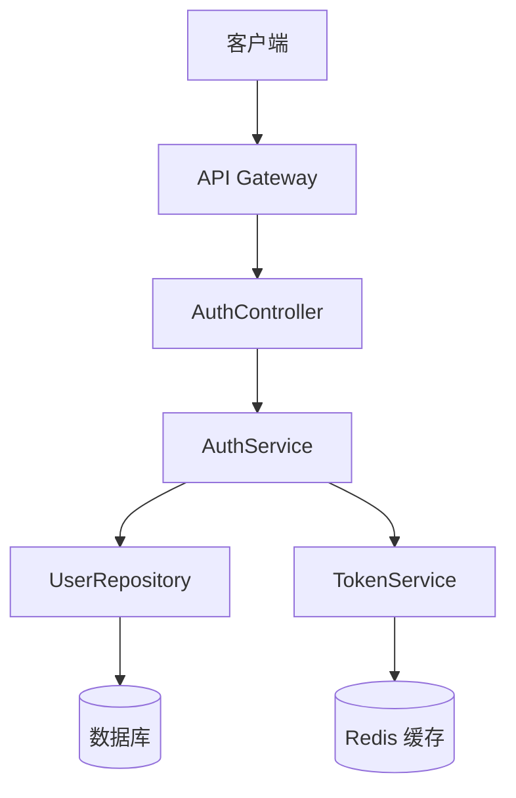

2. **ASCII 架构图**：适用于简单的层次结构

```
┌─────────────────────────────────────────┐
│              客户端层                    │
│  Web Browser / Mobile App / API Client  │
└─────────────────────┬───────────────────┘
                      │ HTTP/HTTPS
┌─────────────────────▼───────────────────┐
│              API 层                      │
│  AuthController / SessionController     │
└─────────────────────┬───────────────────┘
                      │
┌─────────────────────▼───────────────────┐
│              服务层                      │
│  AuthService / TokenService             │
└──────────┬──────────────────┬───────────┘
           │                  │
┌──────────▼──────┐  ┌────────▼──────────┐
│   数据访问层     │  │    缓存层          │
│  UserRepository │  │  Redis / Memcached │
└──────────┬──────┘  └───────────────────┘
           │
┌──────────▼──────┐
│    数据库层      │
│  PostgreSQL     │
└─────────────────┘
```

**示例**：
```markdown
## 架构

### 系统组件

用户认证系统由以下四个主要组件构成：

1. **AuthController**：处理 HTTP 请求，负责路由和请求/响应格式化
2. **AuthService**：实现核心认证逻辑，包括凭证验证和会话管理
3. **UserRepository**：封装数据库访问，提供用户数据的 CRUD 操作
4. **TokenService**：负责 JWT token 的生成、验证和刷新

### 架构图

\`\`\`mermaid
graph TD
    Client[客户端] -->|HTTP 请求| AuthController
    AuthController -->|调用| AuthService
    AuthService -->|查询用户| UserRepository
    AuthService -->|生成/验证 token| TokenService
    UserRepository -->|SQL 查询| DB[(PostgreSQL)]
    TokenService -->|缓存 token| Cache[(Redis)]
\`\`\`
```

#### 5.1.4 组件和接口章节（Components and Interfaces）

**目的**：详细描述每个组件的职责、输入/输出接口和内部逻辑。

**内容要求**：
- 为每个主要组件提供独立的小节
- 说明组件的职责（Responsibilities）
- 定义组件的接口（API、函数签名、数据结构）
- 说明组件的依赖关系
- 提供关键方法的说明

**接口定义格式**：

使用 TypeScript 接口或伪代码定义接口，保持语言无关性：

```typescript
// 服务接口示例
interface AuthService {
  // 验证用户凭证，成功返回 token 对，失败抛出异常
  login(username: string, password: string): Promise<AuthTokens>;
  
  // 使用 refresh token 获取新的 access token
  refreshToken(refreshToken: string): Promise<string>;
  
  // 登出，使 token 失效
  logout(accessToken: string): Promise<void>;
  
  // 验证 access token 的有效性
  validateToken(accessToken: string): Promise<TokenPayload>;
}

// 数据结构示例
interface AuthTokens {
  accessToken: string;   // JWT access token，有效期 15 分钟
  refreshToken: string;  // Refresh token，有效期 7 天
  expiresIn: number;     // access token 过期时间（秒）
}
```

**示例**：
```markdown
## 组件和接口

### 1. AuthController

**职责**：处理认证相关的 HTTP 请求，负责请求验证、响应格式化和错误处理。

**接口**：
- `POST /auth/login` - 用户登录
- `POST /auth/logout` - 用户登出
- `POST /auth/refresh` - 刷新 access token
- `POST /auth/reset-password` - 请求密码重置

**输入验证**：
- 验证请求体的 JSON 格式
- 验证必需字段的存在性
- 验证字段类型和格式

### 2. AuthService

**职责**：实现核心认证业务逻辑。

**接口**：
\`\`\`typescript
interface AuthService {
  login(credentials: LoginCredentials): Promise<AuthTokens>;
  logout(userId: string, tokenId: string): Promise<void>;
  refreshToken(refreshToken: string): Promise<string>;
  validateToken(token: string): Promise<TokenPayload>;
}
\`\`\`

**依赖**：UserRepository, TokenService
```

#### 5.1.5 数据模型章节（Data Model）

**目的**：定义系统使用的数据结构、类型和关系。

**内容要求**：
- 定义所有核心数据实体
- 说明实体之间的关系
- 提供字段类型和约束说明
- 可选：提供实体关系图（ER 图）

**数据模型格式**：

使用 TypeScript 接口或类定义数据模型：

```typescript
// 数据模型示例
interface User {
  id: string;           // UUID v4，主键
  username: string;     // 唯一，3-50 个字符，只允许字母数字和连字符
  email: string;        // 唯一，有效的电子邮件格式
  passwordHash: string; // bcrypt 哈希，不在 API 响应中返回
  isActive: boolean;    // 账户是否激活
  isLocked: boolean;    // 账户是否被锁定
  lockUntil: Date | null; // 锁定到期时间
  createdAt: Date;      // 创建时间
  updatedAt: Date;      // 最后更新时间
}

interface Session {
  id: string;           // UUID v4，主键
  userId: string;       // 外键，关联 User.id
  refreshToken: string; // 哈希后的 refresh token
  userAgent: string;    // 客户端 User-Agent
  ipAddress: string;    // 客户端 IP 地址
  createdAt: Date;      // 创建时间
  expiresAt: Date;      // 过期时间
}
```

**实体关系图**（使用 Mermaid）：

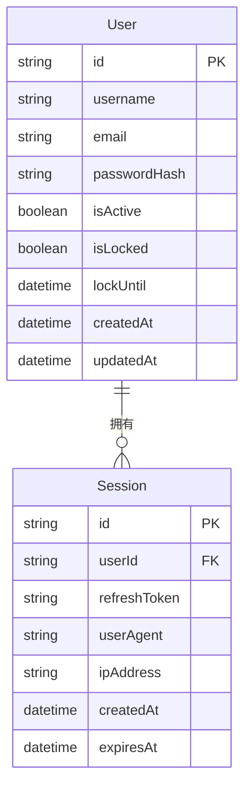

#### 5.1.6 错误处理章节（Error Handling）

**目的**：定义系统的错误处理策略，包括错误类型、错误消息和处理方式。

**内容要求**：
- 列出所有可能的错误场景
- 定义错误类型和错误码
- 说明每种错误的处理方式
- 提供错误响应格式

**示例**：
```markdown
## 错误处理

### 错误类型

| 错误场景 | HTTP 状态码 | 错误码 | 处理方式 |
|---------|-----------|--------|---------|
| 凭证无效 | 401 | AUTH_001 | 返回通用错误消息，不透露具体原因 |
| 账户被锁定 | 401 | AUTH_002 | 返回锁定时间信息 |
| Token 过期 | 401 | AUTH_003 | 提示客户端刷新 token |
| Token 无效 | 401 | AUTH_004 | 要求重新登录 |
| 请求频率超限 | 429 | AUTH_005 | 返回重试等待时间 |

### 错误响应格式

\`\`\`json
{
  "error": {
    "code": "AUTH_001",
    "message": "Invalid username or password",
    "requestId": "req-uuid-here"
  }
}
\`\`\`
```

#### 5.1.7 测试策略章节（Testing Strategy）

**目的**：定义如何验证设计的正确性，包括测试方法、正确性属性和覆盖率目标。

**内容要求**：
- 说明测试方法（单元测试、集成测试、属性测试）
- 定义正确性属性（Correctness Properties）
- 说明何时使用属性测试（Property-Based Testing）
- 设定测试覆盖率目标

**正确性属性格式**：

正确性属性描述系统在任意输入下都应满足的不变量：

```markdown
### 正确性属性

1. **Token 验证的幂等性**（Idempotence）
   - 属性：多次验证同一个有效 token 应当返回相同的结果
   - 测试方法：属性测试，生成随机有效 token，验证多次调用结果一致

2. **密码哈希的单向性**（Invariant）
   - 属性：对于任意密码，`hash(password) != password`
   - 测试方法：属性测试，生成随机密码，验证哈希值不等于原始密码

3. **会话创建和销毁的对称性**（Round Trip）
   - 属性：创建会话后立即销毁，系统状态应恢复到创建前
   - 测试方法：集成测试，验证会话的完整生命周期
```

**示例**：
```markdown
## 测试策略

### 测试方法

1. **单元测试**：测试各组件的独立功能
   - AuthService 的凭证验证逻辑
   - TokenService 的 token 生成和验证
   - 密码哈希和验证函数

2. **集成测试**：测试组件之间的交互
   - 完整的登录流程（从 HTTP 请求到数据库操作）
   - Token 刷新流程
   - 会话管理流程

3. **属性测试**：验证系统的通用属性
   - Token 验证的幂等性
   - 密码哈希的单向性

### 覆盖率目标

- 单元测试覆盖率：≥ 90%
- 集成测试：覆盖所有主要用户流程
- 属性测试：覆盖所有正确性属性
```

#### 5.1.8 实现考虑章节（Implementation Considerations）

**目的**：记录影响实现的技术决策、约束条件和注意事项。

**内容要求**：
- 说明技术选择及其理由
- 说明性能考虑（如缓存策略、数据库索引）
- 说明可维护性考虑（如代码组织、文档）
- 说明兼容性考虑（如环境要求、向后兼容性）
- 说明安全考虑（如密钥管理、数据保护）

**实现考虑的典型内容**：

```markdown
## 实现考虑

### 技术选择

**JWT 库**：使用 `jsonwebtoken`（Node.js）
- 理由：成熟、广泛使用、支持 RS256 和 HS256 算法
- 替代方案：`jose`（更现代，支持 Web Crypto API）

**密码哈希**：使用 `bcrypt`
- 理由：行业标准，内置 salt，可调节计算成本
- 替代方案：`argon2`（更现代，但依赖原生模块）

### 性能考虑

- **Token 验证缓存**：将已验证的 token 缓存在 Redis 中（TTL = token 剩余有效期），避免重复验证
- **数据库索引**：在 `users.email`、`users.username` 和 `sessions.userId` 上创建索引
- **连接池**：使用数据库连接池（最大连接数 = CPU 核心数 × 2）

### 安全考虑

- **密钥管理**：JWT 签名密钥通过环境变量注入，不硬编码在代码中
- **Token 轮换**：每次刷新 token 时，同时使旧的 refresh token 失效
- **日志脱敏**：日志中不记录密码、token 等敏感信息

### 可维护性

- **模块化设计**：每个组件独立可测试，通过依赖注入解耦
- **错误类型化**：使用自定义错误类（如 `AuthenticationError`、`TokenExpiredError`）便于错误处理
- **配置外部化**：所有可配置参数（token 有效期、锁定时间等）通过配置文件管理
```

#### 5.1.9 序列图（Sequence Diagrams）

序列图用于展示关键流程中各组件之间的交互时序，帮助理解复杂的多步骤操作。

**何时使用序列图**：
- 涉及多个组件的复杂交互流程
- 需要明确展示操作顺序的场景
- 异步操作或事件驱动的流程
- 需要展示错误处理路径的场景

**序列图格式**：

使用 **Mermaid** 的 `sequenceDiagram` 语法绘制序列图：

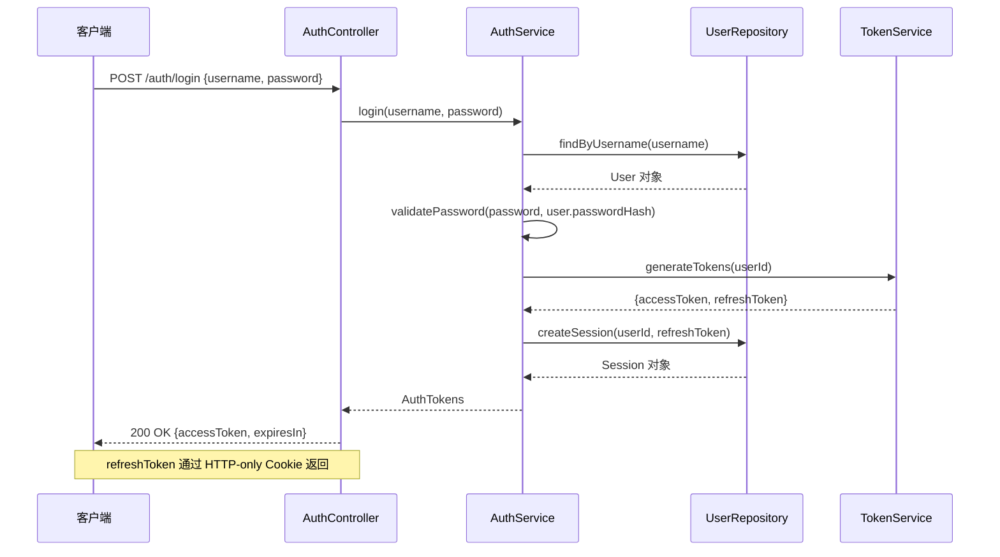

**序列图语法说明**：

```
sequenceDiagram
    participant A as 参与者A的显示名称
    participant B as 参与者B的显示名称
    
    A->>B: 同步调用（实线箭头）
    B-->>A: 返回值（虚线箭头）
    A-)B: 异步调用（实线开放箭头）
    
    Note over A,B: 跨越多个参与者的注释
    Note right of A: 单个参与者的注释
    
    alt 条件成立
        A->>B: 条件分支1
    else 条件不成立
        A->>B: 条件分支2
    end
    
    loop 循环条件
        A->>B: 循环操作
    end
```

**示例：登录流程序列图**

```markdown
### 登录流程

\`\`\`mermaid
sequenceDiagram
    participant C as 客户端
    participant AC as AuthController
    participant AS as AuthService
    participant UR as UserRepository
    participant TS as TokenService

    C->>AC: POST /auth/login
    AC->>AC: 验证请求格式
    
    alt 请求格式无效
        AC-->>C: 400 Bad Request
    else 请求格式有效
        AC->>AS: login(username, password)
        AS->>UR: findByUsername(username)
        
        alt 用户不存在
            UR-->>AS: null
            AS-->>AC: AuthenticationError
            AC-->>C: 401 Unauthorized
        else 用户存在
            UR-->>AS: User 对象
            AS->>AS: validatePassword(password, hash)
            
            alt 密码错误
                AS->>UR: incrementFailedAttempts(userId)
                AS-->>AC: AuthenticationError
                AC-->>C: 401 Unauthorized
            else 密码正确
                AS->>TS: generateTokens(userId)
                TS-->>AS: {accessToken, refreshToken}
                AS->>UR: createSession(userId, refreshToken)
                AS-->>AC: AuthTokens
                AC-->>C: 200 OK {accessToken}
            end
        end
    end
\`\`\`
```

#### 5.1.10 设计文档检查清单

在完成设计文档后，使用以下检查清单验证质量：

- [ ] 概述章节清楚地说明了设计目标和原则
- [ ] 架构章节包含架构图（Mermaid 或 ASCII）
- [ ] 所有主要组件都有职责说明和接口定义
- [ ] 数据模型定义了所有核心数据结构
- [ ] 错误处理章节覆盖了主要错误场景
- [ ] 测试策略章节定义了正确性属性
- [ ] 实现考虑章节记录了关键技术决策
- [ ] 复杂流程有对应的序列图
- [ ] 设计与需求文档中的验收标准对应
- [ ] 接口定义清晰，足以指导实现
- [ ] 文档使用中文描述，术语和代码保持英文

### 5.2 design.md 模板

本节提供 `design.md` 文档的标准模板，包含所有必需章节和格式规范。

#### 5.2.1 模板结构

````markdown
# 设计文档：{功能名称}

## 概述

{简要描述设计目标、核心决策和设计原则。1-3 段文字。}

### 核心目标

1. **{目标1}**：{说明}
2. **{目标2}**：{说明}
3. **{目标3}**：{说明}

### 设计原则

- **{原则1}**：{说明}
- **{原则2}**：{说明}

## 架构

### 系统组件

{描述主要组件及其职责。}

1. **{组件1}**：{职责说明}
2. **{组件2}**：{职责说明}
3. **{组件3}**：{职责说明}

### 架构图

```mermaid
graph TD
    A[{组件A}] --> B[{组件B}]
    B --> C[{组件C}]
    C --> D[({数据存储})]
```

### 数据流

{描述数据在系统中的流向。}

## 组件和接口

### 1. {组件名称}

**职责**：{组件的主要职责}

**接口**：
```typescript
interface {ComponentName} {
  {methodName}({param}: {Type}): Promise<{ReturnType}>;
}
```

**依赖**：{依赖的其他组件}

### 2. {组件名称}

**职责**：{组件的主要职责}

**接口**：
```typescript
interface {ComponentName} {
  {methodName}({param}: {Type}): Promise<{ReturnType}>;
}
```

**依赖**：{依赖的其他组件}

## 数据模型

### {实体名称}

```typescript
interface {EntityName} {
  id: string;           // UUID v4，主键
  {field1}: {Type};     // {字段说明}
  {field2}: {Type};     // {字段说明}
  createdAt: Date;      // 创建时间
  updatedAt: Date;      // 最后更新时间
}
```

### 实体关系图

```mermaid
erDiagram
    {Entity1} {
        string id PK
        string {field1}
        datetime createdAt
    }
    {Entity2} {
        string id PK
        string {entity1Id} FK
        string {field1}
    }
    {Entity1} ||--o{ {Entity2} : "{关系描述}"
```

## 序列图

### {流程名称}

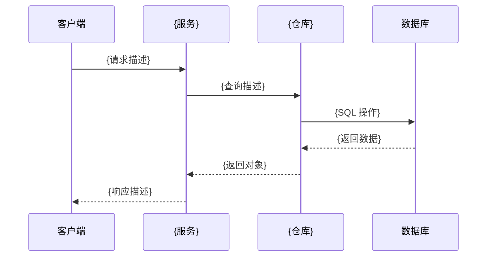

## 错误处理

### 错误类型

| 错误场景 | HTTP 状态码 | 错误码 | 处理方式 |
|---------|-----------|--------|---------|
| {错误场景1} | {状态码} | {错误码} | {处理方式} |
| {错误场景2} | {状态码} | {错误码} | {处理方式} |

### 错误响应格式

```json
{
  "error": {
    "code": "{ERROR_CODE}",
    "message": "{错误消息}",
    "requestId": "{请求ID}"
  }
}
```

## 测试策略

### 测试方法

1. **单元测试**：{说明测试范围}
2. **集成测试**：{说明测试范围}
3. **属性测试**：{说明测试范围，如适用}

### 正确性属性

1. **{属性名称}**（{属性类型：Invariant/Round Trip/Idempotence 等}）
   - 属性：{描述系统应满足的不变量}
   - 测试方法：{如何验证此属性}

2. **{属性名称}**（{属性类型}）
   - 属性：{描述}
   - 测试方法：{如何验证}

### 覆盖率目标

- 单元测试覆盖率：≥ {目标百分比}%
- 集成测试：覆盖所有主要用户流程
- 属性测试：覆盖所有正确性属性

## 实现考虑

### 技术选择

**{技术/库名称}**：
- 理由：{选择理由}
- 替代方案：{其他选项}

### 性能考虑

- **{性能优化点1}**：{说明}
- **{性能优化点2}**：{说明}

### 安全考虑

- **{安全措施1}**：{说明}
- **{安全措施2}**：{说明}

### 可维护性

- **{可维护性措施1}**：{说明}
- **{可维护性措施2}**：{说明}

### 兼容性

- **环境要求**：{说明}
- **向后兼容性**：{说明}
````

#### 5.2.2 章节填写指南

| 章节 | 最少内容 | 推荐内容 |
|------|---------|---------|
| 概述 | 1 段说明 + 核心目标 | 核心目标 + 设计原则 + 约束条件 |
| 架构 | 组件列表 + 架构图 | 组件列表 + Mermaid 图 + 数据流说明 |
| 组件和接口 | 每个组件的职责 + 接口 | 职责 + TypeScript 接口 + 依赖关系 |
| 数据模型 | 核心数据结构 | TypeScript 接口 + ER 图 |
| 序列图 | 主要流程的序列图 | 所有关键流程（含错误路径）的序列图 |
| 错误处理 | 错误类型表 | 错误类型表 + 错误响应格式 |
| 测试策略 | 测试方法 + 正确性属性 | 测试方法 + 正确性属性 + 覆盖率目标 |
| 实现考虑 | 技术选择 | 技术选择 + 性能 + 安全 + 可维护性 |

### 5.3 design.md 完整示例

以下是一个完整的 `design.md` 文档示例，展示用户认证系统的设计文档填写效果。

````markdown
# 设计文档：用户认证系统

## 概述

本功能为电商平台实现安全、可扩展的用户认证系统。系统采用 JWT（JSON Web Token）无状态认证机制，结合 Redis 缓存和 PostgreSQL 持久化存储，提供高性能的认证服务。

### 核心目标

1. **安全性**：使用行业标准的加密和令牌机制保护用户凭证，防止常见攻击（暴力破解、会话劫持等）
2. **可扩展性**：无状态 JWT 认证支持水平扩展，满足高并发需求
3. **可维护性**：清晰的模块划分和依赖注入，便于独立测试和更新

### 设计原则

- **最小权限**：每个组件只拥有完成其职责所需的最小权限
- **防御性设计**：假设所有输入可能是恶意的，对所有输入进行严格验证
- **无状态认证**：使用 JWT 实现无状态认证，access token 不存储在服务端
- **失败安全**：认证失败时返回通用错误消息，不透露具体失败原因

## 架构

### 系统组件

用户认证系统由以下四个主要组件构成：

1. **AuthController**：处理 HTTP 请求，负责路由、请求验证和响应格式化
2. **AuthService**：实现核心认证业务逻辑，包括凭证验证、会话管理和 token 操作
3. **UserRepository**：封装数据库访问，提供用户数据和会话数据的 CRUD 操作
4. **TokenService**：负责 JWT token 的生成、验证、刷新和撤销

### 架构图

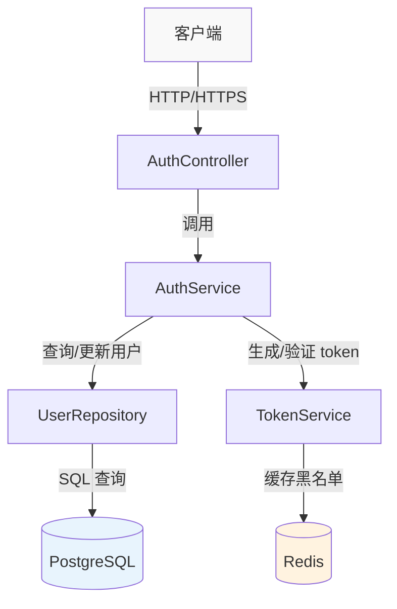

### 数据流

**登录流程**：客户端 → AuthController（验证请求格式）→ AuthService（验证凭证）→ UserRepository（查询用户）→ TokenService（生成 token）→ 客户端

**请求验证流程**：客户端（携带 token）→ AuthController（提取 token）→ TokenService（验证签名和有效期）→ 业务处理

## 组件和接口

### 1. AuthController

**职责**：处理认证相关的 HTTP 请求，负责请求格式验证、响应格式化和错误处理。

**接口**：
- `POST /auth/register` - 用户注册
- `POST /auth/login` - 用户登录
- `POST /auth/logout` - 用户登出
- `POST /auth/refresh` - 刷新 access token
- `POST /auth/reset-password/request` - 请求密码重置
- `POST /auth/reset-password/confirm` - 确认密码重置

**依赖**：AuthService

### 2. AuthService

**职责**：实现核心认证业务逻辑，协调 UserRepository 和 TokenService 完成认证操作。

**接口**：
```typescript
interface AuthService {
  // 注册新用户，返回用户信息（不含密码）
  register(data: RegisterData): Promise<UserProfile>;

  // 验证凭证，成功返回 token 对，失败抛出 AuthenticationError
  login(credentials: LoginCredentials): Promise<AuthTokens>;

  // 使当前 token 失效，删除会话记录
  logout(userId: string, tokenId: string): Promise<void>;

  // 使用 refresh token 获取新的 access token
  refreshToken(refreshToken: string): Promise<string>;

  // 验证 access token，返回 token 载荷
  validateToken(accessToken: string): Promise<TokenPayload>;

  // 发起密码重置流程，发送重置邮件
  requestPasswordReset(email: string): Promise<void>;

  // 使用重置令牌设置新密码
  confirmPasswordReset(token: string, newPassword: string): Promise<void>;
}
```

**依赖**：UserRepository, TokenService

### 3. UserRepository

**职责**：封装所有数据库访问操作，提供用户和会话数据的持久化接口。

**接口**：
```typescript
interface UserRepository {
  // 根据用户名查找用户
  findByUsername(username: string): Promise<User | null>;

  // 根据邮箱查找用户
  findByEmail(email: string): Promise<User | null>;

  // 创建新用户
  create(data: CreateUserData): Promise<User>;

  // 更新用户信息
  update(userId: string, data: Partial<User>): Promise<User>;

  // 创建会话记录
  createSession(userId: string, sessionData: CreateSessionData): Promise<Session>;

  // 删除会话记录
  deleteSession(sessionId: string): Promise<void>;

  // 删除用户的所有会话
  deleteAllSessions(userId: string): Promise<void>;

  // 记录登录失败次数
  incrementFailedAttempts(userId: string): Promise<number>;

  // 重置登录失败次数
  resetFailedAttempts(userId: string): Promise<void>;
}
```

**依赖**：PostgreSQL 数据库连接

### 4. TokenService

**职责**：负责 JWT token 的生成、验证和管理，维护 token 黑名单。

**接口**：
```typescript
interface TokenService {
  // 生成 access token 和 refresh token 对
  generateTokens(userId: string, sessionId: string): AuthTokens;

  // 验证 access token 的签名和有效期
  verifyAccessToken(token: string): TokenPayload;

  // 验证 refresh token
  verifyRefreshToken(token: string): RefreshTokenPayload;

  // 将 token 加入黑名单（用于登出）
  blacklistToken(tokenId: string, expiresAt: Date): Promise<void>;

  // 检查 token 是否在黑名单中
  isBlacklisted(tokenId: string): Promise<boolean>;
}
```

**依赖**：Redis 缓存

## 数据模型

### User（用户）

```typescript
interface User {
  id: string;              // UUID v4，主键
  username: string;        // 唯一，3-50 个字符，只允许字母数字和连字符
  email: string;           // 唯一，有效的电子邮件格式
  passwordHash: string;    // bcrypt 哈希，不在 API 响应中返回
  isActive: boolean;       // 账户是否激活（邮箱验证后为 true）
  isLocked: boolean;       // 账户是否被锁定
  lockUntil: Date | null;  // 锁定到期时间，null 表示未锁定
  failedAttempts: number;  // 连续登录失败次数
  createdAt: Date;         // 创建时间
  updatedAt: Date;         // 最后更新时间
}
```

### Session（会话）

```typescript
interface Session {
  id: string;           // UUID v4，主键
  userId: string;       // 外键，关联 User.id
  refreshTokenHash: string; // 哈希后的 refresh token
  userAgent: string;    // 客户端 User-Agent
  ipAddress: string;    // 客户端 IP 地址
  createdAt: Date;      // 创建时间
  expiresAt: Date;      // 过期时间（7 天后）
  lastUsedAt: Date;     // 最后使用时间
}
```

### PasswordResetToken（密码重置令牌）

```typescript
interface PasswordResetToken {
  id: string;        // UUID v4，主键
  userId: string;    // 外键，关联 User.id
  tokenHash: string; // 哈希后的重置令牌
  createdAt: Date;   // 创建时间
  expiresAt: Date;   // 过期时间（1 小时后）
  usedAt: Date | null; // 使用时间，null 表示未使用
}
```

### 实体关系图

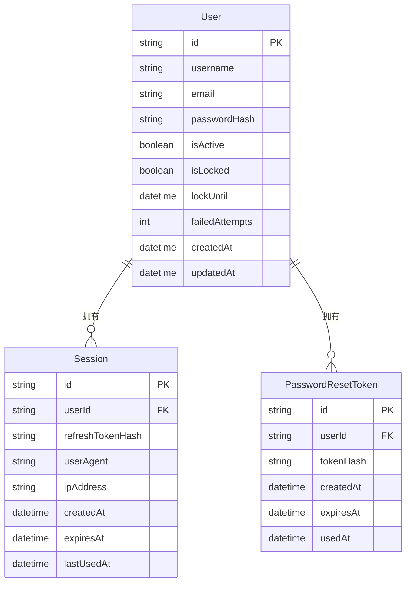

## 序列图

### 登录流程

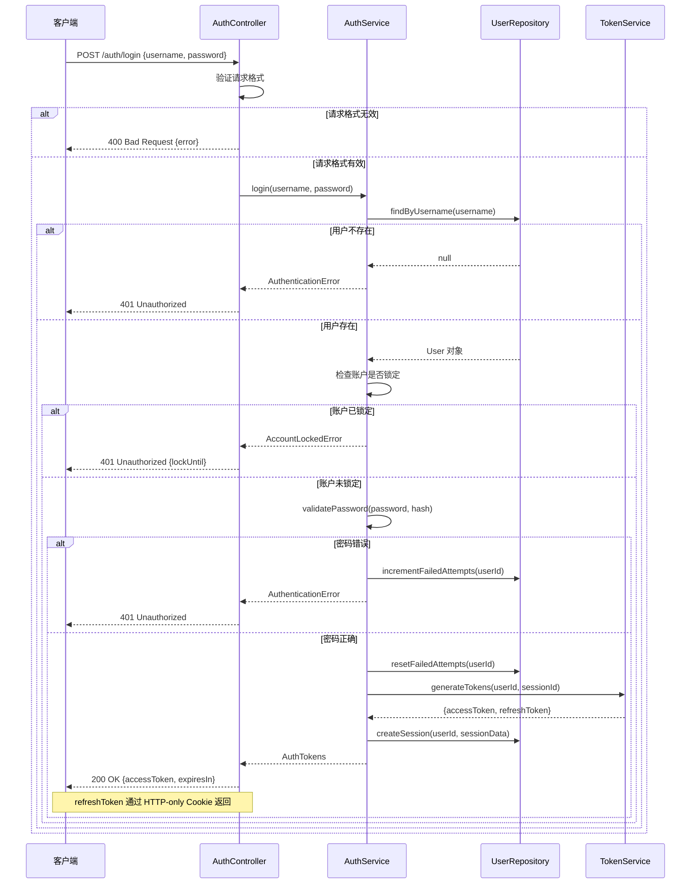

### Token 刷新流程

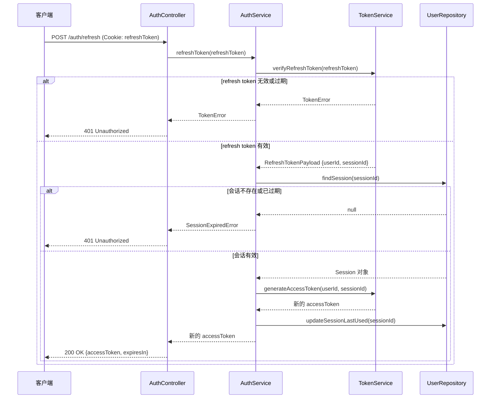

## 错误处理

### 错误类型

| 错误场景 | HTTP 状态码 | 错误码 | 处理方式 |
|---------|-----------|--------|---------|
| 凭证无效（用户名或密码错误） | 401 | AUTH_001 | 返回通用错误消息，不透露具体原因 |
| 账户被锁定 | 401 | AUTH_002 | 返回锁定到期时间 |
| 账户未激活 | 401 | AUTH_003 | 提示用户验证邮箱 |
| Access token 过期 | 401 | AUTH_004 | 提示客户端使用 refresh token 刷新 |
| Access token 无效 | 401 | AUTH_005 | 要求重新登录 |
| Refresh token 无效或过期 | 401 | AUTH_006 | 要求重新登录 |
| 请求频率超限 | 429 | AUTH_007 | 返回重试等待时间（Retry-After 头） |
| 请求格式无效 | 400 | AUTH_008 | 返回字段验证错误详情 |
| 重置令牌无效或过期 | 400 | AUTH_009 | 提示用户重新申请重置链接 |

### 错误响应格式

```json
{
  "error": {
    "code": "AUTH_001",
    "message": "Invalid username or password",
    "requestId": "req-550e8400-e29b"
  }
}
```

**安全原则**：认证失败时，始终返回通用错误消息（如 "Invalid username or password"），不透露是用户名不存在还是密码错误，防止用户名枚举攻击。

## 测试策略

### 测试方法

1. **单元测试**：测试各组件的独立功能
   - AuthService 的凭证验证逻辑（含账户锁定逻辑）
   - TokenService 的 token 生成、验证和黑名单管理
   - 密码哈希和验证函数
   - 输入验证逻辑

2. **集成测试**：测试组件之间的交互
   - 完整的登录流程（从 HTTP 请求到数据库操作）
   - Token 刷新流程
   - 密码重置流程
   - 账户锁定和解锁流程

3. **属性测试**：验证系统的通用属性（使用 fast-check 或 Hypothesis）
   - Token 验证的幂等性
   - 密码哈希的单向性

### 正确性属性

1. **Token 验证的幂等性**（Idempotence）
   - 属性：对于任意有效的 access token，多次调用 `validateToken` 应返回相同的载荷
   - 测试方法：属性测试，生成随机用户 ID 和会话 ID，生成 token 后多次验证，断言结果一致

2. **密码哈希的单向性**（Invariant）
   - 属性：对于任意密码字符串 `p`，`hash(p) !== p`
   - 测试方法：属性测试，生成随机字符串，验证哈希值不等于原始值

3. **登录-登出的状态一致性**（Round Trip）
   - 属性：用户登录后立即登出，其 token 应立即失效
   - 测试方法：集成测试，登录获取 token，登出后尝试使用该 token 访问受保护资源，断言返回 401

4. **账户锁定的不变性**（Invariant）
   - 属性：账户锁定期间，无论输入什么凭证，登录都应失败
   - 测试方法：属性测试，锁定账户后生成随机凭证尝试登录，断言始终返回 401

### 覆盖率目标

- 单元测试覆盖率：≥ 90%
- 集成测试：覆盖所有主要用户流程（登录、登出、刷新、重置密码）
- 属性测试：覆盖所有 4 个正确性属性

## 实现考虑

### 技术选择

**JWT 库**：使用 `jsonwebtoken`（Node.js）
- 理由：成熟、广泛使用、支持 RS256 和 HS256 算法
- 替代方案：`jose`（更现代，支持 Web Crypto API，但 API 较复杂）

**密码哈希**：使用 `bcrypt`
- 理由：行业标准，内置 salt，可调节计算成本（cost factor）
- 替代方案：`argon2`（更现代，内存硬化，但依赖原生模块，部署复杂）

**缓存**：使用 Redis 存储 token 黑名单
- 理由：高性能、支持 TTL 自动过期、分布式部署友好
- 替代方案：内存缓存（不支持多实例部署）

### 性能考虑

- **Token 验证缓存**：将已验证的 token 载荷缓存在 Redis 中（TTL = token 剩余有效期），避免重复解析 JWT
- **数据库索引**：在 `users.email`、`users.username` 和 `sessions.userId` 上创建索引，加速查询
- **连接池**：使用数据库连接池（最大连接数 = CPU 核心数 × 2），避免频繁建立连接
- **bcrypt 成本因子**：设置为 12，在安全性和性能之间取得平衡（约 300ms/次哈希）

### 安全考虑

- **密钥管理**：JWT 签名密钥通过环境变量注入，不硬编码在代码中；生产环境使用 RS256 非对称加密
- **Token 轮换**：每次刷新 token 时，同时使旧的 refresh token 失效，防止 token 重放攻击
- **日志脱敏**：日志中不记录密码、token 等敏感信息；IP 地址在存储前进行哈希处理
- **HTTPS 强制**：所有认证相关端点强制使用 HTTPS，防止中间人攻击
- **Cookie 安全**：refresh token cookie 设置 `HttpOnly`、`Secure`、`SameSite=Strict` 标志

### 可维护性

- **模块化设计**：每个组件独立可测试，通过依赖注入解耦，便于替换实现
- **错误类型化**：使用自定义错误类（`AuthenticationError`、`TokenExpiredError`、`AccountLockedError`）便于精确错误处理
- **配置外部化**：所有可配置参数（token 有效期、锁定时间、bcrypt 成本因子等）通过配置文件管理，无需修改代码

### 兼容性

- **环境要求**：Node.js 18+，PostgreSQL 14+，Redis 7+
- **向后兼容性**：token 格式变更时，通过 token 版本字段（`ver`）支持平滑迁移，旧版 token 在过期前继续有效
````


## 6. 任务阶段

任务阶段是 Spec 工作流的第三个阶段，目标是将设计分解为可执行的离散任务。任务文档（`tasks.md`）将设计方案转化为具体的实现步骤，每个步骤都可以独立跟踪和执行。

### 6.1 任务文档格式

`tasks.md` 使用结构化的 Markdown 格式，通过两级层次结构组织任务，确保任务的清晰性和可追溯性。

#### 6.1.1 两级层次结构

任务列表采用**两级层次结构**：

- **顶级任务**：功能模块或阶段的分组容器，使用整数编号（1, 2, 3...）
- **子任务**：实际的执行单元，使用点分编号（1.1, 1.2, 2.1...）

**关键规则**：
- 顶级任务是**分组容器**，不直接执行，只包含子任务
- 子任务是**实际执行单元**，代理逐一实现子任务
- 每个子任务应该足够小，可以在一次对话中完成

**格式示例**：

```markdown
- [ ] 1. 实现认证服务
  - [ ] 1.1 创建 AuthenticationService 类
    - 实现 login(username, password) 方法
    - 实现 validateToken(token) 方法
    - _需求: 1.1, 1.2_

  - [ ] 1.2 实现密码哈希功能
    - 使用 bcrypt 库
    - 添加 salt 生成
    - _需求: 1.3_

- [ ] 2. 实现 token 管理
  - [ ] 2.1 创建 TokenService 类
    - 实现 JWT token 生成
    - 实现 token 验证
    - _需求: 1.4_

  - [ ] 2.2 实现 token 刷新
    - 实现 refresh token 逻辑
    - 添加 token 黑名单
    - _需求: 1.5_
```

**层次结构说明**：

| 层级 | 格式 | 角色 | 示例 |
|------|------|------|------|
| 顶级任务 | `- [ ] 1. 功能名称` | 分组容器 | `- [ ] 1. 实现认证服务` |
| 子任务 | `  - [ ] 1.1 具体实现` | 执行单元 | `  - [ ] 1.1 创建 AuthenticationService 类` |
| 实现细节 | `    - 说明` | 参考信息 | `    - 实现 login 方法` |

#### 6.1.2 任务编号规范

任务编号遵循以下规范：

**顶级任务编号**：
- 使用连续整数：1, 2, 3, 4...
- 按照实现顺序排列
- 反映功能模块的逻辑分组

**子任务编号**：
- 使用点分格式：`父编号.子编号`
- 例如：1.1, 1.2, 1.3, 2.1, 2.2...
- 子编号从 1 开始，在同一父任务内连续递增

**编号与依赖关系**：
- 编号顺序暗示了推荐的实现顺序
- 较小编号的任务通常是较大编号任务的前置条件
- 如果任务之间有明确依赖，在任务描述中说明

**示例**：

```markdown
- [ ] 1. 数据库层
  - [ ] 1.1 创建数据库 schema
  - [ ] 1.2 实现 UserRepository
  - [ ] 1.3 实现 SessionRepository

- [ ] 2. 服务层（依赖任务 1 完成）
  - [ ] 2.1 实现 AuthService
  - [ ] 2.2 实现 TokenService

- [ ] 3. API 层（依赖任务 2 完成）
  - [ ] 3.1 实现 AuthController
  - [ ] 3.2 配置路由和中间件
```

#### 6.1.3 可选任务标记

某些任务对于 MVP（最小可行产品）不是必需的，可以使用 `*` 标记为可选任务：

**格式**：在任务编号后加 `*`

```markdown
- [ ] 2. 实现高级功能
  - [ ] 2.1 实现基本登录功能
    - _需求: 1.1_

  - [ ]* 2.2 实现多因素认证
    - 集成 TOTP 验证器
    - 支持短信验证码
    - _需求: 1.6_

  - [ ]* 2.3 实现社交媒体登录
    - 支持 Google OAuth
    - 支持 GitHub OAuth
    - _需求: 1.7_
```

**可选任务的使用场景**：
- 增强功能，不影响核心流程
- 性能优化，基本功能已可用
- 高级特性，可在后续迭代中实现
- 边缘情况处理，不影响主要用户流程

**可选任务的处理规则**：
- 代理在实现时可以跳过可选任务，优先完成必需任务
- 跳过可选任务不影响 MVP 的交付
- 用户可以明确要求实现可选任务
- 可选任务完成后，`*` 标记保留，仅勾选状态改变

#### 6.1.4 需求引用格式

每个子任务应在末尾引用相关需求，确保实现的可追溯性：

**格式**：`_需求: X.X, X.X_`

```markdown
- [ ] 1.1 实现用户登录功能
  - 验证用户名和密码
  - 生成 JWT token
  - 创建会话记录
  - _需求: 2.1, 2.2_
```

**需求引用规则**：
- 使用斜体格式（`_需求: ..._`）放在子任务的最后一行
- 引用格式为需求编号，多个需求用逗号分隔
- 需求编号对应 `requirements.md` 中的验收标准编号
- 每个子任务至少引用一个需求

**需求引用的作用**：
- **可追溯性**：从任务追溯到需求，确保所有需求都被实现
- **范围控制**：明确每个任务的实现范围，避免过度实现
- **验证依据**：完成任务后，根据引用的需求验证实现是否正确

**示例**：

```markdown
- [ ] 1. 实现用户认证
  - [ ] 1.1 实现登录端点
    - 创建 POST /auth/login 路由
    - 验证请求体格式
    - 调用 AuthService.login()
    - _需求: 2.1, 2.2, 2.3_

  - [ ] 1.2 实现账户锁定机制
    - 记录登录失败次数
    - 超过阈值后锁定账户
    - 锁定期满后自动解锁
    - _需求: 2.4_
```

#### 6.1.5 Checkpoint 任务格式

Checkpoint 是一种特殊的顶级任务，用于在实现过程中进行阶段性验证。

**Checkpoint 的特点**：
- 是**顶级任务**，不包含子任务
- 用于验证前面若干任务的阶段性成果
- 确保在继续实现之前，已完成的部分是正确的
- 为用户提供反馈和调整的机会

**格式**：

```markdown
- [ ] 5. Checkpoint - 验证认证核心功能
- [ ] 11. Checkpoint - 验证完整用户流程
```

**Checkpoint 的命名规范**：
- 以 `Checkpoint` 开头
- 用连字符（`-`）分隔
- 后跟简短的验证目标描述

**Checkpoint 的作用**：

1. **增量验证**：在完成一组相关任务后，验证这些任务的整体效果
2. **用户反馈**：给用户机会审查已完成的工作，提出调整意见
3. **风险控制**：在继续实现之前，确认方向正确，避免大量返工
4. **里程碑标记**：标记实现过程中的重要节点

**Checkpoint 的放置原则**：
- 在完成一个完整的功能模块后放置
- 在开始依赖前面工作的新模块之前放置
- 通常每 3-5 个顶级任务后放置一个 Checkpoint
- 在整个任务列表的末尾放置最终 Checkpoint

**完整示例**：

```markdown
- [ ] 1. 数据库层
  - [ ] 1.1 创建数据库 schema
    - _需求: 1.1_
  - [ ] 1.2 实现 UserRepository
    - _需求: 1.2_

- [ ] 2. 服务层
  - [ ] 2.1 实现 AuthService
    - _需求: 2.1, 2.2_
  - [ ] 2.2 实现 TokenService
    - _需求: 2.3_

- [ ] 3. Checkpoint - 验证数据层和服务层

- [ ] 4. API 层
  - [ ] 4.1 实现 AuthController
    - _需求: 3.1_
  - [ ] 4.2 配置路由
    - _需求: 3.2_

- [ ] 5. 测试
  - [ ] 5.1 编写单元测试
    - _需求: 4.1_
  - [ ]* 5.2 编写集成测试
    - _需求: 4.2_

- [ ] 6. Checkpoint - 验证完整实现
```

### 6.2 tasks.md 模板

本节提供 `tasks.md` 文档的标准模板。

#### 6.2.1 模板结构

```markdown
# 实现计划：{功能名称}

## 概述

{简要描述实现计划的范围和目标。说明主要的实现阶段和预期产出。}

## 任务

- [ ] 1. {第一个功能模块}
  - [ ] 1.1 {第一个子任务}
    - {实现细节1}
    - {实现细节2}
    - _需求: X.X_

  - [ ] 1.2 {第二个子任务}
    - {实现细节1}
    - _需求: X.X, X.X_

- [ ] 2. {第二个功能模块}
  - [ ] 2.1 {子任务}
    - {实现细节}
    - _需求: X.X_

  - [ ]* 2.2 {可选子任务}
    - {实现细节}
    - _需求: X.X_

- [ ] 3. Checkpoint - {验证目标}

- [ ] 4. {第三个功能模块}
  - [ ] 4.1 {子任务}
    - {实现细节}
    - _需求: X.X_

- [ ] 5. Checkpoint - {最终验证目标}

## 注释

- 任务标记 `*` 的为可选任务，可以跳过以加快 MVP 交付
- 每个任务都引用了具体的需求编号以确保可追溯性
- Checkpoint 任务确保增量验证和用户反馈

## Task Dependency Graph

```json
{
  "waves": [
    { "id": 0, "tasks": ["1.1"] },
    { "id": 1, "tasks": ["1.2", "2.1"] },
    { "id": 2, "tasks": ["2.2"] },
    { "id": 3, "tasks": ["3"] }
  ]
}
```
```

#### 6.2.2 任务依赖图说明

`Task Dependency Graph` 章节使用 JSON 格式描述任务之间的执行顺序和并行关系。

**格式说明**：

```json
{
  "waves": [
    { "id": 0, "tasks": ["1.1"] },
    { "id": 1, "tasks": ["1.2", "2.1"] },
    { "id": 2, "tasks": ["2.2"] },
    { "id": 3, "tasks": ["3"] }
  ]
}
```

**字段说明**：

- `waves`：波次数组，定义任务的执行顺序
- `id`：波次编号，从 0 开始递增
- `tasks`：该波次中包含的任务 ID 列表

**执行规则**：

- 同一波次（`wave`）内的任务可以**并行执行**
- 后续波次的任务必须等待前面所有波次的任务**全部完成**后才能开始
- 波次编号越小，优先级越高，越先执行

**示例解读**：

| 波次 | 任务 | 说明 |
|------|------|------|
| Wave 0 | `1.1` | 首先执行，无依赖 |
| Wave 1 | `1.2`, `2.1` | 依赖 Wave 0 完成，两个任务可并行 |
| Wave 2 | `2.2` | 依赖 Wave 1 完成 |
| Wave 3 | `3` | 最后执行，依赖所有前置任务 |

#### 6.2.3 完整示例：用户认证系统

以下是用户认证系统的完整 `tasks.md` 示例：

```markdown
# 实现计划：用户认证系统

## 概述

本实现计划将用户认证系统的设计分解为可执行的离散任务。实现分为四个阶段：数据库层、服务层、API 层和测试，每个阶段完成后进行 Checkpoint 验证。

## 任务

- [ ] 1. 数据库层
  - [ ] 1.1 创建数据库 schema
    - 创建 users 表（id, username, email, passwordHash, isActive, isLocked, lockUntil, failedAttempts, createdAt, updatedAt）
    - 创建 sessions 表（id, userId, refreshTokenHash, userAgent, ipAddress, createdAt, expiresAt, lastUsedAt）
    - 创建 password_reset_tokens 表（id, userId, tokenHash, createdAt, expiresAt, usedAt）
    - 在 users.email、users.username、sessions.userId 上创建索引
    - _需求: 1.1_

  - [ ] 1.2 实现 UserRepository
    - 实现 findByUsername(username) 方法
    - 实现 findByEmail(email) 方法
    - 实现 create(data) 方法
    - 实现 update(userId, data) 方法
    - 实现 incrementFailedAttempts(userId) 方法
    - 实现 resetFailedAttempts(userId) 方法
    - _需求: 1.1, 1.2_

  - [ ] 1.3 实现 SessionRepository
    - 实现 create(userId, sessionData) 方法
    - 实现 findById(sessionId) 方法
    - 实现 delete(sessionId) 方法
    - 实现 deleteAllByUserId(userId) 方法
    - 实现 countByUserId(userId) 方法
    - _需求: 3.1_

- [ ] 2. 服务层
  - [ ] 2.1 实现 TokenService
    - 实现 generateTokens(userId, sessionId) 方法，返回 accessToken 和 refreshToken
    - 实现 verifyAccessToken(token) 方法
    - 实现 verifyRefreshToken(token) 方法
    - 实现 blacklistToken(tokenId, expiresAt) 方法
    - 实现 isBlacklisted(tokenId) 方法
    - _需求: 4.1, 4.2_

  - [ ] 2.2 实现 AuthService - 注册和登录
    - 实现 register(data) 方法：验证输入、哈希密码、创建用户
    - 实现 login(credentials) 方法：验证凭证、检查锁定状态、生成 token
    - 实现账户锁定逻辑：3 次失败后锁定 15 分钟
    - _需求: 1.1, 2.1, 2.2, 2.3, 2.4_

  - [ ] 2.3 实现 AuthService - 会话管理
    - 实现 logout(userId, tokenId) 方法
    - 实现 refreshToken(refreshToken) 方法
    - 实现会话数量限制（最多 5 个并发会话）
    - _需求: 3.1, 3.2, 3.3_

  - [ ] 2.4 实现 AuthService - 密码重置
    - 实现 requestPasswordReset(email) 方法
    - 实现 confirmPasswordReset(token, newPassword) 方法
    - 密码重置成功后使所有会话失效
    - _需求: 5.1, 5.2, 5.3_

- [ ] 3. Checkpoint - 验证数据层和服务层

- [ ] 4. API 层
  - [ ] 4.1 实现 AuthController - 注册和登录
    - 实现 POST /auth/register 端点
    - 实现 POST /auth/login 端点
    - 添加请求体验证中间件
    - _需求: 1.1, 2.1_

  - [ ] 4.2 实现 AuthController - 会话管理
    - 实现 POST /auth/logout 端点
    - 实现 POST /auth/refresh 端点
    - 实现 POST /auth/logout-all 端点
    - _需求: 3.1, 7.1_

  - [ ] 4.3 实现 AuthController - 密码重置
    - 实现 POST /auth/reset-password/request 端点
    - 实现 POST /auth/reset-password/confirm 端点
    - _需求: 5.1_

  - [ ] 4.4 实现认证中间件
    - 实现 token 提取和验证中间件
    - 将用户信息注入请求上下文
    - 处理 token 过期和无效的情况
    - _需求: 4.1, 4.2, 4.3_

  - [ ]* 4.5 实现速率限制
    - 配置登录端点的速率限制（10 次/分钟/IP）
    - 实现速率超限的响应处理
    - _需求: 6.1, 6.2_

- [ ] 5. 测试
  - [ ] 5.1 编写 TokenService 单元测试
    - 测试 token 生成和验证
    - 测试 token 黑名单功能
    - _需求: 4.1, 4.2_

  - [ ] 5.2 编写 AuthService 单元测试
    - 测试登录成功和失败场景
    - 测试账户锁定逻辑
    - 测试密码重置流程
    - _需求: 2.1, 2.2, 2.4, 5.1_

  - [ ]* 5.3 编写集成测试
    - 测试完整的登录流程（HTTP 请求到数据库）
    - 测试 token 刷新流程
    - 测试密码重置流程
    - _需求: 2.1, 3.1, 5.1_

- [ ] 6. Checkpoint - 验证完整用户认证系统
```

### 6.3 任务文档编写最佳实践

1. **从设计文档推导任务**：每个任务应该对应设计文档中的一个组件或功能，确保设计和实现的一致性

2. **保持任务粒度适中**：
   - 太大：一个子任务包含太多工作，难以在一次对话中完成
   - 太小：任务过于琐碎，增加管理开销
   - 适中：每个子任务约 1-3 小时的工作量

3. **按依赖顺序排列**：将被依赖的任务排在前面，例如先实现数据层，再实现服务层，最后实现 API 层

4. **使用 Checkpoint 分段验证**：每完成一个完整的功能模块，添加 Checkpoint 进行验证，避免在错误的基础上继续构建

5. **标记可选任务**：使用 `*` 标记非 MVP 必需的任务，帮助代理和用户区分优先级

6. **引用需求确保覆盖**：每个子任务都应引用相关需求，完成所有任务后，所有需求都应被覆盖

7. **提供足够的实现细节**：在子任务下列出关键的实现要点，帮助代理理解任务范围，但不要过于详细（设计文档已有详细说明）

### 6.4 任务文档检查清单

在完成任务文档后，使用以下检查清单验证质量：

- [ ] 所有顶级任务都有清晰的功能模块名称
- [ ] 所有子任务都有具体的实现描述
- [ ] 所有子任务都引用了相关需求
- [ ] 任务按照依赖顺序排列
- [ ] 可选任务已用 `*` 标记
- [ ] 适当位置放置了 Checkpoint 任务
- [ ] 任务覆盖了设计文档中的所有组件
- [ ] 所有需求都被至少一个任务引用
- [ ] 任务粒度适中，每个子任务可以独立完成
- [ ] 文档格式一致，使用中文描述，代码和路径保持英文


## 7. 属性测试指南

### 7.1 正确性模式（Correctness Patterns）

属性测试（Property-Based Testing，PBT）的核心在于识别代码中存在的**正确性模式**——即无论输入如何变化，代码都应当满足的普遍性质。以下是 7 种常见的正确性模式，每种模式都有其独特的适用场景和验证方式。

---

#### 7.1.1 Invariants（不变量）

**定义**：无论输入如何变化，某些属性始终保持不变。

**说明**：

不变量是系统中最基础的正确性保证。它描述的是一个在所有合法操作下都不会被破坏的性质。不变量通常与数据结构的完整性、业务规则的约束或系统状态的合法性相关。

验证不变量时，你不需要知道操作的具体输出，只需要确认某个属性在操作前后都成立。

**代码示例**：

```python
# 示例：排序后列表长度不变
def test_sort_preserves_length(lst):
    sorted_lst = sort(lst)
    assert len(sorted_lst) == len(lst)  # 不变量：长度不变

# 示例：排序后元素集合不变（没有元素丢失或新增）
def test_sort_preserves_elements(lst):
    sorted_lst = sort(lst)
    assert set(sorted_lst) == set(lst)  # 不变量：元素集合不变

# 示例：二叉搜索树的结构不变量
def test_bst_invariant(tree, value):
    insert(tree, value)
    # 不变量：插入后仍然是合法的 BST
    assert is_valid_bst(tree)

# 示例：账户余额不变量
def test_transfer_preserves_total_balance(account_a, account_b, amount):
    total_before = account_a.balance + account_b.balance
    transfer(account_a, account_b, amount)
    total_after = account_a.balance + account_b.balance
    assert total_after == total_before  # 不变量：总余额不变
```

**适用场景**：

- 数据结构操作（排序、过滤、映射）
- 数据库事务（转账、库存调整）
- 状态机转换（合法状态约束）
- 集合操作（并集、交集、差集）
- 任何需要保证数据完整性的操作

---

#### 7.1.2 Round Trip（往返）

**定义**：将操作与其逆操作组合后，返回原始值。

**说明**：

往返属性是最直观的正确性模式之一。它验证两个互逆操作的组合是否构成恒等变换。最典型的例子是序列化与反序列化：将数据序列化为字节流，再反序列化回来，应当得到与原始数据等价的结果。

往返属性有两个方向：
- **正向往返**：`decode(encode(x)) == x`
- **逆向往返**：`encode(decode(y)) == y`（并非总是成立，取决于编码是否有损）

**代码示例**：

```python
# 示例：JSON 序列化往返
def test_json_round_trip(data):
    assert json.loads(json.dumps(data)) == data

# 示例：Base64 编码往返
def test_base64_round_trip(bytes_data):
    assert base64.decode(base64.encode(bytes_data)) == bytes_data

# 示例：压缩往返
def test_compression_round_trip(data):
    assert decompress(compress(data)) == data

# 示例：加密往返（使用相同密钥）
def test_encryption_round_trip(plaintext, key):
    assert decrypt(encrypt(plaintext, key), key) == plaintext

# 示例：URL 编码往返
def test_url_encoding_round_trip(url):
    assert url_decode(url_encode(url)) == url

# 示例：解析器往返（parse → print → parse）
def test_parser_round_trip(source_code):
    ast1 = parse(source_code)
    printed = pretty_print(ast1)
    ast2 = parse(printed)
    assert ast1 == ast2  # 两次解析结果相同
```

**适用场景**：

- 序列化器和反序列化器（JSON、XML、Protobuf、MessagePack）
- 编码和解码（Base64、URL 编码、HTML 实体）
- 压缩和解压缩
- 加密和解密
- 解析器和 pretty printer（**必须**实现此属性，详见 7.3 节）
- 数据格式转换（CSV ↔ 对象、Markdown ↔ HTML）

---

#### 7.1.3 Idempotence（幂等性）

**定义**：执行操作两次与执行一次的结果相同。

**说明**：

幂等性是分布式系统和 API 设计中的重要概念。一个幂等操作满足：`f(f(x)) == f(x)`。这意味着无论操作执行多少次，结果都与执行一次相同。

幂等性对于网络请求重试、消息队列处理和数据库操作尤为重要——当操作可能因网络故障而重复执行时，幂等性保证了系统的一致性。

**代码示例**：

```python
# 示例：排序的幂等性
def test_sort_idempotent(lst):
    assert sort(sort(lst)) == sort(lst)

# 示例：去重的幂等性
def test_deduplicate_idempotent(lst):
    assert deduplicate(deduplicate(lst)) == deduplicate(lst)

# 示例：HTTP PUT 请求的幂等性
def test_put_request_idempotent(resource_id, data):
    response1 = put(resource_id, data)
    response2 = put(resource_id, data)
    assert get(resource_id) == get(resource_id)  # 两次 PUT 后状态相同

# 示例：数据库 upsert 的幂等性
def test_upsert_idempotent(record):
    upsert(record)
    upsert(record)
    assert count_by_id(record.id) == 1  # 不会创建重复记录

# 示例：格式化代码的幂等性
def test_formatter_idempotent(code):
    formatted_once = format_code(code)
    formatted_twice = format_code(formatted_once)
    assert formatted_twice == formatted_once

# 示例：规范化的幂等性
def test_normalize_idempotent(text):
    assert normalize(normalize(text)) == normalize(text)
```

**适用场景**：

- HTTP PUT 和 DELETE 请求
- 数据库 upsert 操作
- 消息队列消费者（at-least-once 语义）
- 代码格式化工具
- 数据规范化和清洗
- 缓存失效操作
- 配置应用（Terraform、Ansible 等 IaC 工具）

---

#### 7.1.4 Metamorphic（变形）

**定义**：不同输入之间存在已知关系，无需知道具体输出即可验证正确性。

**说明**：

变形测试解决了一个经典难题：当你无法轻易计算预期输出时，如何验证函数的正确性？变形属性通过描述**输入变换与输出变换之间的关系**来绕过这个问题。

例如，你可能不知道 `sin(x)` 的精确值，但你知道 `sin(x) == sin(π - x)`。这个关系就是一个变形属性，可以用来验证 `sin` 函数的实现。

**代码示例**：

```python
# 示例：搜索结果的变形属性
# 添加更多匹配项不会减少搜索结果数量
def test_search_metamorphic(query, extra_matching_document):
    results_before = search(query, corpus)
    results_after = search(query, corpus + [extra_matching_document])
    assert len(results_after) >= len(results_before)

# 示例：排序的变形属性
# 反转输入后排序，结果应该是原排序结果的反转
def test_sort_metamorphic(lst):
    assert sort(lst, reverse=True) == list(reversed(sort(lst)))

# 示例：机器学习模型的变形属性
# 对图像进行水平翻转后，分类结果应该相同（对于对称类别）
def test_classifier_metamorphic(image):
    result1 = classify(image)
    result2 = classify(flip_horizontal(image))
    assert result1 == result2  # 假设分类对翻转不敏感

# 示例：数学函数的变形属性
# sin(x) == sin(π - x)
def test_sin_metamorphic(x):
    assert abs(sin(x) - sin(math.pi - x)) < 1e-10

# 示例：路径查找的变形属性
# 添加一条边不会增加最短路径的长度
def test_shortest_path_metamorphic(graph, start, end, new_edge):
    path_before = shortest_path(graph, start, end)
    path_after = shortest_path(graph + [new_edge], start, end)
    assert len(path_after) <= len(path_before)

# 示例：编译器的变形属性
# 添加无用代码不应改变程序的输出
def test_compiler_metamorphic(program, dead_code):
    output1 = run(compile(program))
    output2 = run(compile(program + dead_code))
    assert output1 == output2
```

**适用场景**：

- 搜索和排名算法（难以计算精确排名）
- 机器学习模型（难以预测精确输出）
- 数学函数（利用已知数学关系）
- 编译器和解释器（语义等价变换）
- 图算法（路径、连通性）
- 任何"神谕问题"（oracle problem）——即难以独立计算预期输出的场景

---

#### 7.1.5 Model-Based（基于模型）

**定义**：将优化实现与简单参考实现进行比较，两者应产生相同结果。

**说明**：

基于模型的测试使用一个**简单但正确的参考实现**（模型）来验证**复杂但高效的实际实现**。参考实现通常是直接、朴素的实现，易于理解和验证其正确性；实际实现则可能经过了大量优化，难以直接验证。

这种模式特别适合验证性能优化是否破坏了正确性。

**代码示例**：

```python
# 示例：高效排序 vs 朴素排序
def naive_sort(lst):
    """朴素的冒泡排序（参考实现）"""
    result = lst.copy()
    for i in range(len(result)):
        for j in range(len(result) - 1):
            if result[j] > result[j + 1]:
                result[j], result[j + 1] = result[j + 1], result[j]
    return result

def test_optimized_sort_matches_model(lst):
    assert optimized_sort(lst) == naive_sort(lst)

# 示例：高效缓存查询 vs 直接数据库查询
def test_cached_query_matches_database(user_id):
    result_from_cache = get_user_cached(user_id)
    result_from_db = get_user_from_db(user_id)
    assert result_from_cache == result_from_db

# 示例：并行计算 vs 串行计算
def test_parallel_sum_matches_sequential(numbers):
    assert parallel_sum(numbers) == sum(numbers)  # sum() 是参考实现

# 示例：优化的字符串搜索 vs 朴素搜索
def naive_search(text, pattern):
    """朴素的字符串搜索（参考实现）"""
    results = []
    for i in range(len(text) - len(pattern) + 1):
        if text[i:i+len(pattern)] == pattern:
            results.append(i)
    return results

def test_kmp_search_matches_naive(text, pattern):
    assert kmp_search(text, pattern) == naive_search(text, pattern)

# 示例：优化的 JSON 解析器 vs 标准库
def test_fast_json_parser_matches_stdlib(json_string):
    assert fast_json_parse(json_string) == json.loads(json_string)
```

**适用场景**：

- 性能优化（验证优化后的实现与原始实现等价）
- 并行/分布式计算（验证并行版本与串行版本等价）
- 缓存层（验证缓存结果与直接查询结果一致）
- 自定义数据结构（验证与标准库实现等价）
- 编译器优化（验证优化后的代码语义不变）
- 任何"有参考实现可用"的场景

---

#### 7.1.6 Confluence（汇合性）

**定义**：操作的顺序不影响最终结果。

**说明**：

汇合性（也称为交换性或结合性）描述的是：无论以何种顺序执行一组操作，最终状态都相同。这在并发系统、分布式数据库和函数式编程中尤为重要。

汇合性保证了系统的**最终一致性**：即使操作以不同顺序到达，系统最终会收敛到相同的状态。

**代码示例**：

```python
# 示例：集合操作的汇合性（并集的交换律）
def test_union_commutative(set_a, set_b):
    assert union(set_a, set_b) == union(set_b, set_a)

# 示例：加法的交换律
def test_addition_commutative(a, b):
    assert add(a, b) == add(b, a)

# 示例：数据库操作的汇合性
# 无论先插入 A 再插入 B，还是先插入 B 再插入 A，最终状态相同
def test_insert_order_independent(record_a, record_b):
    db1 = new_database()
    insert(db1, record_a)
    insert(db1, record_b)

    db2 = new_database()
    insert(db2, record_b)
    insert(db2, record_a)

    assert db1.state == db2.state

# 示例：CRDT（无冲突复制数据类型）的汇合性
def test_crdt_merge_commutative(state_a, state_b):
    assert merge(state_a, state_b) == merge(state_b, state_a)

# 示例：配置合并的汇合性
def test_config_merge_order_independent(config_a, config_b):
    result1 = merge_configs(config_a, config_b)
    result2 = merge_configs(config_b, config_a)
    assert result1 == result2

# 示例：事件溯源的汇合性
# 对于可交换的事件，应用顺序不影响最终状态
def test_commutative_events(initial_state, event_a, event_b):
    state1 = apply(apply(initial_state, event_a), event_b)
    state2 = apply(apply(initial_state, event_b), event_a)
    assert state1 == state2
```

**适用场景**：

- 分布式系统（最终一致性）
- CRDT（无冲突复制数据类型）
- 事件溯源（可交换事件）
- 数学运算（交换律、结合律）
- 配置合并（多来源配置）
- 并发数据结构（无锁算法）
- 函数式编程中的 Monoid 和 Commutative Monoid

---

#### 7.1.7 Error Conditions（错误条件）

**定义**：无效输入应当正确触发错误，而不是静默失败或产生错误结果。

**说明**：

错误条件测试验证系统对无效输入的处理是否正确。这包括：
- 无效输入应当抛出异常或返回错误，而不是静默接受
- 错误消息应当清晰、有意义
- 错误不应该导致系统进入不一致状态
- 边界值（空输入、极大值、极小值）应当被正确处理

这种模式特别重要，因为错误处理代码往往是最难测试的部分，也是最容易出现安全漏洞的地方。

**代码示例**：

```python
# 示例：除法的错误条件
def test_division_by_zero_raises_error(numerator):
    with pytest.raises(ZeroDivisionError):
        divide(numerator, 0)

# 示例：无效 JSON 应当抛出解析错误
def test_invalid_json_raises_parse_error(invalid_json_string):
    with pytest.raises(ParseError):
        parse_json(invalid_json_string)

# 示例：负数索引应当抛出错误
def test_negative_index_raises_error(lst, negative_index):
    assume(negative_index < 0)
    with pytest.raises(IndexError):
        get_element(lst, negative_index)

# 示例：空字符串不应被接受为有效用户名
def test_empty_username_rejected(password):
    result = create_user("", password)
    assert result.is_error()
    assert "username" in result.error_message.lower()

# 示例：超出范围的值应当被拒绝
def test_out_of_range_age_rejected(name):
    # 年龄必须在 0-150 之间
    result_negative = create_profile(name, age=-1)
    assert result_negative.is_error()

    result_too_large = create_profile(name, age=200)
    assert result_too_large.is_error()

# 示例：格式错误的 email 应当被拒绝
def test_invalid_email_format_rejected(invalid_email):
    assume(not is_valid_email_format(invalid_email))
    result = register_user(invalid_email, "password123")
    assert result.is_error()

# 示例：错误不应破坏系统状态
def test_error_does_not_corrupt_state(system, invalid_input):
    state_before = system.get_state()
    try:
        system.process(invalid_input)
    except Exception:
        pass  # 预期会抛出异常
    state_after = system.get_state()
    assert state_before == state_after  # 状态不应被破坏
```

**适用场景**：

- 输入验证（用户输入、API 参数、配置文件）
- 边界值处理（空值、零值、最大值、最小值）
- 类型错误处理（错误的数据类型）
- 权限验证（未授权访问应当被拒绝）
- 资源限制（文件大小、请求频率）
- 任何需要验证"坏输入被正确拒绝"的场景

---

#### 7.1.8 正确性模式快速参考

| 模式 | 核心思想 | 典型公式 | 最常见场景 |
|------|---------|---------|-----------|
| **Invariants** | 某属性始终成立 | `property(f(x)) == property(x)` | 数据结构操作、事务 |
| **Round Trip** | 操作与逆操作互消 | `decode(encode(x)) == x` | 序列化、编解码、解析器 |
| **Idempotence** | 重复执行无副作用 | `f(f(x)) == f(x)` | HTTP PUT、upsert、格式化 |
| **Metamorphic** | 输入关系决定输出关系 | `f(transform(x)) == transform'(f(x))` | 搜索、ML 模型、数学函数 |
| **Model-Based** | 与参考实现对比 | `optimized(x) == reference(x)` | 性能优化、缓存、并行计算 |
| **Confluence** | 顺序不影响结果 | `f(g(x)) == g(f(x))` | 分布式系统、CRDT、并发 |
| **Error Conditions** | 无效输入触发错误 | `invalid(x) → error(f(x))` | 输入验证、边界值、权限 |


### 7.2 常见正确性模式（概览）

以下是对七种正确性模式的快速概览，详细说明和代码示例请参见上方 7.1 节。

在设计测试策略时，以下七种正确性模式可以帮助识别适合属性测试的场景：

| 模式 | 说明 | 适用场景 |
|------|------|---------|
| **Invariants**（不变量） | 无论输入如何变化，某些属性始终成立 | 数据验证、约束检查 |
| **Round Trip**（往返） | 操作与其逆操作组合后恢复原始状态 | 序列化/反序列化、编码/解码 |
| **Idempotence**（幂等性） | 执行操作两次与执行一次结果相同 | 数据库更新、缓存刷新 |
| **Metamorphic**（变形关系） | 输入之间的关系决定输出之间的关系 | 排序算法、搜索功能 |
| **Model-Based**（基于模型） | 优化实现与简单参考实现结果一致 | 性能优化、算法替换 |
| **Confluence**（汇合性） | 操作顺序不影响最终结果 | 并发操作、事件处理 |
| **Error Conditions**（错误条件） | 无效输入始终触发适当的错误 | 输入验证、边界检查 |

#### 7.2.1 Invariants（不变量）

**定义**：无论对数据进行什么操作，某些属性始终保持不变。

**示例**：
```typescript
// 属性：对任意非空列表排序后，长度不变
property("排序不改变列表长度", fc.array(fc.integer(), { minLength: 1 }), (arr) => {
  const sorted = sort(arr);
  return sorted.length === arr.length;
});

// 属性：密码哈希值永远不等于原始密码
property("密码哈希的单向性", fc.string({ minLength: 1 }), (password) => {
  const hash = hashPassword(password);
  return hash !== password;
});
```

#### 7.2.2 Round Trip（往返）

**定义**：将操作与其逆操作组合后，结果应恢复到原始状态。

**示例**：
```typescript
// 属性：序列化后反序列化，结果与原始对象相等
property("JSON 序列化往返", fc.record({ name: fc.string(), age: fc.integer() }), (obj) => {
  const serialized = JSON.stringify(obj);
  const deserialized = JSON.parse(serialized);
  return deepEqual(deserialized, obj);
});

// 属性：编码后解码，结果与原始字符串相等
property("Base64 编码往返", fc.string(), (str) => {
  const encoded = base64Encode(str);
  const decoded = base64Decode(encoded);
  return decoded === str;
});
```

#### 7.2.3 Idempotence（幂等性）

**定义**：执行操作两次与执行一次的结果相同。

**示例**：
```typescript
// 属性：对已排序的列表再次排序，结果不变
property("排序的幂等性", fc.array(fc.integer()), (arr) => {
  const sortedOnce = sort(arr);
  const sortedTwice = sort(sortedOnce);
  return deepEqual(sortedOnce, sortedTwice);
});

// 属性：多次验证同一个有效 token，结果一致
property("Token 验证的幂等性", fc.string(), (userId) => {
  const token = generateToken(userId);
  const result1 = validateToken(token);
  const result2 = validateToken(token);
  return deepEqual(result1, result2);
});
```

#### 7.2.4 Metamorphic（变形关系）

**定义**：输入之间的关系决定了输出之间的关系，无需知道具体的正确输出。

**示例**：
```typescript
// 属性：搜索结果的子集关系——更严格的查询返回更少的结果
property("搜索结果的单调性", fc.string(), fc.string(), (query1, query2) => {
  // 如果 query2 包含 query1，则 query2 的结果是 query1 结果的子集
  const results1 = search(query1);
  const results2 = search(query1 + query2);
  return results2.every(r => results1.includes(r));
});
```

#### 7.2.5 Model-Based（基于模型）

**定义**：优化实现与简单的参考实现（模型）产生相同的结果。

**示例**：
```typescript
// 属性：优化的排序算法与简单冒泡排序结果一致
property("优化排序与参考实现一致", fc.array(fc.integer()), (arr) => {
  const optimizedResult = quickSort([...arr]);
  const referenceResult = bubbleSort([...arr]);
  return deepEqual(optimizedResult, referenceResult);
});
```

#### 7.2.6 Confluence（汇合性）

**定义**：操作的执行顺序不影响最终结果。

**示例**：
```typescript
// 属性：集合的并集操作满足交换律
property("集合并集的交换律", fc.set(fc.integer()), fc.set(fc.integer()), (setA, setB) => {
  const unionAB = union(setA, setB);
  const unionBA = union(setB, setA);
  return deepEqual(unionAB, unionBA);
});
```

#### 7.2.7 Error Conditions（错误条件）

**定义**：无效输入始终触发适当的错误，而不是静默失败或产生错误结果。

**示例**：
```typescript
// 属性：空字符串作为用户名始终触发验证错误
property("空用户名触发验证错误", fc.constant(""), (username) => {
  expect(() => validateUsername(username)).toThrow(ValidationError);
  return true;
});

// 属性：负数 ID 始终触发错误
property("负数 ID 触发错误", fc.integer({ max: -1 }), (id) => {
  expect(() => findUserById(id)).toThrow(InvalidIdError);
  return true;
});
```

### 7.3 PBT 决策指南

在决定是否使用属性测试时，可以通过以下四个决策问题来评估。

#### 7.3.1 四个决策问题

**问题 1：输入变化（Input Variation）**

> 这个函数是否接受多种不同的输入？

- **是** → 考虑使用 PBT（函数需要在各种输入下都正确工作）
- **否** → 可能不需要 PBT（固定输入用示例测试即可）

**问题 2：代码所有权（Code Ownership）**

> 这是我们自己编写的核心逻辑吗？

- **是** → 考虑使用 PBT（我们对代码的正确性负责）
- **否** → 可能不需要 PBT（第三方库或外部服务应由其提供者保证正确性）

**问题 3：迭代价值（Iterative Value）**

> 随着代码演进，这些测试是否仍然有价值？

- **是** → 考虑使用 PBT（属性测试在重构时能持续发现回归问题）
- **否** → 可能不需要 PBT（一次性验证用示例测试即可）

**问题 4：成本合理性（Cost Justification）**

> 编写属性测试的成本是否合理？

- **是** → 使用 PBT（复杂逻辑、高风险代码值得投入）
- **否** → 使用示例测试（简单逻辑不需要过度测试）

#### 7.3.2 决策流程图

```
函数是否接受多种不同输入？
├── 否 → 使用示例测试
└── 是 ↓
    这是我们自己编写的核心逻辑吗？
    ├── 否 → 使用集成测试或跳过
    └── 是 ↓
        随着代码演进，测试是否仍有价值？
        ├── 否 → 使用示例测试
        └── 是 ↓
            编写属性测试的成本是否合理？
            ├── 否 → 使用示例测试
            └── 是 → 使用 PBT ✓
```

#### 7.3.3 何时使用 PBT

满足以下条件时，优先考虑使用属性测试：

1. **纯函数和转换逻辑**：函数根据输入计算输出，没有副作用
   ```typescript
   // 适合 PBT：字符串转换函数
   function toSlug(title: string): string {
     return title.toLowerCase().replace(/\s+/g, '-').replace(/[^a-z0-9-]/g, '');
   }
   ```

2. **数据验证逻辑**：验证函数需要在各种输入下都正确工作
   ```typescript
   // 适合 PBT：邮箱验证函数
   function isValidEmail(email: string): boolean {
     return /^[^\s@]+@[^\s@]+\.[^\s@]+$/.test(email);
   }
   ```

3. **序列化和反序列化**：需要验证 round-trip 属性
   ```typescript
   // 适合 PBT：自定义序列化器
   function serialize(data: Config): string { ... }
   function deserialize(str: string): Config { ... }
   ```

4. **算法实现**：排序、搜索、计算等算法
   ```typescript
   // 适合 PBT：自定义排序算法
   function customSort<T>(arr: T[], compareFn: (a: T, b: T) => number): T[] { ... }
   ```

5. **业务规则**：复杂的业务逻辑，需要在各种边界条件下验证
   ```typescript
   // 适合 PBT：折扣计算逻辑
   function calculateDiscount(price: number, quantity: number, memberLevel: string): number { ... }
   ```

#### 7.3.4 何时不使用 PBT

以下场景**不适合**使用属性测试：

**1. 基础设施代码（Infrastructure Code）**

数据库连接、文件系统操作、网络请求等基础设施代码不适合 PBT，因为：
- 依赖外部系统，难以生成有意义的随机输入
- 测试速度慢，不适合大量随机测试
- 应使用集成测试验证

```typescript
// 不适合 PBT：数据库操作
async function saveUser(user: User): Promise<void> {
  await db.query('INSERT INTO users VALUES ($1, $2)', [user.id, user.name]);
}
```

**2. 外部服务集成（External Service Integration）**

调用第三方 API、外部服务的代码不适合 PBT，因为：
- 外部服务的行为由第三方决定，不是我们的核心逻辑
- 随机输入可能触发真实的外部调用，产生副作用
- 应使用集成测试或 mock 测试

```typescript
// 不适合 PBT：第三方支付 API 调用
async function processPayment(amount: number, cardToken: string): Promise<PaymentResult> {
  return await stripeClient.charges.create({ amount, source: cardToken });
}
```

**3. 配置文件处理（Configuration Handling）**

读取和解析配置文件的代码通常不适合 PBT，因为：
- 配置格式是固定的，不需要测试随机输入
- 配置的正确性依赖于具体的业务规则，不是通用属性
- 应使用示例测试验证特定配置场景

```typescript
// 不适合 PBT：配置文件解析
function loadConfig(configPath: string): AppConfig {
  const raw = fs.readFileSync(configPath, 'utf-8');
  return JSON.parse(raw) as AppConfig;
}
```

**4. 确定性外部行为（Deterministic External Behavior）**

当外部系统的行为是固定的、确定性的时，不需要 PBT：
- 固定格式的外部数据（如特定 API 的响应格式）
- 已知的外部系统约束
- 应使用示例测试验证已知的行为

```typescript
// 不适合 PBT：解析固定格式的外部 API 响应
function parseGitHubUser(response: GitHubApiResponse): User {
  return {
    id: response.id,
    name: response.login,
    email: response.email ?? '',
  };
}
```

**5. 高成本操作（High-Cost Operations）**

需要大量计算资源或时间的操作不适合 PBT：
- 机器学习模型推理
- 大规模数据处理
- 复杂的图形渲染
- 应使用少量精心选择的示例测试

```typescript
// 不适合 PBT：机器学习模型推理（成本过高）
async function classifyImage(imageBuffer: Buffer): Promise<string[]> {
  return await mlModel.predict(imageBuffer);
}
```

#### 7.3.5 PBT 决策速查表

| 场景 | 推荐方法 | 原因 |
|------|---------|------|
| 纯函数转换逻辑 | ✅ PBT | 输入多样，逻辑可验证 |
| 数据验证函数 | ✅ PBT | 需要覆盖各种边界输入 |
| 序列化/反序列化 | ✅ PBT | Round-trip 属性天然适合 |
| 排序/搜索算法 | ✅ PBT | 通用属性（如排序后有序）易于表达 |
| 数据库操作 | ❌ 集成测试 | 依赖外部系统 |
| 第三方 API 调用 | ❌ 集成测试/Mock | 外部行为不受控 |
| 配置文件读取 | ❌ 示例测试 | 固定格式，无需随机输入 |
| 机器学习推理 | ❌ 示例测试 | 成本过高 |
| HTTP 路由处理 | ❌ 集成测试 | 依赖框架和中间件 |
| 业务规则计算 | ✅ PBT | 核心逻辑，输入多样 |

### 7.4 解析器和序列化器特殊要求

解析器（Parser）和序列化器（Serializer/Pretty Printer）是属性测试的最佳候选，因为它们具有明确的正确性属性，且输入空间巨大，手动测试难以覆盖所有边界情况。本节规定了在 Spec 工作流中处理解析器和序列化器需求的特殊规则。

#### 7.4.1 为什么解析器需要特殊处理

解析器和序列化器是 PBT 的理想候选，原因如下：

1. **输入空间巨大**：解析器的输入是任意字符串，可能的输入组合几乎无限，手动测试只能覆盖极小的子集
2. **存在明确的正确性属性**：round-trip 属性（`parse(print(parse(x))) == parse(x)`）是一个清晰、可自动验证的不变量
3. **边界情况难以预测**：Unicode 字符、嵌套结构、空输入、超长输入等边界情况很容易被手动测试遗漏
4. **错误代价高**：解析器的 bug 往往导致数据损坏或安全漏洞，需要高置信度的测试覆盖

#### 7.4.2 核心规则

在编写涉及解析器或序列化器的需求时，必须遵守以下四条核心规则：

**规则 1：显式需求**

所有解析器必须作为**显式需求**列出，不能隐含在其他需求中。

- ✅ 正确：为 JSON 解析器单独创建一个需求条目
- ❌ 错误：在"数据导入"需求中隐含地提到"系统应当解析 JSON 文件"

**规则 2：引用语法**

解析器需求必须明确引用正在解析的**语法规范**（Grammar/Syntax）。

- ✅ 正确：`系统应当能够解析符合 RFC 8259 规范的 JSON 文档`
- ❌ 错误：`系统应当能够解析 JSON 文档`（未引用具体规范）

语法引用可以是：
- 标准规范（如 RFC 8259 for JSON、W3C XML 规范）
- 自定义 DSL 的 BNF/EBNF 语法定义
- 语言版本（如 Python 3.11 语法、ECMAScript 2023）

**规则 3：包含 Pretty Printer**

每个解析器需求必须包含对应的 **pretty printer**（格式化输出/序列化器）需求。

- Pretty printer 将 AST（抽象语法树）或内部表示转换回规范的文本格式
- Pretty printer 是 round-trip 测试的必要组成部分
- 没有 pretty printer 的解析器需求是不完整的

**规则 4：包含 Round-Trip 属性**

每个解析器需求必须包含 **round-trip 测试**需求，即：

```
对任意有效输入 x：parse(print(parse(x))) == parse(x)
```

这个属性确保：
- 解析器能正确解析所有有效输入
- Pretty printer 能正确序列化解析结果
- 解析和序列化的组合是幂等的

#### 7.4.3 解析器需求模板

以下是符合所有四条规则的解析器需求标准模板：

```markdown
### 需求X: {语言/格式}解析器

**用户故事:** 作为...，我希望能够解析{语法描述}，以便...

#### 验收标准

1. 系统应当能够解析符合{语法规范引用}的{格式}文档
2. 系统应当提供 pretty printer，将 AST 格式化输出为规范的{格式}文本
3. 系统应当满足 round-trip 属性：对任意有效输入 x，parse(print(parse(x))) == parse(x)
4. 系统应当对无效输入返回有意义的错误信息，包含行号和错误描述
```

**模板说明**：

| 占位符 | 说明 | 示例 |
|--------|------|------|
| `{语言/格式}` | 被解析的语言或格式名称 | JSON、XML、Markdown、自定义 DSL |
| `{语法描述}` | 对语法的简短描述 | "符合 RFC 8259 的 JSON 数据" |
| `{语法规范引用}` | 具体的语法规范 | RFC 8259、W3C XML 1.0、附录 A 中的 BNF 语法 |
| `{格式}` | 格式名称 | JSON、XML、DSL |

#### 7.4.4 完整示例

以下是三个不同场景的解析器需求完整示例：

**示例 1：JSON 解析器**

```markdown
### 需求 3: JSON 解析器

**用户故事:** 作为数据处理系统，我希望能够解析 JSON 格式的配置文件和 API 响应，以便在系统内部处理结构化数据。

#### 验收标准

1. 系统应当能够解析符合 RFC 8259 规范的 JSON 文档，支持所有 JSON 数据类型（null、boolean、number、string、array、object）
2. 系统应当提供 pretty printer，将内部 JSON AST 格式化输出为规范的 JSON 文本，支持可配置的缩进级别
3. 系统应当满足 round-trip 属性：对任意有效的 JSON 输入 x，`parse(print(parse(x))) == parse(x)`
4. 系统应当对无效的 JSON 输入返回错误信息，包含行号、列号和具体的语法错误描述
```

**示例 2：自定义 DSL 解析器**

```markdown
### 需求 5: 查询语言解析器

**用户故事:** 作为数据分析师，我希望能够使用自定义查询语言（QueryDSL）来过滤和聚合数据，以便灵活地分析业务数据。

#### 验收标准

1. 系统应当能够解析符合附录 A 中定义的 QueryDSL BNF 语法的查询表达式
2. 系统应当提供 pretty printer，将解析后的查询 AST 格式化输出为规范的 QueryDSL 文本（标准化空白符和括号）
3. 系统应当满足 round-trip 属性：对任意有效的 QueryDSL 输入 x，`parse(print(parse(x))) == parse(x)`
4. 系统应当对语法错误的查询返回错误信息，包含错误位置（行号和列号）和期望的语法元素描述
```

**示例 3：配置文件解析器**

```markdown
### 需求 7: TOML 配置解析器

**用户故事:** 作为系统管理员，我希望能够使用 TOML 格式的配置文件来配置应用程序，以便以人类可读的方式管理配置。

#### 验收标准

1. 系统应当能够解析符合 TOML v1.0.0 规范的配置文件，支持所有 TOML 数据类型（字符串、整数、浮点数、布尔值、日期时间、数组、内联表、表）
2. 系统应当提供 pretty printer，将解析后的配置数据序列化为规范的 TOML 文本，保持键的字母顺序
3. 系统应当满足 round-trip 属性：对任意有效的 TOML 输入 x，`parse(print(parse(x))) == parse(x)`
4. 系统应当对无效的 TOML 输入返回错误信息，包含文件名、行号和具体的错误描述
```

#### 7.4.5 在设计文档中的对应要求

当需求文档中包含解析器需求时，设计文档的测试策略章节必须包含对应的属性测试规划：

```markdown
### 正确性属性（解析器相关）

1. **{格式}解析器的 Round-Trip 属性**（Round Trip）
   - 属性：对任意有效的{格式}输入 x，`parse(print(parse(x))) == parse(x)`
   - 测试方法：属性测试，使用 PBT 框架生成随机有效的{格式}文档，验证 round-trip 属性
   - 测试框架：{fast-check / Hypothesis / QuickCheck 等}

2. **{格式}解析器的错误处理**（Error Conditions）
   - 属性：对任意无效的{格式}输入，解析器应当返回错误而不是崩溃或返回错误结果
   - 测试方法：属性测试，生成随机的无效输入（随机字节序列、截断的有效输入等），验证解析器始终返回错误而不抛出未处理的异常
```

#### 7.4.6 常见错误和解决方法

**错误 1：解析器需求隐含在其他需求中**

```markdown
❌ 错误示例：
### 需求 2: 数据导入功能
#### 验收标准
1. 系统应当支持从 CSV 文件导入数据
2. 系统应当支持从 JSON 文件导入数据  ← 隐含了 JSON 解析器
```

```markdown
✅ 正确示例：
### 需求 2: 数据导入功能
#### 验收标准
1. 系统应当支持从 CSV 文件导入数据（参见需求 3：CSV 解析器）
2. 系统应当支持从 JSON 文件导入数据（参见需求 4：JSON 解析器）

### 需求 3: CSV 解析器
（完整的解析器需求，包含 pretty printer 和 round-trip 属性）

### 需求 4: JSON 解析器
（完整的解析器需求，包含 pretty printer 和 round-trip 属性）
```

**错误 2：缺少 pretty printer 需求**

```markdown
❌ 错误示例：
### 需求 5: XML 解析器
#### 验收标准
1. 系统应当能够解析符合 W3C XML 1.0 规范的 XML 文档
2. 系统应当对无效 XML 返回错误信息
← 缺少 pretty printer 需求和 round-trip 属性
```

```markdown
✅ 正确示例：
### 需求 5: XML 解析器
#### 验收标准
1. 系统应当能够解析符合 W3C XML 1.0 规范的 XML 文档
2. 系统应当提供 pretty printer，将 XML DOM 序列化为规范的 XML 文本
3. 系统应当满足 round-trip 属性：对任意有效的 XML 输入 x，parse(print(parse(x))) == parse(x)
4. 系统应当对无效 XML 返回包含行号和错误描述的错误信息
```

**错误 3：round-trip 属性描述不精确**

```markdown
❌ 错误示例：
3. 系统应当支持解析和序列化的互转
← 描述模糊，没有明确的数学属性
```

```markdown
✅ 正确示例：
3. 系统应当满足 round-trip 属性：对任意有效输入 x，parse(print(parse(x))) == parse(x)
← 精确的数学属性，可以直接转化为属性测试代码
```

#### 7.4.7 解析器需求检查清单

在完成包含解析器的需求文档后，使用以下检查清单验证：

- [ ] 所有解析器都作为独立的显式需求列出
- [ ] 每个解析器需求都引用了具体的语法规范
- [ ] 每个解析器需求都包含 pretty printer 验收标准
- [ ] 每个解析器需求都包含 round-trip 属性验收标准（`parse(print(parse(x))) == parse(x)`）
- [ ] 每个解析器需求都包含错误处理验收标准（无效输入的处理）
- [ ] 设计文档的测试策略章节包含对应的属性测试规划
- [ ] round-trip 属性的描述是精确的数学表达式，而非模糊描述

### 7.5 PBT vs 集成测试对比示例

以下示例展示了同一功能（用户名验证）分别用 PBT 和集成测试的不同写法，说明各自的优缺点。

#### 7.5.1 功能描述

用户名验证规则：
- 长度在 3 到 50 个字符之间
- 只允许字母、数字和连字符（`-`）
- 不能以连字符开头或结尾
- 不能包含连续的连字符

#### 7.5.2 使用 PBT 的写法

```typescript
import fc from 'fast-check';
import { validateUsername } from './auth';

describe('validateUsername - 属性测试', () => {
  // 属性 1：有效用户名始终通过验证（Invariant）
  // **Validates: Requirements 1.4**
  it('有效用户名始终通过验证', () => {
    // 生成符合规则的有效用户名
    const validUsernameArb = fc.stringOf(
      fc.constantFrom(...'abcdefghijklmnopqrstuvwxyz0123456789'.split('')),
      { minLength: 3, maxLength: 50 }
    );

    fc.assert(
      fc.property(validUsernameArb, (username) => {
        return validateUsername(username) === true;
      })
    );
  });

  // 属性 2：过短的用户名始终失败（Error Conditions）
  // **Validates: Requirements 1.4**
  it('长度不足的用户名始终失败', () => {
    const shortUsernameArb = fc.stringOf(
      fc.constantFrom(...'abcdefghijklmnopqrstuvwxyz'.split('')),
      { minLength: 0, maxLength: 2 }
    );

    fc.assert(
      fc.property(shortUsernameArb, (username) => {
        return validateUsername(username) === false;
      })
    );
  });

  // 属性 3：包含非法字符的用户名始终失败（Error Conditions）
  // **Validates: Requirements 1.4**
  it('包含非法字符的用户名始终失败', () => {
    // 生成包含非法字符（如空格、@、#）的用户名
    const invalidCharArb = fc.constantFrom(' ', '@', '#', '!', '.', '_');
    const usernameWithInvalidCharArb = fc.tuple(
      fc.stringOf(fc.constantFrom(...'abc'.split('')), { minLength: 1, maxLength: 10 }),
      invalidCharArb,
      fc.stringOf(fc.constantFrom(...'abc'.split('')), { minLength: 1, maxLength: 10 })
    ).map(([prefix, invalid, suffix]) => prefix + invalid + suffix);

    fc.assert(
      fc.property(usernameWithInvalidCharArb, (username) => {
        return validateUsername(username) === false;
      })
    );
  });
});
```

**PBT 的优点**：
- 自动生成数百个测试用例，覆盖各种边界情况
- 发现手动测试难以想到的边界输入（如全数字用户名、最大长度用户名）
- 测试逻辑简洁，直接表达业务规则
- 代码演进时，属性测试持续有效

**PBT 的缺点**：
- 需要学习属性测试框架（如 fast-check、Hypothesis）
- 生成器的编写需要一定技巧
- 随机性可能导致偶发性失败（需要固定随机种子）
- 不适合验证具体的输出值

#### 7.5.3 使用集成测试的写法

```typescript
import { validateUsername } from './auth';

describe('validateUsername - 集成测试', () => {
  // 测试有效用户名
  describe('有效用户名', () => {
    it('应接受标准字母数字用户名', () => {
      expect(validateUsername('john123')).toBe(true);
    });

    it('应接受包含连字符的用户名', () => {
      expect(validateUsername('john-doe')).toBe(true);
    });

    it('应接受最短有效用户名（3 个字符）', () => {
      expect(validateUsername('abc')).toBe(true);
    });

    it('应接受最长有效用户名（50 个字符）', () => {
      expect(validateUsername('a'.repeat(50))).toBe(true);
    });
  });

  // 测试无效用户名
  describe('无效用户名', () => {
    it('应拒绝空字符串', () => {
      expect(validateUsername('')).toBe(false);
    });

    it('应拒绝过短的用户名（少于 3 个字符）', () => {
      expect(validateUsername('ab')).toBe(false);
    });

    it('应拒绝过长的用户名（超过 50 个字符）', () => {
      expect(validateUsername('a'.repeat(51))).toBe(false);
    });

    it('应拒绝包含空格的用户名', () => {
      expect(validateUsername('john doe')).toBe(false);
    });

    it('应拒绝以连字符开头的用户名', () => {
      expect(validateUsername('-john')).toBe(false);
    });

    it('应拒绝以连字符结尾的用户名', () => {
      expect(validateUsername('john-')).toBe(false);
    });

    it('应拒绝包含连续连字符的用户名', () => {
      expect(validateUsername('john--doe')).toBe(false);
    });
  });
});
```

**集成测试的优点**：
- 测试用例直观，易于理解和维护
- 明确验证具体的输入/输出对
- 不需要学习额外的框架
- 失败时容易定位问题（知道具体哪个输入失败了）

**集成测试的缺点**：
- 只测试了开发者想到的场景，可能遗漏边界情况
- 随着规则变化，需要手动更新测试用例
- 测试用例数量有限，覆盖率不如 PBT
- 难以发现意外的边界情况（如特殊 Unicode 字符）

#### 7.5.4 最佳实践：结合使用两种方法

对于核心业务逻辑，推荐**同时使用 PBT 和集成测试**：

- **PBT**：验证通用属性（如"有效输入始终通过"、"无效输入始终失败"）
- **集成测试**：验证具体的业务场景（如"以连字符开头的用户名被拒绝"）

```typescript
describe('validateUsername', () => {
  // 集成测试：验证具体场景
  it('应拒绝以连字符开头的用户名', () => {
    expect(validateUsername('-john')).toBe(false);
  });

  it('应接受标准用户名', () => {
    expect(validateUsername('john-doe')).toBe(true);
  });

  // PBT：验证通用属性
  it('有效用户名始终通过验证', () => {
    fc.assert(
      fc.property(validUsernameGenerator(), (username) => {
        return validateUsername(username) === true;
      })
    );
  });

  it('无效用户名始终被拒绝', () => {
    fc.assert(
      fc.property(invalidUsernameGenerator(), (username) => {
        return validateUsername(username) === false;
      })
    );
  });
});
```

这种组合方式既能验证具体的业务规则，又能通过随机测试发现意外的边界情况，是最全面的测试策略。


## 8. 工作流变体

Spec 工作流提供三种主要变体，适用于不同的开发场景。本章详细说明每种变体的工作流程、阶段步骤和转换规则。

### 8.1 Requirements-First 工作流

Requirements-First（需求优先）工作流是最常用的变体，适用于需求明确、业务逻辑清晰的功能开发场景。工作流按照**需求 → 设计 → 任务**的顺序推进。

#### 8.1.1 适用场景

- 需求来自明确的业务目标或用户故事
- 功能边界清晰，可以在设计之前完整描述"要做什么"
- 需要需求文档作为合同或规范（如与外部团队协作）
- 团队成员需要先理解业务需求，再讨论技术方案

**配置文件**：

```json
{
  "specId": "your-uuid-here",
  "workflowType": "requirements-first",
  "specType": "feature"
}
```

#### 8.1.2 三个阶段概览

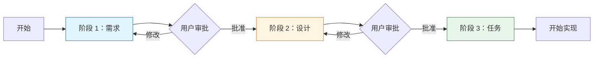

| 阶段 | 产出物 | 核心活动 | 结束条件 |
|------|--------|---------|---------|
| 阶段 1：需求 | `requirements.md` | 定义术语、编写用户故事、制定验收标准 | 用户批准需求文档 |
| 阶段 2：设计 | `design.md` | 架构设计、组件定义、序列图、测试策略 | 用户批准设计文档 |
| 阶段 3：任务 | `tasks.md` | 任务分解、编号、依赖关系、需求引用 | 开始实现 |

#### 8.1.3 阶段 1：需求阶段详细步骤

**目标**：明确要构建什么，产出完整的 `requirements.md`。

**步骤 1：初始化 spec 目录**

```bash
mkdir -p .agent/specs/{feature-name}
cd .agent/specs/{feature-name}
```

创建 `.config.agent`：

```json
{
  "specId": "生成的 UUID v4",
  "workflowType": "requirements-first",
  "specType": "feature"
}
```

**步骤 2：与用户澄清需求**

在开始编写文档之前，向用户提出澄清问题：

- 这个功能的核心业务目标是什么？
- 主要用户是谁？他们的使用场景是什么？
- 有哪些已知的约束或限制？
- 是否有需要集成的现有系统？
- 有哪些不在范围内的内容（Out of Scope）？

**步骤 3：编写术语表**

在 `requirements.md` 中定义所有关键术语，确保文档中的术语使用一致：

```markdown
## 术语表

- **User**（用户）: 已注册并通过邮箱验证的系统账户持有者
- **Session**（会话）: 用户成功登录后创建的认证状态，包含 access token 和 refresh token
- **Access_Token**（访问令牌）: 短期有效的 JWT token，用于验证 API 请求
```

**步骤 4：编写用户故事和验收标准**

使用 EARS 模式（详见第 4 章）为每个需求编写验收标准：

```markdown
### 需求 1：用户登录

**用户故事**：作为注册用户，我希望能够使用用户名和密码登录系统，以便访问我的个人账户。

#### 验收标准

1. WHEN 用户提交有效的用户名和密码 THEN 系统应当验证凭证并返回 access token
2. WHEN 用户提交无效的凭证 THEN 系统应当返回 401 错误并显示通用错误消息
3. IF 用户连续 3 次登录失败 THEN 系统应当锁定账户 15 分钟
4. THE 系统应当在 200 毫秒内响应登录请求（95% 的情况下）
```

**步骤 5：应用 INCOSE 质量规则验证**

检查每条需求是否满足以下质量标准（详见第 4 章）：

- ✅ **Unambiguous**：没有模糊词语（"快速"、"高效"、"用户友好"）
- ✅ **Verifiable**：可以通过测试验证
- ✅ **Singular**：每条需求只描述一个行为
- ✅ **Complete**：包含所有必要的前提条件和后置条件
- ✅ **Consistent**：与其他需求不冲突

**步骤 6：停止并等待用户审批**

完成 `requirements.md` 后，向用户展示文档并明确请求审批：

```
需求文档已完成。请审阅以下内容：

[展示 requirements.md 的主要内容]

请确认：
1. 所有需求是否准确反映了你的期望？
2. 是否有遗漏的需求？
3. 是否有需要修改的验收标准？

批准后，我将开始设计阶段。
```

> ⚠️ **重要**：代理必须在此停止，等待用户明确批准后才能进入设计阶段。

#### 8.1.4 阶段 2：设计阶段详细步骤

**目标**：规划如何实现需求，产出完整的 `design.md`。

**前提条件**：需求文档已获得用户批准。

**步骤 1：设计系统架构**

基于需求文档，设计系统的整体架构：

- 识别主要组件（服务、模块、层次）
- 定义组件之间的职责边界
- 选择技术栈和关键依赖
- 绘制架构图（使用 Mermaid）

```markdown
## 架构

### 系统组件

1. **AuthController**：处理 HTTP 请求，负责路由和响应格式化
2. **AuthService**：实现核心认证业务逻辑
3. **UserRepository**：封装数据库访问
4. **TokenService**：负责 JWT token 的生成和验证

### 架构图

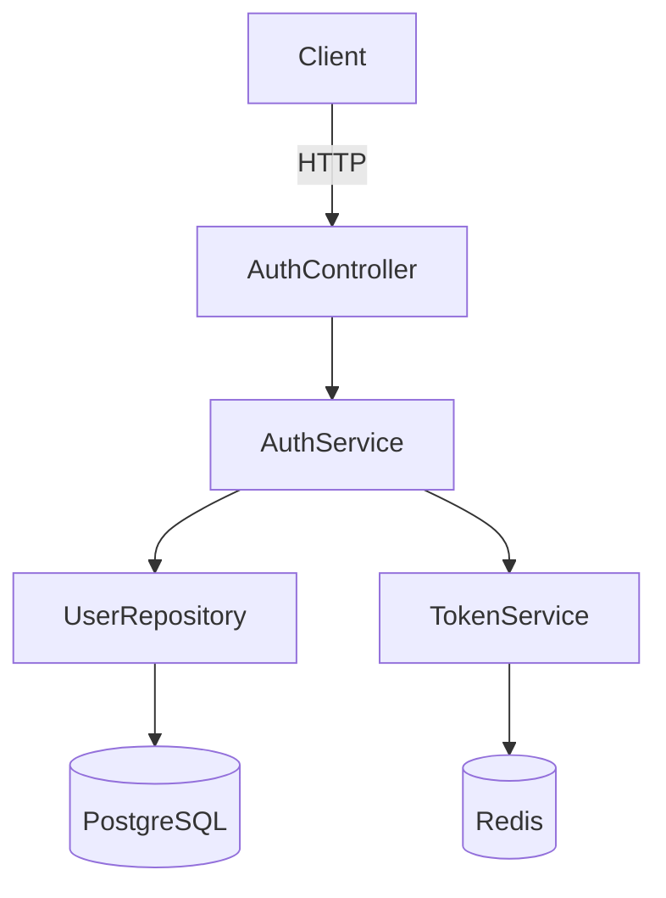
```

**步骤 2：定义组件接口**

为每个组件定义清晰的接口（API、方法签名、数据结构）：

```markdown
## 组件和接口

### AuthService

```typescript
interface AuthService {
  login(credentials: LoginCredentials): Promise<AuthTokens>;
  logout(userId: string, tokenId: string): Promise<void>;
  refreshToken(refreshToken: string): Promise<string>;
}
```
```

**步骤 3：绘制序列图**

为关键流程绘制序列图，展示组件之间的交互：

```markdown
## 序列图

### 登录流程

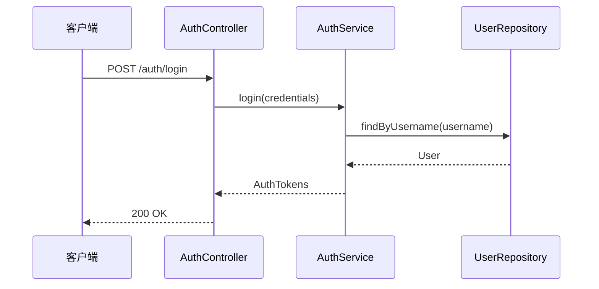
```

**步骤 4：定义正确性属性**

识别系统中需要通过属性测试验证的正确性属性（详见第 7 章）：

```markdown
## 正确性属性

1. **Token 验证的幂等性**：多次验证同一个有效 token 应返回相同结果
2. **密码哈希的单向性**：对于任意密码 p，hash(p) !== p
3. **登录-登出的状态一致性**：登出后 token 立即失效
```

**步骤 5：制定测试策略**

说明如何测试系统，包括单元测试、集成测试和属性测试的范围：

```markdown
## 测试策略

1. **单元测试**：测试 AuthService 的凭证验证逻辑、TokenService 的 token 操作
2. **集成测试**：测试完整的登录流程（HTTP 请求到数据库操作）
3. **属性测试**：验证 token 幂等性和密码哈希单向性
```

**步骤 6：停止并等待用户审批**

完成 `design.md` 后，向用户展示设计并请求审批：

```
设计文档已完成。请审阅以下内容：

[展示 design.md 的主要内容]

请确认：
1. 架构设计是否满足所有需求？
2. 组件划分是否合理？
3. 是否有技术风险或需要调整的地方？

批准后，我将开始任务分解阶段。
```

> ⚠️ **重要**：代理必须在此停止，等待用户明确批准后才能进入任务阶段。
>
> **例外情况**：如果用户回复"Skip to Implementation Plan"，代理可以直接进入任务阶段而不停止。

#### 8.1.5 阶段 3：任务阶段详细步骤

**目标**：将设计分解为可执行的离散任务，产出完整的 `tasks.md`。

**前提条件**：设计文档已获得用户批准（或用户明确要求跳过审批）。

**步骤 1：识别实现模块**

基于设计文档，识别主要的实现模块，每个模块对应一个顶级任务：

- 数据库层（schema、repository）
- 服务层（业务逻辑）
- API 层（控制器、路由）
- 测试（单元测试、集成测试）

**步骤 2：分解子任务**

将每个模块分解为具体的子任务，每个子任务应该：

- 足够小，可以在一次对话中完成
- 有明确的完成标准
- 引用相关需求（`_需求: X.X_`）

**步骤 3：确定任务顺序和依赖**

按照依赖关系排列任务：

- 被依赖的任务排在前面（如先实现数据层，再实现服务层）
- 在适当位置插入 Checkpoint 任务
- 标记可选任务（使用 `*` 后缀）

**步骤 4：创建任务依赖图**

在 `tasks.md` 末尾添加 JSON 格式的任务依赖图，说明哪些任务可以并行执行：

```json
{
  "waves": [
    { "id": 0, "tasks": ["1.1", "1.2"] },
    { "id": 1, "tasks": ["2.1", "2.2"] },
    { "id": 2, "tasks": ["3"] }
  ]
}
```

**步骤 5：验证需求覆盖**

检查所有需求是否都被至少一个任务引用：

- 遍历 `requirements.md` 中的所有验收标准
- 确认每条标准都在某个子任务的 `_需求: X.X_` 中被引用
- 如有遗漏，添加相应的任务

**步骤 6：开始实现**

任务文档完成后，代理可以开始逐一实现子任务。任务阶段不需要用户审批即可开始实现（但用户可以随时提供反馈）。

#### 8.1.6 阶段转换规则

Requirements-First 工作流的阶段转换遵循以下规则：

**规则 1：完成每个阶段后必须停止**

代理在完成需求文档或设计文档后，必须停止并等待用户审批，不得自动进入下一阶段。

```
✅ 正确行为：
代理：需求文档已完成，请审阅并批准后我将开始设计阶段。
用户：[审阅后] 批准，请继续。
代理：[开始设计阶段]

❌ 错误行为：
代理：需求文档已完成，现在开始设计阶段...
[未等待用户批准直接继续]
```

**规则 2：整合所有用户反馈后才能继续**

如果用户在审批时提出修改意见，代理必须整合所有反馈并更新文档，然后再次请求审批：

```
用户：需求 2.3 的验收标准不够清晰，请修改。
代理：[修改需求 2.3]
代理：已更新需求 2.3，请再次审阅。
用户：[审阅后] 批准。
代理：[开始设计阶段]
```

**规则 3："Skip to Implementation Plan" 例外**

如果用户在设计阶段审批时回复"Skip to Implementation Plan"，代理可以直接进入任务阶段而不停止：

```
代理：设计文档已完成，请审阅...
用户：Skip to Implementation Plan
代理：[直接开始任务分解，不再等待设计审批]
```

**规则 4：发现缺口时提供返回选项**

如果在设计阶段发现需求有缺口，或在任务阶段发现设计有缺口，代理应提供返回到先前阶段的选项：

```
代理：在设计过程中，我发现需求文档中没有说明密码重置功能的超时时间。
     有两个选项：
     A. 返回需求阶段，补充密码重置超时需求
     B. 在设计文档中做出合理假设（超时时间为 1 小时），继续设计阶段
     请选择处理方式。
```

#### 8.1.7 完整工作流示例

以下是一个完整的 Requirements-First 工作流示例，展示代理与用户的交互过程：

```
[开始]
代理：我将使用 Requirements-First 工作流为"用户认证"功能创建 spec。
     首先，我需要了解一些信息：
     1. 这个认证系统需要支持哪些登录方式？
     2. 是否需要多因素认证？
     3. 有哪些安全要求？

用户：支持用户名/密码登录，不需要多因素认证，需要账户锁定机制。

[阶段 1：需求]
代理：[创建 .agent/specs/user-authentication/ 目录和 .config.agent]
代理：[编写 requirements.md，包含术语表、用户故事和验收标准]
代理：需求文档已完成，请审阅：
     [展示 requirements.md 内容]
     批准后我将开始设计阶段。

用户：需求 1.3 的锁定时间改为 30 分钟。

代理：[更新需求 1.3]
代理：已更新，请再次确认。

用户：批准。

[阶段 2：设计]
代理：[编写 design.md，包含架构图、组件接口、序列图和测试策略]
代理：设计文档已完成，请审阅：
     [展示 design.md 内容]
     批准后我将开始任务分解。

用户：设计看起来不错，批准。

[阶段 3：任务]
代理：[编写 tasks.md，包含任务列表和依赖图]
代理：任务文档已完成，共 15 个子任务，分为 4 个模块。
     现在开始实现第一个任务：1.1 创建数据库 schema。

[开始实现]
```


### 8.2 Design-First 工作流

Design-First（设计优先）工作流适用于技术驱动的功能开发场景，例如性能优化、架构重构、技术债务清理等。工作流按照**设计 → 需求 → 任务**的顺序推进——先从技术方案出发，再反推和验证需求。

配置文件中 `workflowType` 设置为 `"design-first"`：

```json
{
  "specId": "f47ac10b-58cc-4372-a567-0e02b2c3d479",
  "workflowType": "design-first",
  "specType": "feature"
}
```

#### 8.2.1 适用场景

- 技术方案已经明确，需要从设计中反推业务需求
- 重构或架构改进项目（如将单体应用拆分为微服务）
- 性能优化项目（如引入缓存层、数据库索引优化）
- 技术债务清理（如替换过时的依赖库、统一 API 风格）
- 原型驱动开发（先有技术原型，再明确需求边界）
- 基础设施变更（如迁移到新的云服务、更换消息队列）

**不适用场景**：

- 需求来自明确的业务目标或用户故事 → 使用 Requirements-First
- 修复已知 bug → 使用 Bugfix 工作流

#### 8.2.2 三个阶段概览

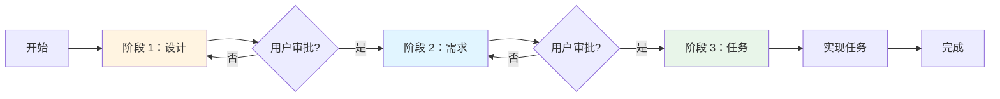

| 阶段 | 产出物 | 主要内容 | 结束条件 |
|------|--------|---------|---------|
| 阶段 1：设计 | `design.md` | 技术方案、架构图、组件接口、正确性属性 | 用户批准设计 |
| 阶段 2：需求 | `requirements.md` | 从设计反推的需求、验收标准、约束条件 | 用户批准需求 |
| 阶段 3：任务 | `tasks.md` | 任务分解、编号、依赖关系、需求引用 | 开始实现 |

#### 8.2.3 阶段 1：设计阶段详细步骤

**目标**：明确技术方案，产出完整的 `design.md`。

**步骤 1：初始化 spec 目录**

```bash
mkdir -p .agent/specs/{feature-name}
```

创建 `.config.agent` 文件：

```json
{
  "specId": "<uuid-v4>",
  "workflowType": "design-first",
  "specType": "feature"
}
```

**步骤 2：了解技术背景**

代理应主动询问以下信息：

- 当前系统的技术栈和架构
- 变更的技术动机（性能问题、可维护性、扩展性等）
- 已知的技术约束（不能更改的接口、必须保持的兼容性等）
- 预期的技术目标（性能指标、代码质量指标等）

**步骤 3：编写设计文档**

`design.md` 应包含以下章节：

1. **概述**：技术方案的目标和背景
2. **架构**：系统架构图（使用 Mermaid）
3. **组件和接口**：各组件的职责和接口定义
4. **数据模型**：数据结构和存储方案
5. **序列图**：关键流程的交互图（使用 Mermaid）
6. **正确性属性**：可验证的技术属性（用于属性测试）
7. **测试策略**：单元测试、集成测试、属性测试计划
8. **迁移策略**（如适用）：从旧方案迁移到新方案的步骤
9. **实现考虑**：技术选型理由、性能考虑、兼容性处理

**步骤 4：停止并等待用户审批**

设计文档完成后，代理必须停止并展示文档内容，等待用户审批：

```
设计文档已完成，请审阅 design.md：
[展示 design.md 内容]

请确认以下内容：
1. 技术方案是否符合预期？
2. 架构设计是否合理？
3. 是否有遗漏的技术考虑？

批准后我将进入需求阶段，从设计中反推业务需求。
```

> ⚠️ **重要**：代理必须在此停止，等待用户明确批准后才能进入需求阶段。

#### 8.2.4 阶段 2：需求阶段详细步骤

**目标**：从设计中反推和验证需求，产出完整的 `requirements.md`。

Design-First 工作流中的需求阶段与 Requirements-First 不同——需求是从已有的设计中**反推**出来的，用于验证设计的完整性和合理性，而不是驱动设计。

**步骤 1：从设计中提取需求**

分析 `design.md` 中的每个组件和接口，提取隐含的需求：

- 每个组件的功能需求（它必须做什么）
- 性能需求（响应时间、吞吐量、资源限制）
- 可靠性需求（错误处理、重试机制、降级策略）
- 兼容性需求（向后兼容、接口稳定性）
- 安全需求（认证、授权、数据保护）

**步骤 2：编写需求文档**

`requirements.md` 应包含以下内容：

1. **术语表**：定义设计文档中使用的关键技术术语
2. **需求列表**：使用 EARS 模式编写从设计反推的需求
3. **约束条件**：技术约束和非功能性需求
4. **验收标准**：每个需求的可验证标准

**示例**：从"引入 Redis 缓存层"的设计中反推需求：

```markdown
### 需求 1：缓存读取

**用户故事**：作为系统，我需要在返回数据前检查缓存，以便减少数据库查询次数。

#### 验收标准

1. WHEN 系统收到数据查询请求 THEN 系统应当首先检查 Redis 缓存
2. WHEN 缓存命中 THEN 系统应当直接返回缓存数据，不查询数据库
3. WHEN 缓存未命中 THEN 系统应当查询数据库并将结果写入缓存
4. THE 缓存条目应当在 TTL 过期后自动失效

### 需求 2：缓存一致性

**用户故事**：作为系统，我需要在数据更新时同步更新缓存，以便保证数据一致性。

#### 验收标准

1. WHEN 数据库记录被更新 THEN 系统应当使对应的缓存条目失效
2. WHEN 数据库记录被删除 THEN 系统应当删除对应的缓存条目
3. IF 缓存更新失败 THEN 系统应当记录错误日志并继续正常运行
```

**步骤 3：验证需求与设计的一致性**

检查需求文档是否：
- 覆盖了设计中所有组件的功能
- 包含了设计中提到的所有性能指标
- 反映了设计中的错误处理策略
- 没有与设计相矛盾的内容

**步骤 4：停止并等待用户审批**

需求文档完成后，代理必须停止并展示文档内容，等待用户审批：

```
需求文档已完成，请审阅 requirements.md：
[展示 requirements.md 内容]

这些需求是从设计文档中反推得出的，用于验证设计的完整性。
请确认：
1. 需求是否完整覆盖了设计的功能？
2. 是否有遗漏的业务约束或非功能性需求？
3. 需求与设计是否一致？

批准后我将进入任务阶段。
```

> ⚠️ **重要**：代理必须在此停止，等待用户明确批准后才能进入任务阶段。

> **例外情况**：如果用户回复"Skip to Implementation Plan"，代理可以直接进入任务阶段而不停止。

#### 8.2.5 阶段 3：任务阶段详细步骤

**目标**：将设计分解为可执行的离散任务，产出完整的 `tasks.md`。

Design-First 工作流的任务阶段与 Requirements-First 相同，但任务分解的依据主要来自设计文档，需求文档用于确保可追溯性。

**步骤 1：分解设计为任务**

按照设计文档中的组件和模块，将实现工作分解为具体任务：

- 每个组件对应一个顶级任务（如 `1. 实现缓存服务`）
- 每个组件的子功能对应子任务（如 `1.1 实现缓存读取逻辑`）
- 迁移步骤单独列为任务（如 `4. 数据迁移`）
- 测试任务与实现任务并列（如 `1.2 编写缓存服务单元测试`）

**步骤 2：添加需求引用**

每个子任务应引用相关需求，确保可追溯性：

```markdown
- [ ] 1.1 实现缓存读取逻辑
  - 检查 Redis 缓存是否存在对应 key
  - 缓存命中时直接返回，缓存未命中时查询数据库
  - _需求: 1.1, 1.2, 1.3_
```

**步骤 3：标记任务依赖**

在任务文档末尾添加依赖图，说明任务之间的执行顺序：

```json
{
  "waves": [
    { "id": 0, "tasks": ["1.1"] },
    { "id": 1, "tasks": ["1.2", "2.1"] },
    { "id": 2, "tasks": ["3.1"] },
    { "id": 3, "tasks": ["4.1"] }
  ]
}
```

**步骤 4：开始实现**

任务文档完成后，代理可以开始逐一实现子任务。任务阶段不需要用户审批即可开始实现（但用户可以随时提供反馈）。

#### 8.2.6 阶段转换规则

Design-First 工作流的阶段转换遵循以下规则：

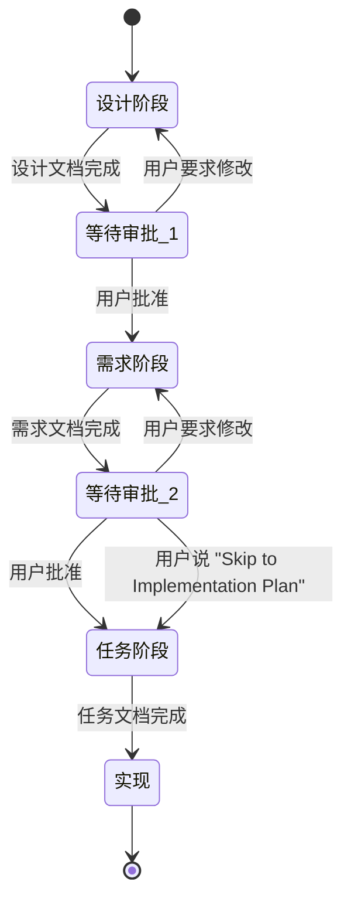

**规则汇总**：

| 转换点 | 触发条件 | 代理行为 |
|--------|---------|---------|
| 设计 → 需求 | 设计文档完成 | 停止，展示文档，等待用户批准 |
| 需求 → 任务 | 需求文档完成 | 停止，展示文档，等待用户批准 |
| 需求 → 任务（快速） | 用户说"Skip to Implementation Plan" | 直接进入任务阶段，不停止 |
| 任务 → 实现 | 任务文档完成 | 直接开始实现，无需审批 |
| 任意阶段 → 上一阶段 | 发现设计或需求有缺口 | 提示用户，提供返回选项 |

**返回上一阶段**：

如果在需求阶段发现设计有重大缺陷，代理应提示用户：

```
在编写需求文档时，我发现设计中存在以下问题：
1. 缓存失效策略未明确定义
2. 并发写入场景下的一致性保证缺失

建议返回设计阶段补充这些内容。是否需要修改设计文档？
```

#### 8.2.7 与 Requirements-First 工作流的主要区别

| 对比维度 | Requirements-First | Design-First |
|---------|-------------------|--------------|
| **起点** | 业务需求、用户故事 | 技术方案、架构设计 |
| **阶段顺序** | 需求 → 设计 → 任务 | 设计 → 需求 → 任务 |
| **需求的作用** | 驱动设计 | 验证设计的完整性 |
| **设计的作用** | 实现需求的方案 | 出发点，定义技术边界 |
| **适用场景** | 业务功能开发 | 技术重构、性能优化 |
| **配置文件** | `"workflowType": "requirements-first"` | `"workflowType": "design-first"` |
| **需求文档** | 先于设计编写 | 从设计中反推 |
| **用户参与** | 需求阶段需要大量用户输入 | 设计阶段需要大量用户输入 |

**核心区别**：在 Requirements-First 中，需求是"因"，设计是"果"；在 Design-First 中，设计是"因"，需求是对设计的"验证和文档化"。

#### 8.2.8 完整工作流示例

以下是一个完整的 Design-First 工作流示例，展示代理与用户的交互过程：

```
[开始]
用户：我们需要将现有的数据库查询层重构为带缓存的架构，使用 Redis。

代理：我将使用 Design-First 工作流为"缓存层重构"功能创建 spec。
     首先，我需要了解一些技术背景：
     1. 当前数据库查询的性能瓶颈在哪里？
     2. 哪些数据适合缓存（读多写少）？
     3. 对缓存一致性有什么要求？
     4. 是否有现有的 Redis 实例可以使用？

用户：主要是用户资料查询太慢，读写比约 10:1，需要最终一致性，已有 Redis 集群。

[阶段 1：设计]
代理：[创建 .agent/specs/cache-layer-refactor/ 目录和 .config.agent]
代理：[编写 design.md，包含缓存架构图、CacheService 接口、序列图和正确性属性]
代理：设计文档已完成，请审阅：
     [展示 design.md 内容]
     批准后我将进入需求阶段，从设计中反推业务需求。

用户：设计看起来不错，但需要添加缓存预热策略。

代理：[更新 design.md，添加缓存预热章节]
代理：已更新，请再次确认。

用户：批准。

[阶段 2：需求]
代理：[分析 design.md，提取隐含需求，编写 requirements.md]
代理：需求文档已完成，请审阅：
     [展示 requirements.md 内容]
     这些需求从设计中反推，用于验证设计的完整性。

用户：需要添加一条需求：缓存命中率必须达到 80% 以上。

代理：[更新 requirements.md，添加性能需求]
代理：已更新，批准后我将开始任务分解。

用户：批准。

[阶段 3：任务]
代理：[编写 tasks.md，包含任务列表和依赖图]
代理：任务文档已完成，共 12 个子任务，分为 3 个模块：
     1. CacheService 实现（4 个子任务）
     2. 数据访问层集成（4 个子任务）
     3. 缓存预热和监控（4 个子任务）
     现在开始实现第一个任务：1.1 创建 CacheService 接口。

[开始实现]
```


### 8.3 Bugfix 工作流

Bugfix 工作流专门用于修复已知 bug，其核心是**精确描述 bug condition（bug 条件）**，而不是描述新功能需求。通过三个维度的分析——当前行为、预期行为、不变行为——确保修复准确、范围最小化，并且不引入新的问题。

配置文件中 `specType` 设置为 `"bugfix"`，**不需要** `workflowType` 字段：

```json
{
  "specId": "7c9e6679-7425-40de-944b-e07fc1f90ae7",
  "specType": "bugfix"
}
```

#### 8.3.1 Bug Condition 方法论

**什么是 Bug Condition？**

Bug condition（bug 条件）是对 bug 的精确描述，包含三个维度：

1. **当前行为（Current Behavior）**：系统实际表现出的错误行为——在什么输入或操作下，系统做了什么错误的事情
2. **预期行为（Expected Behavior）**：系统应该表现出的正确行为——在相同的输入或操作下，系统应该做什么
3. **不变行为（Invariant Behavior）**：修复过程中不应该改变的行为——哪些现有功能必须保持不变，防止修复引入新 bug

**为什么使用 Bug Condition 而不是直接修复？**

直接修复 bug 的常见问题：

- **范围蔓延**：修复过程中顺手改了其他代码，引入新问题
- **修复不完整**：只修复了表面症状，没有解决根本原因
- **回归风险**：修复破坏了其他功能，但没有意识到
- **难以验证**：不清楚修复是否真正解决了问题

Bug condition 方法论通过精确定义"什么是 bug"和"什么不是 bug"，解决上述问题：

- **精确范围**：只修复 bug condition 描述的问题，不做额外改动
- **可验证性**：预期行为提供了明确的验证标准
- **防止回归**：不变行为分析确保修复不破坏现有功能
- **根因分析**：三个维度的分析迫使开发者深入理解 bug 的本质

**三个维度的详细说明**

**维度 1：当前行为（Current Behavior）**

描述系统实际表现出的错误行为，需要包含：

- **触发条件**：什么操作或输入会触发这个 bug
- **错误表现**：系统做了什么错误的事情（错误消息、错误结果、崩溃等）
- **复现步骤**：如何稳定地复现这个 bug
- **影响范围**：哪些用户或场景受到影响

```markdown
**当前行为示例**：
当用户在登录表单中输入包含特殊字符（如 `'` 或 `"`)的密码时，
系统返回 500 Internal Server Error，而不是正常处理登录请求。
复现步骤：
1. 打开登录页面
2. 输入用户名：testuser
3. 输入密码：pass'word
4. 点击登录按钮
5. 观察到 500 错误
```

**维度 2：预期行为（Expected Behavior）**

描述系统应该表现出的正确行为，需要包含：

- **正确结果**：在相同触发条件下，系统应该做什么
- **验证标准**：如何判断修复是否成功
- **边界条件**：修复后应该处理哪些相关的边界情况

```markdown
**预期行为示例**：
当用户输入包含特殊字符的密码时，系统应当：
1. 正确处理密码中的特殊字符（不将其解释为 SQL 语法）
2. 验证密码是否与数据库中存储的哈希值匹配
3. 如果密码正确，正常完成登录流程
4. 如果密码错误，返回标准的"用户名或密码错误"提示
```

**维度 3：不变行为（Invariant Behavior）**

描述修复过程中不应该改变的行为，这是防止引入新 bug 的关键：

- **现有功能**：哪些功能在修复前是正常工作的，修复后必须继续正常工作
- **性能指标**：修复不应该显著降低系统性能
- **接口兼容性**：修复不应该改变公共 API 的行为
- **数据完整性**：修复不应该影响现有数据的正确性

```markdown
**不变行为示例**：
修复不应该影响以下现有功能：
1. 使用普通字母数字密码的用户登录流程（必须继续正常工作）
2. 密码错误时的账户锁定机制（3 次失败后锁定 15 分钟）
3. 登录成功后的 session 创建和 token 生成
4. 登录日志记录功能
5. 登录接口的响应时间（不应超过 200ms）
```

#### 8.3.2 Bugfix Spec 文档结构

Bugfix spec 使用与 feature spec 相同的目录结构，但文件内容有所不同：

```
.agent/specs/{bug-name}/
├── .config.agent          # specType 为 "bugfix"，无 workflowType
├── requirements.md        # 包含 bug condition 分析（三个维度）
├── design.md              # 修复方案设计
└── tasks.md               # 修复任务分解
```

**`.config.agent` 配置**

Bugfix spec 的配置文件只需要 `specId` 和 `specType` 两个字段：

```json
{
  "specId": "7c9e6679-7425-40de-944b-e07fc1f90ae7",
  "specType": "bugfix"
}
```

**注意**：不需要 `workflowType` 字段，因为 bugfix 有自己固定的工作流（Bug 分析 → 设计 → 任务）。

**`requirements.md` 的特殊格式**

Bugfix 的 `requirements.md` 以 bug condition 分析为核心，格式如下：

```markdown
# Bug 分析：{bug 名称}

## Bug 信息

- **Bug ID**：{issue 编号或内部 ID}
- **严重程度**：Critical / High / Medium / Low
- **影响版本**：{受影响的版本}
- **报告日期**：{日期}

## Bug Condition 分析

### 当前行为（Current Behavior）

{描述系统实际表现出的错误行为}

**触发条件**：
{什么操作或输入会触发这个 bug}

**复现步骤**：
1. {步骤 1}
2. {步骤 2}
3. {步骤 3}

**错误表现**：
{系统做了什么错误的事情}

### 预期行为（Expected Behavior）

{描述系统应该表现出的正确行为}

**正确结果**：
{在相同触发条件下，系统应该做什么}

**验证标准**：
{如何判断修复是否成功}

### 不变行为（Invariant Behavior）

修复过程中，以下行为必须保持不变：

1. {不变行为 1}
2. {不变行为 2}
3. {不变行为 3}

## 根因分析

{对 bug 根本原因的分析，说明为什么会出现当前行为}

## 修复范围

修复应当**仅限于**解决上述 bug condition，不应包含：
- {不在范围内的改动 1}
- {不在范围内的改动 2}
```

**`design.md` 的内容**

Bugfix 的 `design.md` 专注于修复方案，应包含：

1. **修复方案概述**：选择的修复方法及其理由
2. **代码变更范围**：需要修改的文件和函数
3. **修复实现细节**：具体的代码变更说明
4. **测试策略**：
   - 如何验证 bug 已修复（针对预期行为）
   - 如何验证不变行为未被破坏（回归测试）
   - 是否需要属性测试（如果 bug 涉及边界条件）

**`tasks.md` 的内容**

Bugfix 的 `tasks.md` 通常比 feature spec 更简洁，任务分解应包含：

1. **编写 bug 复现测试**：先写一个能复现 bug 的测试（测试驱动修复）
2. **实现修复**：按照 design.md 中的方案修改代码
3. **验证不变行为**：运行回归测试，确保不变行为未被破坏
4. **更新文档**（如适用）：更新受影响的文档或注释

#### 8.3.3 Bugfix 工作流步骤

Bugfix 工作流按照**Bug 分析 → 设计 → 任务**的顺序推进。

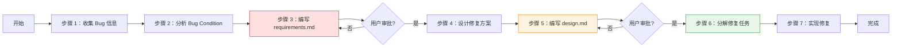

**步骤 1：收集 Bug 信息**

在开始分析之前，收集以下信息：

- **复现步骤**：如何稳定地触发这个 bug
- **错误信息**：错误消息、堆栈跟踪、日志输出
- **环境信息**：操作系统、浏览器版本、应用版本
- **影响范围**：哪些用户或场景受到影响
- **发现时间**：bug 是什么时候开始出现的（帮助定位引入 bug 的变更）

向用户提出澄清问题：

```
为了准确分析这个 bug，我需要了解以下信息：
1. 能否提供稳定复现这个 bug 的步骤？
2. 错误发生时有什么具体的错误消息或日志？
3. 这个 bug 是什么时候开始出现的？之前是否正常工作？
4. 哪些用户或场景受到影响？
5. 是否有已知的临时解决方案（workaround）？
```

**步骤 2：分析 Bug Condition（三个维度）**

基于收集到的信息，分析 bug 的三个维度：

- **当前行为**：精确描述 bug 的触发条件和错误表现
- **预期行为**：明确系统应该如何正确处理这种情况
- **不变行为**：列出修复时必须保持不变的现有功能

**步骤 3：编写 `requirements.md`**

创建 spec 目录和配置文件，然后编写包含 bug condition 分析的 `requirements.md`：

```bash
mkdir -p .agent/specs/{bug-name}
```

`.config.agent`：
```json
{
  "specId": "<uuid-v4>",
  "specType": "bugfix"
}
```

完成 `requirements.md` 后，停止并等待用户审批：

```
Bug 分析文档已完成，请审阅 requirements.md：
[展示 requirements.md 内容]

请确认：
1. 当前行为的描述是否准确？
2. 预期行为是否符合你的期望？
3. 不变行为列表是否完整？

批准后，我将开始设计修复方案。
```

> ⚠️ **重要**：代理必须在此停止，等待用户明确批准后才能进入设计阶段。

**步骤 4：设计修复方案**

基于 bug condition 分析，设计最小化的修复方案：

- 定位 bug 的根本原因（哪个函数、哪行代码）
- 选择修复方法（修改逻辑、添加验证、修复边界条件等）
- 评估修复对不变行为的影响
- 规划测试策略（如何验证修复有效且不引入回归）

**步骤 5：编写 `design.md`**

将修复方案文档化，完成后停止并等待用户审批：

```
修复方案设计已完成，请审阅 design.md：
[展示 design.md 内容]

请确认：
1. 修复方案是否准确解决了 bug condition？
2. 修复范围是否最小化（没有不必要的改动）？
3. 测试策略是否足够覆盖预期行为和不变行为？

批准后，我将开始任务分解。
```

> ⚠️ **重要**：代理必须在此停止，等待用户明确批准后才能进入任务阶段。

**步骤 6：分解修复任务**

将修复工作分解为具体任务，编写 `tasks.md`：

```markdown
# 修复计划：{bug 名称}

## 任务

- [ ] 1. 编写 bug 复现测试
  - [ ] 1.1 编写能复现当前错误行为的测试用例
    - 测试应当在修复前失败，修复后通过
    - _需求: bug condition - 当前行为_

- [ ] 2. 实现修复
  - [ ] 2.1 {具体的代码修改任务}
    - {修改说明}
    - _需求: bug condition - 预期行为_

- [ ] 3. 验证不变行为
  - [ ] 3.1 运行现有回归测试套件
    - 确认所有不变行为测试通过
    - _需求: bug condition - 不变行为_
  - [ ] 3.2 手动验证关键不变行为场景
    - {需要手动验证的场景列表}
```

**步骤 7：实现修复**

按照任务列表逐一实现修复，遵循以下原则：

- **最小化修改**：只修改 bug condition 描述的问题，不做额外改动
- **测试驱动**：先写复现测试，再实现修复，确保测试从失败变为通过
- **验证不变行为**：每次修改后运行回归测试，确保不变行为未被破坏

#### 8.3.4 Bugfix Requirements.md 模板

以下是一个完整的 bugfix `requirements.md` 模板：

```markdown
# Bug 分析：{bug 名称}

## Bug 信息

- **Bug ID**：{issue 编号}
- **严重程度**：{Critical / High / Medium / Low}
- **影响版本**：{版本号}
- **报告日期**：{YYYY-MM-DD}
- **环境**：{操作系统、浏览器、运行环境等}

## Bug Condition 分析

### 当前行为（Current Behavior）

**触发条件**：
{描述触发 bug 的具体操作或输入}

**复现步骤**：
1. {步骤 1}
2. {步骤 2}
3. {步骤 3}
4. 观察到：{错误表现}

**错误表现**：
{详细描述系统的错误行为，包括错误消息、错误结果或异常状态}

**错误日志**（如有）：
```
{粘贴相关的错误日志或堆栈跟踪}
```

### 预期行为（Expected Behavior）

**正确结果**：
{描述在相同触发条件下，系统应该做什么}

**验证标准**：
1. {验证标准 1：如何判断修复是否成功}
2. {验证标准 2}
3. {验证标准 3}

### 不变行为（Invariant Behavior）

修复过程中，以下行为必须保持不变：

1. {不变行为 1：描述必须继续正常工作的功能}
2. {不变行为 2}
3. {不变行为 3}
4. {性能指标：如响应时间不应超过 Xms}

## 根因分析

**根本原因**：
{分析 bug 的根本原因，说明为什么会出现当前行为}

**相关代码位置**：
- `{文件路径}:{行号}` - {说明}

## 修复范围

**在范围内**：
- {需要修改的内容 1}
- {需要修改的内容 2}

**不在范围内**（不应在此次修复中改动）：
- {不应改动的内容 1}
- {不应改动的内容 2}
```

#### 8.3.5 完整 Bugfix 工作流示例

以下是一个完整的 bugfix 工作流示例，展示代理与用户的交互过程：

**场景**：修复登录时密码包含特殊字符导致 500 错误的 bug。

```
[开始]
用户：我们有一个 bug：用户输入包含单引号的密码时，登录接口返回 500 错误。

代理：我将使用 Bugfix 工作流来分析和修复这个问题。
     首先，我需要收集更多信息：
     1. 能否提供稳定复现这个 bug 的步骤？
     2. 500 错误时有什么具体的错误日志？
     3. 这个 bug 是什么时候开始出现的？
     4. 是否所有包含特殊字符的密码都会触发，还是只有单引号？

用户：复现步骤：输入密码 pass'word 然后点击登录。
     日志显示：ERROR: syntax error at or near "word" - 看起来是 SQL 注入问题。
     一直都有这个问题，刚发现。所有特殊字符都可能有问题。

[步骤 1-2：收集信息并分析 Bug Condition]
代理：[分析三个维度]
     当前行为：密码中的单引号被直接拼接到 SQL 查询中，导致 SQL 语法错误
     预期行为：密码应当作为参数化查询的参数传递，不被解释为 SQL 语法
     不变行为：普通密码登录、账户锁定机制、session 创建等必须继续正常工作

[步骤 3：编写 requirements.md]
代理：[创建 .agent/specs/fix-login-sql-injection/ 目录]
代理：[编写 requirements.md，包含完整的 bug condition 分析]
代理：Bug 分析文档已完成，请审阅：

     ## Bug Condition 分析

     ### 当前行为
     当用户输入包含单引号（'）或其他 SQL 特殊字符的密码时，
     系统将密码直接拼接到 SQL 查询字符串中，导致 SQL 语法错误，
     返回 500 Internal Server Error。

     ### 预期行为
     系统应当使用参数化查询（Parameterized Query）处理密码，
     将密码作为查询参数而非 SQL 语句的一部分，
     正确验证密码并返回相应的登录结果。

     ### 不变行为
     1. 使用普通字母数字密码的登录流程必须继续正常工作
     2. 密码错误时的 401 响应和错误消息必须保持不变
     3. 账户锁定机制（3 次失败后锁定 15 分钟）必须继续工作
     4. 登录成功后的 session 创建和 token 生成必须正常
     5. 登录接口响应时间不应超过 200ms

     请确认分析是否准确，批准后我将设计修复方案。

用户：分析准确，批准。

[步骤 4-5：设计修复方案]
代理：[分析代码，定位 SQL 拼接问题]
代理：[编写 design.md，说明将 SQL 拼接改为参数化查询的方案]
代理：修复方案设计已完成，请审阅：

     ## 修复方案

     **根本原因**：`auth/repository.js` 第 42 行使用字符串拼接构建 SQL 查询：
     ```javascript
     // 当前代码（有问题）
     const query = `SELECT * FROM users WHERE username='${username}' AND password_hash='${hash}'`;
     ```

     **修复方案**：改为参数化查询：
     ```javascript
     // 修复后代码
     const query = 'SELECT * FROM users WHERE username=$1 AND password_hash=$2';
     const params = [username, hash];
     ```

     **修复范围**：仅修改 `auth/repository.js` 第 42 行，不涉及其他文件。

     请确认修复方案，批准后我将开始任务分解。

用户：批准。

[步骤 6：分解修复任务]
代理：[编写 tasks.md]
代理：任务文档已完成，共 3 个任务：
     1. 编写 bug 复现测试（测试包含特殊字符密码的登录）
     2. 将 SQL 拼接改为参数化查询
     3. 运行回归测试验证不变行为

[步骤 7：实现修复]
代理：开始实现任务 1.1：编写 bug 复现测试...
```

#### 8.3.6 Bugfix 工作流的关键原则

**原则 1：修复范围最小化**

Bugfix 的核心原则是**只修复 bug condition 描述的问题**，不做额外改动。即使在修复过程中发现了其他问题，也应该：

- 记录发现的其他问题（创建新的 bug 报告）
- 在当前 spec 中只修复已分析的 bug condition
- 避免"顺手"修改其他代码

**原则 2：不变行为分析是防止回归的关键**

不变行为分析不是可选的——它是防止修复引入新 bug 的核心机制。在编写不变行为列表时，应该：

- 列出所有与 bug 相关的功能（即使看起来不受影响）
- 包含性能指标（修复不应该显著降低性能）
- 包含接口兼容性（修复不应该改变 API 行为）

**原则 3：测试驱动修复**

推荐使用测试驱动的方式实现修复：

1. 先编写一个能复现 bug 的测试（此时测试应该失败）
2. 实现修复（使测试通过）
3. 运行回归测试（确保不变行为未被破坏）

这种方式确保修复是可验证的，并且防止 bug 在未来重新出现。

**原则 4：Bugfix Spec 不使用 workflowType**

Bugfix spec 的配置文件中不需要 `workflowType` 字段，因为 bugfix 有固定的工作流（Bug 分析 → 设计 → 任务）。如果配置文件中包含 `workflowType`，代理应当忽略它。

```json
// ✅ 正确的 bugfix 配置
{
  "specId": "7c9e6679-7425-40de-944b-e07fc1f90ae7",
  "specType": "bugfix"
}

// ❌ 不推荐（包含不必要的 workflowType）
{
  "specId": "7c9e6679-7425-40de-944b-e07fc1f90ae7",
  "workflowType": "requirements-first",
  "specType": "bugfix"
}
```

#### 8.3.7 与 Feature 工作流的主要区别

| 对比维度 | Feature 工作流 | Bugfix 工作流 |
|---------|--------------|--------------|
| **目标** | 实现新功能 | 修复已知 bug |
| **配置文件** | 需要 `workflowType` | 不需要 `workflowType` |
| **需求文档** | 用户故事 + 验收标准 | Bug condition 分析（三个维度） |
| **设计重点** | 如何实现功能 | 如何最小化修复 bug |
| **任务重点** | 功能实现任务 | 复现测试 + 修复 + 回归验证 |
| **范围控制** | 功能边界 | 修复范围最小化 |
| **不变行为** | 不适用 | 核心分析维度，防止回归 |
| **测试策略** | 验证新功能 | 验证修复 + 回归测试 |


## 9. 阶段转换规则

本章定义代理在 Spec 工作流各阶段之间转换时必须遵守的规则，包括停止规则、审批规则和例外情况。

### 9.1 停止和审批规则

_需求引用: 8.1, 8.2, 8.4_

#### 9.1.1 停止规则

**代理必须在完成每个阶段的文档后立即停止执行，等待用户审批。**

具体而言，在以下时机代理必须停止：

- **需求阶段结束时**：完成 `requirements.md`（或 `bugfix.md`）的编写后，代理必须停止，不得自行进入设计阶段
- **设计阶段结束时**：完成 `design.md` 的编写后，代理必须停止，不得自行进入任务阶段
- **任务阶段结束时**：完成 `tasks.md` 的编写后，代理必须停止，等待用户指示开始实现

停止时，代理应当明确告知用户：

1. 当前阶段已完成
2. 产出物的位置（文件路径）
3. 下一阶段是什么
4. 等待用户的批准或反馈

**示例停止消息**：

```
需求文档已完成，保存在 .agent/specs/user-authentication/requirements.md。

文档包含以下内容：
- 术语表（5 个术语）
- 需求 1：用户登录（5 条验收标准）
- 需求 2：会话管理（4 条验收标准）
- 需求 3：密码重置（6 条验收标准）

下一步是设计阶段（design.md）。

请审阅需求文档，如有修改意见请告知，或回复"批准"继续进入设计阶段。
```

#### 9.1.2 审批规则

**代理必须等待用户明确批准后，才能进入下一阶段。**

用户批准的形式包括但不限于：

- 回复"批准"、"approve"、"ok"、"继续"等表示同意的词语
- 提供修改意见后说明"修改后继续"
- 明确指示进入下一阶段（如"开始设计"）

在等待批准期间，代理应当：

- **不得**自行进入下一阶段
- **不得**假设用户已批准
- **应当**响应用户的修改请求，更新当前阶段文档后再次等待批准

如果用户提供了修改意见，代理应当：

1. 整合所有用户反馈，更新当前阶段文档
2. 告知用户已完成修改
3. 再次等待用户批准

#### 9.1.3 "Skip to Implementation Plan"例外

**当用户在需求阶段回复"Skip to Implementation Plan"时，代理可以跳过设计阶段，直接从需求阶段进入任务阶段，无需额外停止等待。**

此例外规则的适用条件：

- 用户必须在需求阶段（即代理等待需求审批时）发出此指令
- 指令内容为"Skip to Implementation Plan"（不区分大小写）
- 代理在收到此指令后，可以连续完成设计文档和任务文档，中间无需停止

**例外流程示意**：

```
[正常流程]
需求阶段 → 停止等待 → 用户批准 → 设计阶段 → 停止等待 → 用户批准 → 任务阶段

[Skip to Implementation Plan 例外]
需求阶段 → 停止等待 → 用户回复 "Skip to Implementation Plan"
         → 设计阶段（不停止）→ 任务阶段 → 停止等待用户指示开始实现
```

**注意**：即使使用此例外，代理在完成任务文档后仍然必须停止，等待用户指示开始实现任务。

#### 9.1.4 阶段转换流程图

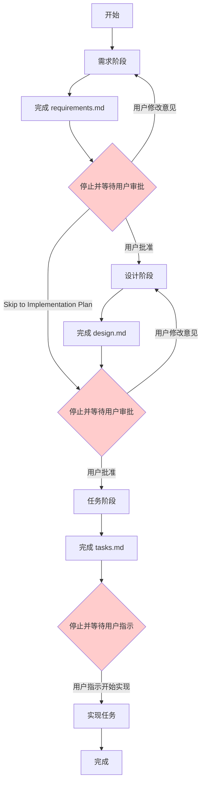

#### 9.1.5 规则总结

| 规则 | 说明 |
|------|------|
| **停止规则** | 每个阶段文档完成后必须停止，不得自行进入下一阶段 |
| **审批规则** | 必须等待用户明确批准后才能继续 |
| **反馈整合** | 收到修改意见后，整合反馈并更新文档，再次等待批准 |
| **Skip 例外** | 用户回复"Skip to Implementation Plan"时，可跳过设计阶段直接进入任务阶段 |
| **实现前停止** | 任务文档完成后仍需停止，等待用户指示开始实现 |

### 9.2 反馈整合规则

_需求引用: 8.3, 8.5_

#### 9.2.1 反馈整合规则

**代理在收到用户反馈后，必须整合所有反馈意见，不得遗漏任何一条。**

具体规则如下：

- **完整整合**：代理必须整合用户提供的**所有**反馈意见，不得选择性地忽略任何一条
- **更新文档**：整合反馈后，必须更新当前阶段的文档（`requirements.md`、`design.md` 或 `tasks.md`）
- **展示修改**：更新完成后，必须再次向用户展示修改内容，并等待用户确认
- **禁止跳过**：不得在反馈未完全整合的情况下进入下一阶段

**反馈整合流程**：

1. 用户提供反馈意见（可能包含多条）
2. 代理逐条分析所有反馈
3. 代理更新当前阶段文档，整合所有修改
4. 代理向用户展示修改摘要（哪些内容被修改、如何修改）
5. 代理再次等待用户批准

**示例反馈整合消息**：

```
已根据您的反馈更新需求文档，具体修改如下：

1. **需求 1.2（会话超时）**：将超时时间从 30 分钟改为 60 分钟 ✓
2. **需求 2.1（密码强度）**：添加了"至少包含一个特殊字符"的要求 ✓
3. **术语表**：添加了"Session Token"的定义 ✓

所有 3 条反馈已整合完毕。请审阅更新后的文档，如无问题请回复"批准"继续进入设计阶段。
```

#### 9.2.2 返回先前阶段的选项

**当代理在当前阶段发现先前阶段存在缺口或问题时，必须提供返回先前阶段的选项。**

**触发场景**：

- **设计阶段发现需求缺口**：在编写 `design.md` 时，发现 `requirements.md` 遗漏了某个功能需求（例如：设计时发现需要缓存层，但需求文档中没有相关性能需求）
- **任务阶段发现设计缺口**：在编写 `tasks.md` 时，发现 `design.md` 存在缺口（例如：某个组件的接口未定义，导致无法分解为具体任务）
- **实现过程中发现根本性问题**：在实现任务时，发现需求或设计存在根本性问题（例如：需求相互矛盾，或设计方案在技术上不可行）

**提供返回选项时，代理应当**：

1. **明确说明问题**：清楚描述在当前阶段发现了什么问题，以及它属于哪个先前阶段的缺口
2. **提供两个选项**：
   - **选项 A**：返回先前阶段修复问题（推荐）
   - **选项 B**：在当前阶段做出合理假设继续
3. **等待用户选择**：不得自行决定，必须等待用户明确选择

**示例返回选项消息**：

```
在设计阶段，我发现需求文档存在一个缺口：

**问题**：用户认证功能需要支持"记住我"（Remember Me）选项，这会影响 token 的有效期设计。
但当前需求文档（需求 1.2）中没有提及此功能，导致无法确定 token 有效期的设计方案。

请选择处理方式：

**选项 A（推荐）：返回需求阶段**
- 在 requirements.md 中添加"记住我"功能的需求
- 明确 token 有效期的业务规则
- 完成后重新进入设计阶段

**选项 B：在当前阶段做出假设继续**
- 假设"记住我"功能不在本次 spec 范围内
- 设计中使用固定的 token 有效期（30 分钟）
- 在设计文档中记录此假设，供后续参考

请告知您的选择（A 或 B）。
```

#### 9.2.3 反馈整合流程图

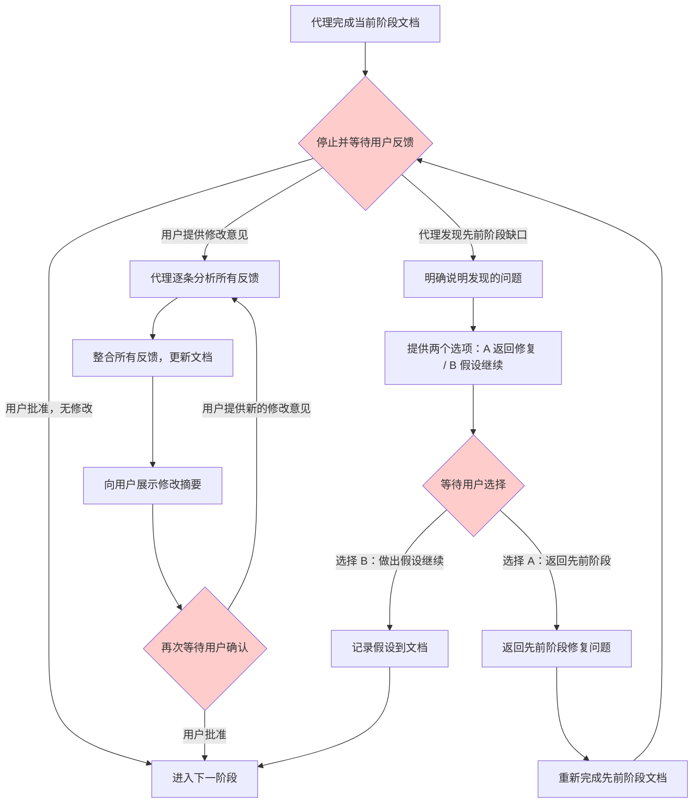

#### 9.2.4 规则总结

| 规则 | 说明 |
|------|------|
| **完整整合** | 必须整合用户提供的所有反馈，不得遗漏任何一条 |
| **更新文档** | 整合反馈后，必须更新当前阶段的文档 |
| **展示修改** | 更新完成后，必须向用户展示修改摘要并等待确认 |
| **禁止跳过** | 不得在反馈未完全整合的情况下进入下一阶段 |
| **识别缺口** | 在当前阶段发现先前阶段缺口时，必须主动提出 |
| **提供选项** | 发现缺口时，必须提供"返回修复"和"假设继续"两个选项 |
| **等待选择** | 不得自行决定如何处理缺口，必须等待用户明确选择 |


## 10. 最佳实践

本章汇总了在 Spec 工作流各阶段中积累的实践经验，帮助通用编码代理和开发者编写更高质量的需求、设计和任务文档。

### 10.1 需求编写技巧

#### 10.1.1 正确选择和应用 EARS 模式

选择合适的 EARS 模式是编写清晰需求的第一步。以下是常见的选择误区和正确做法：

**误区 1：将所有需求都写成 Event-driven 模式**

```
❌ WHEN the system starts THEN the system SHALL encrypt all data at rest
❌ WHEN a user is logged in THEN the system SHALL display the dashboard
```

**问题**：第一个需求是系统的持续性约束，应使用 Ubiquitous 模式；第二个需求描述的是状态下的行为，应使用 State-driven 模式。

```
✅ THE system SHALL encrypt all data at rest using AES-256 encryption
✅ WHILE a user session is active the system SHALL display the user dashboard
```

**误区 2：将错误处理写成 Event-driven 模式**

```
❌ WHEN a user enters wrong password THEN the system SHALL show an error
```

**问题**：密码错误是一个"不期望事件"，应使用 Unwanted event 模式，更清晰地表达这是异常情况。

```
✅ IF a user enters incorrect credentials THEN the system SHALL display an authentication error message
```

**EARS 模式快速选择口诀**：
- 总是成立 → **Ubiquitous**（THE system SHALL）
- 事件触发 → **Event-driven**（WHEN...THEN）
- 状态持续 → **State-driven**（WHILE...SHALL）
- 错误异常 → **Unwanted event**（IF...THEN）
- 功能开关 → **Optional feature**（WHERE...SHALL）
- 多条件组合 → **Complex**（WHEN...WHILE...）

#### 10.1.2 遵循 INCOSE 质量规则的实践技巧

**技巧 1：用数字消除模糊性（Unambiguous 规则）**

每当你写出"快速"、"高效"、"及时"、"大量"等形容词时，立即用具体数字替换：

| 模糊表达 | 具体表达 |
|---------|---------|
| 快速响应 | 在 200ms 内响应 |
| 高可用性 | 99.9% 月度可用性 |
| 支持大量用户 | 支持 10,000 并发用户 |
| 定期备份 | 每 24 小时备份一次 |
| 较小的文件 | 不超过 10MB 的文件 |

**技巧 2：为每个需求设计验证方法（Verifiable 规则）**

在写完需求后，立即问自己："如何测试这个需求？"如果无法回答，需求可能不够具体：

```
❌ THE system SHALL be user-friendly
→ 如何测试"用户友好"？无法测试，需求无效。

✅ THE system SHALL allow users to complete the registration process in under 3 minutes
→ 如何测试？计时用户完成注册流程，验证时间 < 3 分钟。✓
```

**技巧 3：一次只写一件事（Singular 规则）**

检查需求中是否包含"并且"、"同时"、"以及"等连接词。如果有，通常意味着需要拆分：

```
❌ WHEN a user registers THEN the system SHALL create an account, send a verification email, 
   and log the registration event

✅ WHEN a user submits a registration form THEN the system SHALL create a new user account
✅ WHEN a user account is created THEN the system SHALL send a verification email to the provided address
✅ WHEN a user account is created THEN the system SHALL log the registration event with timestamp
```

**技巧 4：建立需求编号体系（Traceable 规则）**

使用层次化编号确保可追溯性：

```markdown
### 需求 1：用户认证

#### 需求 1.1：用户登录
WHEN a user submits valid credentials THEN the system SHALL authenticate the user

#### 需求 1.2：会话管理
WHILE a user session is active the system SHALL maintain authentication state

#### 需求 1.3：登录失败处理
IF a user enters incorrect credentials three times THEN the system SHALL lock the account
```

#### 10.1.3 常见需求编写错误及避免方法

**错误 1：需求包含实现细节**

```
❌ WHEN a user logs in THEN the system SHALL call AuthService.authenticate() 
   and store the JWT token in Redis with a 30-minute TTL

✅ WHEN a user logs in with valid credentials THEN the system SHALL create 
   an authenticated session valid for 30 minutes
```

**规则**：需求描述"做什么"（What），设计文档描述"怎么做"（How）。

---

**错误 2：需求使用被动语态导致主体不明**

```
❌ The data should be validated before processing
→ 谁来验证？什么数据？什么时候验证？

✅ WHEN a user submits a form THEN the system SHALL validate all required fields 
   before processing the submission
```

---

**错误 3：需求中包含"应该"（should）而非"应当"（shall）**

在 EARS 模式中，使用 **SHALL** 表示强制性需求，使用 **SHOULD** 表示推荐性需求。混用会导致歧义：

```
❌ THE system should encrypt passwords
→ "should" 表示可选，密码加密是强制要求

✅ THE system SHALL hash all passwords using bcrypt before storage
```

---

**错误 4：遗漏错误处理需求**

很多开发者只写"正常路径"需求，忽略错误处理。使用 Unwanted event 模式补充：

```
# 正常路径（已有）
WHEN a user uploads a file THEN the system SHALL store the file and return a success response

# 错误处理（容易遗漏）
IF a user uploads a file exceeding 10MB THEN the system SHALL reject the upload and return HTTP 413
IF a user uploads a file with an unsupported format THEN the system SHALL reject the upload and return HTTP 415
IF the storage service is unavailable THEN the system SHALL return HTTP 503 and log the error
```

---

**错误 5：术语不一致**

在需求文档中，同一概念使用不同名称会造成混乱：

```
❌ 需求 1.1：用户登录后，系统应当创建 session
❌ 需求 1.2：当 user session 过期时...
❌ 需求 1.3：如果 authentication token 无效...
→ "session"、"user session"、"authentication token" 是同一个概念吗？

✅ 在术语表中定义：
   - Session：用户认证后创建的会话对象，包含 token 和过期时间
   
✅ 然后在所有需求中统一使用 "Session"
```

**最佳实践**：在开始编写需求之前，先完善术语表，确保所有关键概念都有明确定义。

### 10.2 设计文档技巧

#### 10.2.1 如何组织设计文档结构

一个好的设计文档应该回答以下问题：

1. **概述**：这个功能是什么？解决什么问题？
2. **架构**：系统由哪些组件构成？它们如何协作？
3. **组件和接口**：每个组件的职责是什么？接口如何定义？
4. **数据模型**：数据如何组织和存储？
5. **测试策略**：如何验证设计的正确性？

**结构化设计文档的好处**：

- 代理可以按章节逐步实现，降低复杂度
- 开发者可以快速定位特定信息
- 便于审查和发现设计缺陷

**推荐的章节顺序**：

```markdown
## 概述
（1-2 段，说明功能目标和设计方向）

## 架构
（系统组件图，说明各组件职责和关系）

## 组件和接口
（每个组件的详细说明，包括接口定义）

## 数据模型
（数据结构定义，使用 TypeScript 接口或类图）

## 序列图
（关键流程的时序图）

## 正确性属性
（Correctness Properties，用于属性测试）

## 测试策略
（单元测试、集成测试、属性测试的策略）

## 错误处理
（错误场景和处理方式）

## 实现考虑
（技术选择、性能、安全等注意事项）
```

#### 10.2.2 如何有效使用 Mermaid 图表

Mermaid 图表是设计文档的重要组成部分，但要避免过度使用或使用不当。

**架构图（flowchart）最佳实践**：

```
✅ 好的架构图：
- 显示主要组件（3-7 个）
- 显示组件间的数据流向
- 使用清晰的标签说明关系
- 使用颜色区分不同类型的组件

❌ 避免：
- 图表过于复杂（超过 10 个节点）
- 缺少标签，关系不明确
- 包含实现细节（如具体的函数调用）
```

**示例：好的架构图**

```mermaid
graph LR
    Client[客户端] -->|HTTP 请求| API[API 网关]
    API -->|认证请求| Auth[认证服务]
    API -->|业务请求| Service[业务服务]
    Auth -->|查询用户| DB[(用户数据库)]
    Service -->|读写数据| DB
    
    style Client fill:#e1f5ff
    style API fill:#fff4e1
    style Auth fill:#e8f5e9
    style Service fill:#e8f5e9
    style DB fill:#f3e5f5
```

**序列图（sequenceDiagram）最佳实践**：

```
✅ 好的序列图：
- 聚焦于一个具体的用户场景或流程
- 显示关键的消息交换
- 包含错误路径（使用 alt/else）
- 参与者数量控制在 3-5 个

❌ 避免：
- 试图在一个图中展示所有场景
- 包含过多的内部实现细节
- 忽略错误处理路径
```

**示例：好的序列图**

```mermaid
sequenceDiagram
    participant U as 用户
    participant API as API 服务
    participant Auth as 认证服务
    participant DB as 数据库

    U->>API: POST /login {username, password}
    API->>Auth: validateCredentials(username, password)
    Auth->>DB: findUser(username)
    DB-->>Auth: User 对象
    
    alt 凭证有效
        Auth-->>API: 认证成功
        API-->>U: 200 OK {token}
    else 凭证无效
        Auth-->>API: 认证失败
        API-->>U: 401 Unauthorized
    end
```

#### 10.2.3 如何描述组件接口和数据模型

**组件接口描述技巧**：

使用 TypeScript 接口或伪代码定义组件接口，明确输入、输出和错误情况：

```typescript
// ✅ 好的接口定义：清晰、完整、包含错误情况
interface AuthenticationService {
  /**
   * 验证用户凭证
   * @param username 用户名
   * @param password 明文密码
   * @returns 认证成功时返回 Session 对象
   * @throws InvalidCredentialsError 凭证无效时
   * @throws AccountLockedError 账户被锁定时
   */
  authenticate(username: string, password: string): Promise<Session>;

  /**
   * 验证 Session token 的有效性
   * @param token JWT token 字符串
   * @returns token 有效时返回 true，否则返回 false
   */
  validateToken(token: string): Promise<boolean>;
}
```

**数据模型描述技巧**：

```typescript
// ✅ 好的数据模型：包含字段说明、类型约束和关系
interface User {
  id: string;           // UUID v4，主键
  username: string;     // 3-50 个字符，唯一
  passwordHash: string; // bcrypt 哈希值
  email: string;        // 有效的电子邮件地址，唯一
  createdAt: Date;      // 账户创建时间
  failedLoginCount: number; // 连续登录失败次数，范围 0-5
  lockedUntil: Date | null; // 账户锁定截止时间，null 表示未锁定
}

interface Session {
  token: string;        // JWT token
  userId: string;       // 关联的用户 ID
  expiresAt: Date;      // token 过期时间
  createdAt: Date;      // session 创建时间
}
```

**避免的数据模型错误**：

```typescript
// ❌ 不好的数据模型：字段含义不明，缺少约束
interface User {
  id: any;
  name: string;
  pass: string;
  data: object;
  flag: boolean;
}
```

#### 10.2.4 正确性属性（Correctness Properties）的编写

正确性属性是设计文档中用于指导属性测试的关键部分。编写时遵循以下原则：

**原则 1：属性应该是普遍成立的**

```
✅ 好的属性：
- "对任意有效 token，validateToken(token) 应当返回 true"
- "对任意用户，序列化后再反序列化应当得到相同的用户对象"

❌ 不好的属性（只对特定输入成立）：
- "对用户 ID 为 '123' 的用户，查询应当返回正确结果"
```

**原则 2：属性应该可以自动验证**

```
✅ 可自动验证：
- Round-trip：parse(serialize(x)) === x
- Idempotence：f(f(x)) === f(x)
- Invariant：排序后数组长度不变

❌ 难以自动验证：
- "系统应当提供良好的用户体验"
- "代码应当易于维护"
```

**原则 3：为每个属性标注对应的需求**

```markdown
## 正确性属性

1. **Token 验证幂等性**（对应需求 1.2）
   - 对任意有效 token，多次调用 `validateToken(token)` 应当返回相同结果
   - 属性类型：Idempotence

2. **密码哈希不可逆性**（对应需求 1.3）
   - 对任意密码，`hashPassword(password)` 的结果不应等于原始密码
   - 属性类型：Invariant

3. **用户序列化 Round-trip**（对应需求 2.1）
   - 对任意用户对象，`deserialize(serialize(user))` 应当等于原始用户对象
   - 属性类型：Round Trip
```

### 10.3 任务分解技巧

#### 10.3.1 如何将需求分解为可执行任务

任务分解是将抽象的需求转化为具体实现步骤的过程。好的任务分解应该让代理能够独立完成每个任务，而不需要猜测。

**分解原则**：

1. **从设计文档出发**：每个设计组件对应一组任务
2. **自底向上**：先实现基础组件，再实现依赖它们的高层组件
3. **测试与实现并行**：每个实现任务后面跟着对应的测试任务

**示例：从设计到任务的分解过程**

设计文档中有以下组件：
- `UserRepository`（数据访问层）
- `AuthenticationService`（业务逻辑层）
- `AuthController`（API 层）

对应的任务分解：

```markdown
- [ ] 1. 实现数据访问层
  - [ ] 1.1 创建 User 数据模型
    - 定义 User 接口（id, username, passwordHash, email 等字段）
    - 创建数据库迁移脚本
    - _需求: 1.1_
  
  - [ ] 1.2 实现 UserRepository
    - 实现 findByUsername(username) 方法
    - 实现 findById(id) 方法
    - 实现 create(userData) 方法
    - 实现 updateFailedLoginCount(userId, count) 方法
    - _需求: 1.1, 1.3_

- [ ] 2. 实现业务逻辑层
  - [ ] 2.1 实现密码哈希工具
    - 实现 hashPassword(password) 函数（使用 bcrypt）
    - 实现 verifyPassword(password, hash) 函数
    - _需求: 1.3_
  
  - [ ] 2.2 实现 AuthenticationService
    - 实现 authenticate(username, password) 方法
    - 实现账户锁定逻辑（3 次失败后锁定 15 分钟）
    - 实现 validateToken(token) 方法
    - _需求: 1.1, 1.2, 1.3_

- [ ] 3. 实现 API 层
  - [ ] 3.1 实现 AuthController
    - 实现 POST /login 端点
    - 实现请求参数验证
    - 实现错误响应格式
    - _需求: 1.1, 1.2, 1.3_
```

#### 10.3.2 如何设置合理的任务粒度

任务粒度是任务分解中最难把握的部分。粒度太粗，代理无法明确知道要做什么；粒度太细，任务列表变得繁琐。

**判断任务粒度是否合适的标准**：

| 标准 | 说明 |
|------|------|
| **时间估算** | 单个子任务应该在 30 分钟到 4 小时内完成 |
| **独立性** | 每个子任务应该可以独立完成，不依赖同级任务 |
| **可验证性** | 每个子任务完成后应该有明确的验证方式 |
| **单一职责** | 每个子任务只做一件事 |

**粒度过粗的示例**：

```markdown
❌ - [ ] 1.1 实现用户认证功能
   （太模糊，代理不知道从哪里开始）
```

**粒度过细的示例**：

```markdown
❌ - [ ] 1.1 创建 auth.ts 文件
   - [ ] 1.2 在 auth.ts 中添加 import 语句
   - [ ] 1.3 在 auth.ts 中定义 AuthService 类
   - [ ] 1.4 在 AuthService 类中添加构造函数
   （过于细碎，增加管理负担）
```

**粒度合适的示例**：

```markdown
✅ - [ ] 1.1 创建 AuthenticationService 类
   - 定义类结构和构造函数（注入 UserRepository 和 TokenService 依赖）
   - 实现 authenticate(username, password) 方法
   - 实现 validateToken(token) 方法
   - 添加单元测试覆盖正常路径和错误路径
   - _需求: 1.1, 1.2_
```

**特殊情况：属性测试任务**

属性测试任务应该单独列出，并明确说明要测试的属性：

```markdown
- [ ] 2.3 为 AuthenticationService 编写属性测试
  - 测试 Token 验证幂等性：多次验证同一 token 结果一致
  - 测试密码哈希不可逆性：哈希值不等于原始密码
  - 使用 fast-check 框架
  - _需求: 1.2, 1.3_
```

#### 10.3.3 如何建立任务依赖关系

明确的任务依赖关系可以帮助代理按正确顺序执行任务，避免因依赖缺失导致的错误。

**依赖关系的表达方式**：

**方式 1：通过任务编号隐式表达**

任务编号本身就暗示了顺序：1.x 在 2.x 之前，1.1 在 1.2 之前。

**方式 2：在任务描述中显式说明**

```markdown
- [ ] 2.2 实现 AuthenticationService
  - 依赖：1.2（UserRepository）和 2.1（密码哈希工具）必须先完成
  - 实现 authenticate(username, password) 方法
  - _需求: 1.1_
```

**方式 3：使用依赖图（推荐用于复杂项目）**

在 `tasks.md` 末尾添加依赖图：

```json
{
  "waves": [
    { "id": 0, "tasks": ["1.1"] },
    { "id": 1, "tasks": ["1.2", "2.1"] },
    { "id": 2, "tasks": ["2.2"] },
    { "id": 3, "tasks": ["3.1"] },
    { "id": 4, "tasks": ["2.3", "3.2"] }
  ]
}
```

**依赖图说明**：
- 同一 wave 中的任务可以并行执行
- 后续 wave 的任务必须等待前一 wave 完成
- 这种结构让代理清楚地知道执行顺序

**常见的依赖关系模式**：

```
数据模型 → 数据访问层 → 业务逻辑层 → API 层 → 集成测试

工具函数 → 核心服务 → 控制器 → 端到端测试

配置 → 基础设施 → 应用层 → 验证测试
```

#### 10.3.4 任务分解的常见错误

**错误 1：忘记测试任务**

```markdown
❌ 只有实现任务，没有测试任务：
- [ ] 1.1 实现 UserRepository
- [ ] 1.2 实现 AuthenticationService
- [ ] 1.3 实现 AuthController

✅ 实现和测试并行：
- [ ] 1.1 实现 UserRepository
  - 实现 CRUD 方法
  - 添加单元测试
  - _需求: 1.1_
- [ ] 1.2 实现 AuthenticationService
  - 实现认证逻辑
  - 添加单元测试和属性测试
  - _需求: 1.1, 1.2_
```

---

**错误 2：任务缺少需求引用**

```markdown
❌ 没有需求引用，无法追溯：
- [ ] 1.1 实现用户登录功能

✅ 有需求引用，可追溯：
- [ ] 1.1 实现用户登录功能
  - 实现凭证验证逻辑
  - 实现 session 创建
  - _需求: 1.1, 1.2_
```

---

**错误 3：任务顺序与依赖关系不一致**

```markdown
❌ 任务 1.1 依赖任务 2.1，但 2.1 排在后面：
- [ ] 1.1 实现 AuthenticationService（依赖 UserRepository）
- [ ] 2.1 实现 UserRepository

✅ 依赖项排在前面：
- [ ] 1.1 实现 UserRepository
- [ ] 2.1 实现 AuthenticationService（依赖 1.1）
```

---

**错误 4：遗漏 Checkpoint 任务**

对于复杂的 spec，在关键节点添加 Checkpoint 任务，确保阶段性验证：

```markdown
- [ ] 3. Checkpoint - 验证数据层实现
  - 确认所有数据模型已定义
  - 确认所有 Repository 方法已实现并通过测试
  - 确认数据库迁移脚本可以正常执行
  - 如有问题，询问用户
```

Checkpoint 任务的作用：
- 在继续下一阶段之前验证当前阶段的完整性
- 为用户提供审查和反馈的机会
- 避免在错误的基础上继续构建


## 11. 常见问题

本章汇总了在使用 Spec 工作流过程中最常遇到的问题，并提供具体的解决方法。

### 11.1 目录冲突问题：`.agent` vs `.kiro`

#### 问题描述

当项目中同时存在通用编码代理和 Kiro 时，开发者可能会担心两者的目录结构发生冲突，或者不确定应该使用哪个目录。

#### 根本原因

`.agent` 和 `.kiro` 是两个完全独立的目录，分别服务于不同的工具：

| 目录 | 使用者 | 配置文件 | 用途 |
|------|--------|---------|------|
| `.agent/` | 通用编码代理（Claude、Cursor 等） | `.config.agent` | 通用代理的 spec 工作空间 |
| `.kiro/` | Kiro | `.config.kiro` | Kiro 的 spec 工作空间 |

#### 解决方法

**规则 1：各用各的目录，互不干涉**

```
项目根目录/
├── .agent/          # 通用代理专用，Kiro 不读取此目录
│   └── specs/
│       └── my-feature/
│           ├── .config.agent
│           ├── requirements.md
│           ├── design.md
│           └── tasks.md
│
├── .kiro/           # Kiro 专用，通用代理不读取此目录
│   └── specs/
│       └── another-feature/
│           ├── .config.kiro
│           ├── requirements.md
│           ├── design.md
│           └── tasks.md
│
└── src/             # 两者共享的实际代码
```

**规则 2：通用代理只操作 `.agent` 目录**

- 通用编码代理**不应**读取、修改或创建 `.kiro` 目录下的任何文件
- 如果用户要求通用代理操作 `.kiro` 目录，代理应提示用户这不是正确的做法

**规则 3：Kiro 只操作 `.kiro` 目录**

- Kiro **不会**读取或修改 `.agent` 目录
- 两个工具可以在同一项目中**并行工作**，各自管理不同的功能

#### 常见误解

**误解**：两个目录会互相覆盖对方的文件。

**事实**：两个目录路径完全不同（`.agent/` vs `.kiro/`），不存在文件覆盖的可能。

**误解**：同一个功能只能由一个工具管理。

**事实**：不同的功能可以分别由不同的工具管理。例如，通用代理负责 `user-authentication` 功能，Kiro 负责 `payment-processing` 功能，两者完全独立。

---

### 11.2 常见配置错误

#### 错误 1：`.config.agent` JSON 语法错误

**症状**：代理无法读取配置文件，或报告 JSON 解析错误。

**常见原因**：

```json
// ❌ 错误示例 1：使用了注释（JSON 不支持注释）
{
  "specId": "550e8400-e29b-41d4-a716-446655440000",
  "workflowType": "requirements-first", // 这是注释
  "specType": "feature"
}

// ❌ 错误示例 2：末尾多余的逗号
{
  "specId": "550e8400-e29b-41d4-a716-446655440000",
  "workflowType": "requirements-first",
  "specType": "feature",
}

// ❌ 错误示例 3：使用单引号而非双引号
{
  'specId': '550e8400-e29b-41d4-a716-446655440000',
  'workflowType': 'requirements-first',
  'specType': 'feature'
}
```

**正确示例**：

```json
{
  "specId": "550e8400-e29b-41d4-a716-446655440000",
  "workflowType": "requirements-first",
  "specType": "feature"
}
```

**验证方法**：

```bash
# 使用 Python 验证 JSON 格式
python3 -c "import json; json.load(open('.config.agent')); print('JSON 格式正确')"

# 使用 jq 验证（如果已安装）
jq . .config.agent
```

---

#### 错误 2：缺少必需字段

**症状**：代理无法确定工作流类型，或跳过某些阶段。

**常见原因**：

```json
// ❌ 错误示例 1：feature spec 缺少 workflowType
{
  "specId": "550e8400-e29b-41d4-a716-446655440000",
  "specType": "feature"
}

// ❌ 错误示例 2：缺少 specId
{
  "workflowType": "requirements-first",
  "specType": "feature"
}

// ❌ 错误示例 3：缺少 specType
{
  "specId": "550e8400-e29b-41d4-a716-446655440000",
  "workflowType": "requirements-first"
}
```

**解决方法**：确保所有必需字段都存在：

```json
// ✅ feature spec 的完整配置
{
  "specId": "550e8400-e29b-41d4-a716-446655440000",
  "workflowType": "requirements-first",
  "specType": "feature"
}

// ✅ bugfix spec 的完整配置（不需要 workflowType）
{
  "specId": "7c9e6679-7425-40de-944b-e07fc1f90ae7",
  "specType": "bugfix"
}
```

**必需字段检查清单**：

| 字段 | feature spec | bugfix spec |
|------|-------------|-------------|
| `specId` | ✅ 必需 | ✅ 必需 |
| `workflowType` | ✅ 必需 | ❌ 不需要 |
| `specType` | ✅ 必需 | ✅ 必需 |

---

#### 错误 3：UUID 格式错误

**症状**：`specId` 不符合 UUID v4 格式，可能导致 spec 无法被正确识别或引用。

**常见原因**：

```json
// ❌ 错误示例 1：使用了自定义 ID 而非 UUID
{
  "specId": "my-feature-001",
  "workflowType": "requirements-first",
  "specType": "feature"
}

// ❌ 错误示例 2：UUID 格式不完整
{
  "specId": "550e8400-e29b-41d4",
  "workflowType": "requirements-first",
  "specType": "feature"
}
```

**UUID v4 正确格式**：`xxxxxxxx-xxxx-4xxx-yxxx-xxxxxxxxxxxx`（32 个十六进制字符，用连字符分为 5 组）

**生成正确 UUID 的方法**：

```bash
# Linux/WSL2
uuidgen

# Python
python3 -c "import uuid; print(uuid.uuid4())"

# Node.js
node -e "console.log(require('crypto').randomUUID())"
```

---

#### 错误 4：`workflowType` 或 `specType` 字段值错误

**症状**：代理使用了错误的工作流，或无法识别 spec 类型。

**常见原因**：

```json
// ❌ 错误示例：workflowType 值拼写错误
{
  "specId": "550e8400-e29b-41d4-a716-446655440000",
  "workflowType": "design-driven",   // ❌ 应为 "design-first"
  "specType": "feature"
}

// ❌ 错误示例：specType 值错误
{
  "specId": "550e8400-e29b-41d4-a716-446655440000",
  "workflowType": "requirements-first",
  "specType": "bug-fix"              // ❌ 应为 "bugfix"
}
```

**合法字段值速查**：

| 字段 | 合法值 |
|------|--------|
| `workflowType` | `"requirements-first"` 或 `"design-first"` |
| `specType` | `"feature"` 或 `"bugfix"` |

---

### 11.3 常见工作流问题

#### 问题 1：跳过阶段审批直接实现

**症状**：代理在用户未审批需求或设计文档的情况下，直接开始编写代码或生成任务列表。

**根本原因**：代理没有遵守阶段转换规则，或用户误以为可以跳过审批步骤。

**正确行为**：

```
需求阶段完成
    ↓
代理停止并输出：
"需求文档已完成，请审阅后告知是否继续进入设计阶段。
如需修改，请提供反馈。"
    ↓
等待用户明确批准
    ↓
设计阶段开始
```

**解决方法**：

1. **对于代理**：在完成每个阶段文档后，必须明确停止并等待用户回复，不得自动进入下一阶段
2. **对于用户**：如果希望跳过审批直接进入任务阶段，可以明确回复 `"Skip to Implementation Plan"`
3. **唯一例外**：用户明确说 `"Skip to Implementation Plan"` 时，代理可以从设计阶段直接进入任务阶段

---

#### 问题 2：需求和设计不一致

**症状**：设计文档中描述的组件或行为与需求文档中的验收标准不匹配，导致实现任务无法追溯到具体需求。

**常见原因**：
- 设计阶段引入了需求中未提及的功能
- 需求更新后设计文档未同步更新
- 设计文档中的技术约束与需求中的业务约束相矛盾

**解决方法**：

1. **设计文档必须引用需求**：每个设计决策都应能追溯到至少一条需求

   ```markdown
   ## 组件设计

   ### AuthenticationService
   
   负责处理用户认证逻辑。
   
   _对应需求: 1.1（用户登录）, 1.2（会话管理）_
   ```

2. **发现不一致时返回需求阶段**：如果在设计阶段发现需求有缺口或矛盾，代理应提示用户并提供返回需求阶段的选项：

   ```
   "在设计过程中发现需求 1.3 中未明确说明密码重置的超时时间。
   建议选项：
   A. 返回需求阶段补充该细节
   B. 在设计文档中做出假设并继续（需要用户确认假设）"
   ```

3. **任务必须引用需求**：`tasks.md` 中每个任务都应通过 `_需求: X.Y_` 格式引用对应的需求

---

#### 问题 3：任务依赖关系错误

**症状**：实现任务时发现某个任务依赖的前置任务尚未完成，或任务顺序导致代码无法编译/运行。

**常见原因**：
- 任务分解时未考虑代码依赖关系（例如先实现调用方，再实现被调用方）
- 数据库 schema 任务排在数据访问层任务之后
- 接口定义任务排在实现任务之后

**解决方法**：

1. **遵循依赖顺序**：任务应按照"基础设施 → 数据层 → 业务逻辑层 → API 层 → UI 层"的顺序排列

   ```markdown
   - [ ] 1. 数据库 schema 和迁移          ← 最先执行
   - [ ] 2. 数据访问层（Repository）       ← 依赖任务 1
   - [ ] 3. 业务逻辑层（Service）          ← 依赖任务 2
   - [ ] 4. API 控制器（Controller）       ← 依赖任务 3
   - [ ] 5. 前端组件                       ← 依赖任务 4
   ```

2. **在任务中明确标注依赖**：使用 `tasks.md` 中的依赖图 JSON 格式记录任务间的依赖关系

   ```json
   {
     "waves": [
       { "id": 0, "tasks": ["1"] },
       { "id": 1, "tasks": ["2"] },
       { "id": 2, "tasks": ["3"] },
       { "id": 3, "tasks": ["4", "5"] }
     ]
   }
   ```

3. **发现依赖错误时的处理**：如果在实现过程中发现任务顺序有误，应暂停当前任务，更新 `tasks.md` 中的任务顺序，然后继续

---

#### 问题 4：Bugfix 工作流中混淆"当前行为"和"预期行为"

**症状**：`bugfix.md` 中对 bug 的描述不清晰，导致修复方向错误，或修复后引入新的问题。

**解决方法**：严格按照 bug condition 方法论的三要素来描述 bug：

```markdown
## Bug 分析

### 当前行为（Current Behavior）
描述 bug 实际发生时系统的表现：
- 具体的输入条件
- 实际观察到的输出或行为
- 错误消息（如有）

### 预期行为（Expected Behavior）
描述系统应该如何正确运行：
- 相同输入条件下的正确输出
- 符合业务逻辑的行为

### 不变行为（Invariant Behavior）
描述修复过程中不应改变的行为：
- 其他功能不应受到影响
- 现有测试不应失败
- 性能不应显著下降
```

**示例**：

```markdown
### 当前行为
WHEN 用户在密码重置表单中输入有效邮箱地址
THEN 系统返回 500 Internal Server Error
AND 用户收不到重置邮件

### 预期行为
WHEN 用户在密码重置表单中输入有效邮箱地址
THEN 系统发送包含重置链接的邮件到该地址
AND 系统显示"重置邮件已发送"的确认消息

### 不变行为
- 用户登录功能不受影响
- 已登录用户的会话不受影响
- 密码重置链接的有效期（24小时）不变
```

---

## 12. 参考

本章提供三个快速参考表，供在编写需求、设计和测试策略时快速查阅。

### 12.1 EARS 模式快速参考表

EARS（Easy Approach to Requirements Syntax）的 6 种模式速查：

| 模式名称 | 语法模板 | 简短示例 |
|---------|---------|---------|
| **Ubiquitous**（普遍性） | `THE <system> SHALL <response>` | `THE system SHALL encrypt all data at rest using AES-256` |
| **Event-driven**（事件驱动） | `WHEN <trigger> THEN the <system> SHALL <response>` | `WHEN a user submits valid credentials THEN the system SHALL return a JWT token` |
| **State-driven**（状态驱动） | `WHILE <state> the <system> SHALL <response>` | `WHILE a session is active the system SHALL refresh the token every 15 minutes` |
| **Unwanted event**（非预期事件） | `IF <unwanted condition> THEN the <system> SHALL <response>` | `IF login fails 3 times THEN the system SHALL lock the account for 15 minutes` |
| **Optional feature**（可选功能） | `WHERE <feature is included> the <system> SHALL <response>` | `WHERE email notifications are enabled the system SHALL send alerts for critical errors` |
| **Complex**（复合） | `WHEN <trigger> WHILE <state> the <system> SHALL <response>` | `WHEN a user edits a record WHILE the record is locked THEN the system SHALL deny the modification` |

**选择指南**：

| 场景描述 | 推荐模式 |
|---------|---------|
| 无条件、始终成立的行为 | Ubiquitous |
| 由用户操作或系统事件触发 | Event-driven |
| 在特定状态下持续发生 | State-driven |
| 错误处理、异常响应 | Unwanted event |
| 仅在特定功能启用时生效 | Optional feature |
| 需要多个前提条件 | Complex |

---

### 12.2 INCOSE 质量规则快速参考表

INCOSE 定义的 8 条核心需求质量规则速查：

| 规则名称 | 说明 | 违规示例 |
|---------|------|---------|
| **Necessary**（必要性） | 每条需求必须有明确的业务价值或技术必要性，不应包含不必要的需求 | `THE system SHALL use a blue color scheme for all buttons`（任意设计决策，无业务必要性） |
| **Achievable**（可实现性） | 需求在技术和资源约束下必须是可实现的，不应提出不切实际的要求 | `THE system SHALL respond to all requests within 0 milliseconds`（物理上不可能实现） |
| **Unambiguous**（明确性） | 需求必须只有一种解释方式，避免模糊词语（如"快速"、"高效"） | `THE system SHALL process requests quickly`（"quickly" 无明确标准） |
| **Complete**（完整性） | 需求必须包含所有必要信息，不应遗漏关键细节或留有 TBD | `WHEN a user uploads a file THEN the system SHALL validate the file`（未说明验证什么） |
| **Singular**（单一性） | 每条需求只表达一个单一的条件或行为，不应用 "and/or" 连接多个需求 | `WHEN login succeeds THEN the system SHALL create a session, log the event, and send an email`（包含三个行为） |
| **Verifiable**（可验证性） | 需求必须可以通过测试、检查或演示来验证，避免"最大化"、"最小化"等无法测试的词语 | `THE system SHALL maximize system uptime`（无明确成功标准） |
| **Traceable**（可追溯性） | 需求必须能追溯到来源（业务目标、用户需求、法规），并能链接到设计和测试 | `The system must encrypt data`（无编号、无来源引用） |
| **Feasible**（可行性） | 需求在项目的时间、成本和技术约束下必须是可行的 | `THE system SHALL support 10 billion concurrent users on day one`（超出合理资源范围） |

---

### 12.3 正确性模式快速参考表

属性测试（Property-Based Testing）的 7 种正确性模式速查：

| 模式名称 | 描述 | 适用场景 |
|---------|------|---------|
| **Invariants**（不变量） | 无论输入如何变化，某些属性始终保持不变 | 数据结构的大小约束、业务规则的持续满足（如账户余额不为负） |
| **Round Trip**（往返） | 将操作与其逆操作组合后，结果应回到原始状态（`parse(print(x)) == x`） | 解析器/序列化器（JSON、XML、CSV）、编码/解码、压缩/解压 |
| **Idempotence**（幂等性） | 执行操作两次与执行一次的结果相同（`f(f(x)) == f(x)`） | HTTP PUT/DELETE 请求、数据库 upsert、格式化操作、幂等 API |
| **Metamorphic**（变形） | 以已知方式改变输入后，输出应以可预测的方式变化（无需知道确切输出） | 排序算法（添加元素后结果仍有序）、搜索（更宽松的查询返回更多结果） |
| **Model-Based**（基于模型） | 将优化实现与简单的参考实现进行比较，两者结果应一致 | 性能优化代码（与朴素实现对比）、缓存层（与直接查询对比） |
| **Confluence**（汇合） | 操作的执行顺序不影响最终结果（操作可交换） | 并发操作、事件处理顺序、数据库事务、分布式系统的最终一致性 |
| **Error Conditions**（错误条件） | 无效输入应正确触发错误，而不是静默失败或产生错误结果 | 输入验证、边界值处理、空值/null 处理、类型检查 |

**快速决策指南**：

| 问题 | 如果是 → 考虑的模式 |
|------|-------------------|
| 是否有解析器或序列化器？ | **Round Trip**（必须使用） |
| 操作是否应该幂等？ | **Idempotence** |
| 是否有简单的参考实现可以对比？ | **Model-Based** |
| 是否有始终成立的业务规则？ | **Invariants** |
| 输入变化是否导致可预测的输出变化？ | **Metamorphic** |
| 操作顺序是否不应影响结果？ | **Confluence** |
| 是否需要验证错误处理逻辑？ | **Error Conditions** |
